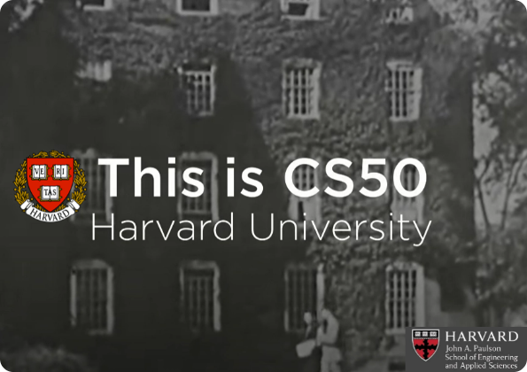

<DOCUMENT filename="README.md">

<p align="center">
  <a href="https://pll.harvard.edu/course/cs50-introduction-computer-science">
    
  </a>
</p>

<br>

<p align="center">
  
  
  
</p>

<br>

# Central Repository - CS50 Harvard University - 2022 / 2025

## 🎓 An introduction to the intellectual enterprises of computer science and the art of programming.

<br>
<br>

<div align="center">

![Languages](https://clone-github-readme-stats-six.vercel.app/api/top-langs/?username=ed-radanovis&repo=provisional_testing_CS50&theme=dark&layout=compact&border_color=fdec02&title_color=0026ff&text_color=b3b3b3&card_width=700&bg_color=000000&exclude_repo=ed-radanovis,Engenharia_Software_Repositorio_Central_01-2025_a_10-2028,Samsung-Ocean-Fullstack-Journey-09-2023,coxaeventosteste,Financial_Management_SaaS_Finance-Control-EWD_Monolithic-Structure-Project-06-2025,Bootcamp-Mobile-Developer_Project-Challenges_06-2025,Soft-App_Memes-Machine_DIO-11-2022,Institutional_Website_Conti_HT_01-2024,Chat-With-Node-React-OpenAI--frontend,Chat-With-Node-React-OpenAI--backend,Inverted-World,Desafio-de-projeto-ANGULAR-2-DIO,Desafio-de-projeto-ANGULAR-1-DIO,Desafio-de-projeto-JS-1-DIO,Desafio-de-projeto-CSS-1-DIO,Desafio-de-projeto-HTML-1-DIO,Database-Conceptual-Project-Service-order-management-mechanic-shop-refined,Database-Conceptual-Project-E-COMMERCE-refined,First-React-project--back-end,First-React-project--front-end,Currency-Converter,Second-Node-project,First-Node-project,First-HTML-form,Desafio-de-projeto-HTML-2-DIO,portfolio-Edmar-Radanovis,Burgershop_fullstack_project-frontend,Burgershop_fullstack_project-backend,First-landing-page-from-YouTube)

</div>

---

> ### 📚 About the course
>
> **Institution :** Harvard University  
> **Platform :** edX (self-paced) / Harvard OpenCourseWare  
> **Duration :** 11 weeks ( 70 hours total )
> **Certificate :** Verified Certificate available (edX)  
> **Difficulty :** Introductory
> **Languages & Frameworks :** C - Python - SQL - HTML - CSS - JavaScript - **_[Flask](https://flask.palletsprojects.com/)_** <br>
> **Lead Instructor:** _`Dr. David J. Malan, Ph.D.`_, Professor of Computer Science, Harvard University

<br>

> ### 🎯 Course Objectives
>
> CS50 is an introduction to computer science and programming. Topics include abstraction, algorithms, data structures, encapsulation, resource management, security, software engineering, and web development. Languages include **_[C](https://en.cppreference.com/)_** , **_[Python](https://www.python.org/)_** and **_[SQL](https://pt.wikipedia.org/wiki/SQL)_** plus **_[HTML](https://developer.mozilla.org/en-US/docs/Web/HTML)_** , **_[CSS](https://developer.mozilla.org/en-US/docs/Web/CSS)_** and **_[JavaScript](https://developer.mozilla.org/en-US/docs/Web/JavaScript)_** . Problem sets inspired by real-world domains of biology, cryptography, finance, forensics, and gaming.
>
> 📊 Key Learning Outcomes:<br>
>
> > ✔️&nbsp;&nbsp;Think algorithmically and solve programming problems efficiently.  
> > ✔️&nbsp;&nbsp;Understand fundamental concepts in computer science.  
> > ✔️&nbsp;&nbsp;Develop programs in multiple programming languages.  
> > ✔️&nbsp;&nbsp;Build and deploy web applications with database integration.  
> > ✔️&nbsp;&nbsp;Collaborate effectively and develop good programming practices.

<br>

### 📖 Detailed Course Curriculum (by Week)

The curriculum is structured over 11 weeks to progressively build the foundations, and includes theoretical lectures, problem sets, labs, and a final project, culminating in a comprehensive understanding.

|  Week  |         Topic         | Key Concepts                             | Programming Languages |
| :----: | :-------------------: | ---------------------------------------- | :-------------------: |
| **0**  |        Scratch        | Computational thinking, Problem solving  |        Scratch        |
| **1**  |           C           | Compiling, Libraries, Types, Operators   |           C           |
| **2**  |        Arrays         | Algorithms, Cryptography, Arrays         |           C           |
| **3**  |      Algorithms       | Searching, Sorting, Complexity           |           C           |
| **4**  |        Memory         | Pointers, Memory allocation, File I/O    |           C           |
| **5**  |    Data Structures    | Linked lists, Hash tables, Trees         |           C           |
| **6**  |        Python         | Python syntax, Libraries, Exceptions     |        Python         |
| **7**  |          SQL          | Databases, SQL queries, Data modeling    |          SQL          |
| **8**  | HTML, CSS, JavaScript | Web development, DOM, APIs               |      HTML/CSS/JS      |
| **9**  |         Flask         | Web frameworks, Sessions, Authentication |     Python/Flask      |
| **10** | Cybersecurity, Ethics | Security, Privacy, AI ethics             |           -           |

---

### 🧠 Skills Developed

Throughout the course, students acquire both technical and problem-solving skills:

- [x] &nbsp; **Technical Skills** : Programming in C and Python, Web development (HTML/CSS/JS), Database design (SQL), Algorithm design, Memory management, Data structures, Flask web framework.
- [x] &nbsp; **Problem-Solving** : Algorithmic thinking, Debugging techniques, Computational complexity analysis, Abstraction and decomposition.
- [x] &nbsp; **Soft Skills** : Persistence, Attention to detail, Time management, Collaborative problem-solving, Presentation skills.
- [x] &nbsp; **CS50 Features** : Access to CS50 IDE, Automated testing, Community support (CS50 Discord), Office hours with teaching fellows.

---

### 🔧 Technologies Mastered

<br>

<div align="center">

[](https://en.cppreference.com/w/c/language)&nbsp;&nbsp;&nbsp;&nbsp;[](https://www.python.org/)&nbsp;&nbsp;&nbsp;&nbsp;[](https://www.postgresql.org/)&nbsp;&nbsp;&nbsp;&nbsp;[](https://developer.mozilla.org/en-US/docs/Web/HTML)&nbsp;&nbsp;&nbsp;&nbsp;[](https://developer.mozilla.org/en-US/docs/Web/CSS)&nbsp;&nbsp;&nbsp;&nbsp;[](https://developer.mozilla.org/en-US/docs/Web/JavaScript)&nbsp;&nbsp;&nbsp;&nbsp;[](https://flask.palletsprojects.com/)&nbsp;&nbsp;&nbsp;&nbsp;[](https://git-scm.com/)

</div>

---

### 📂 Index and Links to Practical Activities by Subject

|  Week   |          Topic          |                                 Links to the Materials                                 | Workload |   Status    |                                                                                                                                                                                                                                                                                                                                            Links to Project Repositories                                                                                                                                                                                                                                                                                                                                            |
| :-----: | :---------------------: | :------------------------------------------------------------------------------------: | :------: | :---------: | :-----------------------------------------------------------------------------------------------------------------------------------------------------------------------------------------------------------------------------------------------------------------------------------------------------------------------------------------------------------------------------------------------------------------------------------------------------------------------------------------------------------------------------------------------------------------------------------------------------------------------------------------------------------------------------------------------------------------: |
|  **0**  |         Scratch         |          [🔗](courseSchedule_subjects_and_exercises/week_0_scratch/materials)          | 06:30 h  | ✔ Completed |                                                                                                                                                                                                                                                        <center>&nbsp;&nbsp;&nbsp;&nbsp; •• &nbsp;&nbsp;&nbsp;&nbsp;[Project 0](courseSchedule_subjects_and_exercises/week_0_scratch/exercises)&nbsp;&nbsp;&nbsp;&nbsp; •• &nbsp;&nbsp;&nbsp;&nbsp;</center>                                                                                                                                                                                                                                                         |
|  **1**  |      C Programming      |             [🔗](courseSchedule_subjects_and_exercises/week_1_C/materials)             | 06:30 h  | ✔ Completed |                                                         <center>[Mario (Less).c](courseSchedule_subjects_and_exercises/week_1_C/exercises)&nbsp;&nbsp;&nbsp;&nbsp; •• &nbsp;&nbsp;&nbsp;&nbsp;[Mario (More).c](courseSchedule_subjects_and_exercises/week_1_C/exercises)&nbsp;&nbsp;&nbsp;&nbsp; •• &nbsp;&nbsp;&nbsp;&nbsp;[Cash.c](courseSchedule_subjects_and_exercises/week_1_C/exercises)&nbsp;&nbsp;&nbsp;&nbsp; •• &nbsp;&nbsp;&nbsp;&nbsp;[Credit.c](courseSchedule_subjects_and_exercises/week_1_C/exercises)&nbsp;&nbsp;&nbsp;&nbsp; •• &nbsp;&nbsp;&nbsp;&nbsp;[Population.c](courseSchedule_subjects_and_exercises/week_1_C/exercises)</center>                                                         |
|  **2**  |         Arrays          |          [🔗](courseSchedule_subjects_and_exercises/week_2_arrays/materials)           | 06:30 h  | ✔ Completed |                                                                                                           <center>[Readability.c](courseSchedule_subjects_and_exercises/week_2_arrays/exercises)&nbsp;&nbsp;&nbsp;&nbsp; •• &nbsp;&nbsp;&nbsp;&nbsp;[Caesar.c](courseSchedule_subjects_and_exercises/week_2_arrays/exercises)&nbsp;&nbsp;&nbsp;&nbsp; •• &nbsp;&nbsp;&nbsp;&nbsp;[Substitution.c](courseSchedule_subjects_and_exercises/week_2_arrays/exercises)&nbsp;&nbsp;&nbsp;&nbsp; •• &nbsp;&nbsp;&nbsp;&nbsp;[Scrabble.c](courseSchedule_subjects_and_exercises/week_2_arrays/exercises)</center>                                                                                                            |
|  **3**  |       Algorithms        |        [🔗](courseSchedule_subjects_and_exercises/week_3_algorithms/materials)         | 06:30 h  | ✔ Completed |                                                                                                                                                                        <center>[Plurality.c](courseSchedule_subjects_and_exercises/week_3_algorithms/exercises)&nbsp;&nbsp;&nbsp;&nbsp; •• &nbsp;&nbsp;&nbsp;&nbsp;[Runoff.c](courseSchedule_subjects_and_exercises/week_3_algorithms/exercises)&nbsp;&nbsp;&nbsp;&nbsp; •• &nbsp;&nbsp;&nbsp;&nbsp;[Tideman.c](courseSchedule_subjects_and_exercises/week_3_algorithms/exercises)</center>                                                                                                                                                                         |
|  **4**  |         Memory          |          [🔗](courseSchedule_subjects_and_exercises/week_4_memory/materials)           | 06:30 h  | ✔ Completed |                                                                                              <center>[Volume.c](courseSchedule_subjects_and_exercises/week_4_memory/exercises)&nbsp;&nbsp;&nbsp;&nbsp; •• &nbsp;&nbsp;&nbsp;&nbsp; [Filter less.c](courseSchedule_subjects_and_exercises/week_4_memory/exercises)&nbsp;&nbsp;&nbsp;&nbsp; •• &nbsp;&nbsp;&nbsp;&nbsp; [Filter more.c](courseSchedule_subjects_and_exercises/week_4_memory/exercises)&nbsp;&nbsp;&nbsp;&nbsp; •• &nbsp;&nbsp;&nbsp;&nbsp; [Recover.c](courseSchedule_subjects_and_exercises/week_4_memory/exercises)&nbsp;&nbsp;&nbsp;&nbsp; </center>                                                                                               |
|  **5**  |     Data Structures     |      [🔗](courseSchedule_subjects_and_exercises/week_5_data_structure/materials)       | 06:30 h  | ✔ Completed |                                                                                                                                                                                                                                   <center>[Inheritance.c](courseSchedule_subjects_and_exercises/week_5_data_structure/exercises)&nbsp;&nbsp;&nbsp;&nbsp; •• &nbsp;&nbsp;&nbsp;&nbsp; [Speller.c](courseSchedule_subjects_and_exercises/week_5_data_structure/exercises)</center>                                                                                                                                                                                                                                    |
| **6.0** |         Python          |         [🔗](courseSchedule_subjects_and_exercises/week_6_0_python/materials)          | 06:30 h  | ✔ Completed | <center>[Mario (Less).py](courseSchedule_subjects_and_exercises/week_6_0_python/exercises)&nbsp;&nbsp;&nbsp; •• &nbsp;&nbsp;&nbsp; [Mario (More).py](courseSchedule_subjects_and_exercises/week_6_0_python/exercises)&nbsp;&nbsp;&nbsp; •• &nbsp;&nbsp;&nbsp; [Cash.py](courseSchedule_subjects_and_exercises/week_6_0_python/exercises)&nbsp;&nbsp;&nbsp; •• &nbsp;&nbsp;&nbsp; [Credit.py](courseSchedule_subjects_and_exercises/week_6_0_python/exercises)&nbsp;&nbsp;&nbsp; •• &nbsp;&nbsp;&nbsp; [Readability.py](courseSchedule_subjects_and_exercises/week_6_0_python/exercises)&nbsp;&nbsp;&nbsp; •• &nbsp;&nbsp;&nbsp; [DNA.py](courseSchedule_subjects_and_exercises/week_6_0_python/exercises) </center> |
| **6.1** | Artificial Intelligence | [🔗](courseSchedule_subjects_and_exercises/week_6_1_artificial_intelligence/materials) | 06:30 h  | ✔ Completed |                                                                                                                                                                                                                                                                                             <center>&nbsp;&nbsp;&nbsp;&nbsp; ••&nbsp;&nbsp;&nbsp;&nbsp;🔒&nbsp;&nbsp;&nbsp;&nbsp; •• &nbsp;&nbsp;&nbsp;&nbsp;</center>                                                                                                                                                                                                                                                                                              |
|  **7**  |           SQL           |       [🔗](courseSchedule_subjects_and_exercises/week_7_database_SQL/materials)        | 06:30 h  | ✔ Completed |                                                                                                                                                                       <center>[Songs](courseSchedule_subjects_and_exercises/week_7_database_SQL/exercises/)&nbsp;&nbsp;&nbsp;&nbsp; •• &nbsp;&nbsp;&nbsp;&nbsp;[Movies](courseSchedule_subjects_and_exercises/week_7_database_SQL/exercises/)&nbsp;&nbsp;&nbsp;&nbsp; •• &nbsp;&nbsp;&nbsp;&nbsp;[Fiftyville](courseSchedule_subjects_and_exercises/week_7_database_SQL/exercises/)</center>                                                                                                                                                                        |
|  **8**  |       HTML/CSS/JS       |        [🔗](courseSchedule_subjects_and_exercises/week_8_HTML_CSS_JS/materials)        | 06:30 h  | ✔ Completed |                                                                                                                                                                                                                                         <center>[Trivia](courseSchedule_subjects_and_exercises/week_8_HTML_CSS_JS/exercises/)&nbsp;&nbsp;&nbsp;&nbsp; •• &nbsp;&nbsp;&nbsp;&nbsp; [Homepage](courseSchedule_subjects_and_exercises/week_8_HTML_CSS_JS/exercises/)</center>                                                                                                                                                                                                                                          |
|  **9**  |          Flask          |           [🔗](courseSchedule_subjects_and_exercises/week_9_flask/materials)           | 06:30 h  | ✔ Completed |                                                                                                                                                                                                                                              <center>[Birthdays](courseSchedule_subjects_and_exercises/week_9_flask/exercises/)&nbsp;&nbsp;&nbsp;&nbsp; •• &nbsp;&nbsp;&nbsp;&nbsp; [Finance](courseSchedule_subjects_and_exercises/week_9_flask/exercises/)</center>                                                                                                                                                                                                                                               |
| **10**  |         Ethics          |          [🔗](courseSchedule_subjects_and_exercises/week_10_ethic/materials)           | 06:30 h  | ✔ Completed |                                                                                                                                                                                                                                                      <center>&nbsp;&nbsp;&nbsp;&nbsp; •• &nbsp;&nbsp;&nbsp;&nbsp;[Final Project](courseSchedule_subjects_and_exercises/week_10_ethic/exercises/)&nbsp;&nbsp;&nbsp;&nbsp; •• &nbsp;&nbsp;&nbsp;&nbsp;</center>                                                                                                                                                                                                                                                       |

---

### 🏗️ Repository Organization

```plaintext
CS50
├── 📁 courseSchedule_subjects_and_exercises/
├── 📁 week_0_scratch/
│   ├── 📁 exercises/
│   │   ├── 📁 scripts_and_corrections/
│   │   │   ├── 📕 CS50_class_0_exerc_1_Scratch_Project.pdf
│   │   ├── 📁 src/
│   │   │   └── 📄 0_Scratch_Project.sb3
│   │   └── 📝 README.md
│   └── 📁 materials/
│       ├── 📁 images/
│       └── 📕 CS50_class_0_scratch.pdf
├── 📁 week_1_C/
│   ├── 📁 exercises/
│   │   ├── 📁 scripts_and_corrections/
│   │   │   ├── 📕 CS50_class_1_exerc_0_instructions_helloitsme.pdf
│   │   │   ├── 📕 CS50_class_1_exerc_1_instructions_mario_less.pdf
│   │   │   ├── 📕 CS50_class_1_exerc_2_instructions_mario_more.pdf
│   │   │   ├── 📕 CS50_class_1_exerc_3_instructions_cash.pdf
│   │   │   ├── 📕 CS50_class_1_exerc_4_instructions_credit.pdf
│   │   │   ├── 📕 CS50_class_1_exerc_5_instructions_population.pdf
│   │   ├── 📁 src/
│   │   └── 📝 README.md
│   └── 📁 materials/
│       ├── 📁 images/
│       ├── 📁 src/
│       └── 📕 CS50_class_1_C.pdf
├── 📁 week_2_arrays/
│   ├── 📁 exercises/
│   │   ├── 📁 scripts_and_corrections/
│   │   │   ├── 📕 CS50_class_2_exerc_0_instructions_scrabble.pdf
│   │   │   ├── 📕 CS50_class_2_exerc_1_instructions_readability.pdf
│   │   │   ├── 📕 CS50_class_2_exerc_2_instructions_caesar.pdf
│   │   │   ├── 📕 CS50_class_2_exerc_3_instructions_substitution.pdf
│   │   ├── 📁 src/
│   │   └── 📝 README.md
│   └── 📁 materials/
│       ├── 📁 images/
│       ├── 📁 src/
│       ├── 📕 CS50_class_2_arrays.pdf
│       └── 📕 CS50_class_2_decimal_ASCII_chart.pdf
├── 📁 week_3_algorithms/
│   ├── 📁 exercises/
│   │   ├── 📁 scripts_and_corrections/
│   │   │   ├── 📕 CS50_class_3_exerc_0_instructions_sort.pdf
│   │   │   ├── 📕 CS50_class_3_exerc_1_instructions_plurality.pdf
│   │   │   ├── 📕 CS50_class_3_exerc_2_instructions_runoff.pdf
│   │   │   ├── 📕 CS50_class_3_exerc_3_instructions_tideman.pdf
│   │   ├── 📁 src/
│   │   │   ├── 📁 sort/
│   │   │   ├── 📄 1plurality.c
│   │   │   ├── 📄 2runoff.c
│   │   │   └── 📄 3tideman.c
│   │   └── 📝 README.md
│   └── 📁 materials/
│       ├── 📁 images/
│       ├── 📁 src/
│       └── 📕 CS50_class_3_algorithms.pdf
├── 📁 week_4_memory/
│   ├── 📁 exercises/
│   │   ├── 📁 scripts_and_corrections/
│   │   │   ├── 📕 CS50_class_4_exerc_0_instructions_volume.pdf
│   │   │   ├── 📕 CS50_class_4_exerc_1_instructions_filter_less.pdf
│   │   │   ├── 📕 CS50_class_4_exerc_2_instructions_filter_more.pdf
│   │   │   ├── 📕 CS50_class_4_exerc_3_instructions_recover.pdf
│   │   ├── 📁 src/
│   │   │   ├── 📁 0volume/
│   │   │   ├── 📁 1filter_less/
│   │   │   │   ├── 📁 images/
│   │   │   │   ├── 📄 1filter_less.c
│   │   │   │   ├── 📄 Makefile
│   │   │   │   ├── ⚡ bmp.h
│   │   │   │   ├── 📄 helpers.c
│   │   │   │   └── ⚡ helpers.h
│   │   │   ├── 📁 2filter_more/
│   │   │   │   ├── 📁 images/
│   │   │   │   ├── 📄 Makefile
│   │   │   │   ├── ⚡ bmp.h
│   │   │   │   ├── 📄 filter.c
│   │   │   │   ├── 📄 helpers.c
│   │   │   │   └── ⚡ helpers.h
│   │   │   └── 📁 3recover/
│   │   │       ├── 📁 recovered images/
│   │   │       ├── 📄 card.raw
│   │   │       └── 📄 recover.c
│   │   └── 📝 README.md
│   └── 📁 materials/
│       ├── 📁 images/
│       ├── 📁 src/
│       └── 📕 CS50_class_4_a_memory.pdf
├── 📁 week_5_data_structure/
│   ├── 📁 exercises/
│   │   ├── 📁 scripts_and_corrections/
│   │   │   ├── 📕 CS50_class_5_exerc_0_instructions_inheritance.pdf
│   │   │   ├── 📕 CS50_class_5_exerc_1_instructions_speller.pdf
│   │   ├── 📁 src/
│   │   │   ├── 📁 1speller/
│   │   │   │   ├── 📁 dictionaries/
│   │   │   │   ├── 📁 keys/
│   │   │   │   ├── 📁 texts/
│   │   │   │   ├── 📄 Makefile
│   │   │   │   ├── 📄 dictionary.c
│   │   │   │   ├── ⚡ dictionary.h
│   │   │   │   ├── 📄 speller.c
│   │   │   │   └── 📄 speller50
│   │   │   └── 📄 0inheritance.c
│   │   └── 📝 README.md
│   └── 📁 materials/
│       ├── 📁 images/
│       ├── 📁 src/
│       └── 📕 CS50_class_5_data_structure.pdf
├── 📁 week_6_0_python/
│   ├── 📁 exercises/
│   │   ├── 📁 scripts_and_corrections/
│   │   │   ├── 📕 CS50_class_6_exerc_0_instructions_hellowithpython.pdf
│   │   │   ├── 📕 CS50_class_6_exerc_1_instructions_mario_less.pdf
│   │   │   ├── 📕 CS50_class_6_exerc_2_instructions_mario_more.pdf
│   │   │   ├── 📕 CS50_class_6_exerc_3_instructions_cash.pdf
│   │   │   ├── 📕 CS50_class_6_exerc_4_instructions_credit.pdf
│   │   │   ├── 📕 CS50_class_6_exerc_5_instructions_readability.pdf
│   │   │   ├── 📕 CS50_class_6_exerc_6_instructions_dna.pdf
│   │   ├── 📁 src/
│   │   │   ├── 📁 6dna/
│   │   │   │   ├── 📁 databases/
│   │   │   │   ├── 📁 sequences/
│   │   │   │   ├──  create_new_character.py
│   │   │   │   └──  dna.py
│   │   │   ├──  0hello.py
│   │   │   ├──  1mario_less.py
│   │   │   ├──  2mario_more.py
│   │   │   ├──  3cash.py
│   │   │   ├──  4credit.py
│   │   │   └──  5readability.py
│   │   └── 📝 README.md
│   └── 📁 materials/
│       ├── 📁 images/
│       ├── 📁 src/
│       │   ├── 📁 1/
│       │   ├── 📁 2/
│       │   ├── 📁 3/
│       │   ├── 📁 4/
│       │   └── 📁 5/
│       └── 📕 CS50_class_6_python.pdf
├── 📁 week_6_1_artificial_intelligence/
│   └── 📁 materials/
│       ├── 📁 images/
│       ├── 📁 src/
│       │   ├── ⚙️ .env.example
│       │   └──     cs50_duck.py
│       ├── 📕 CS50_class_6_IA.pdf
│       └── 📝 README.md
├── 📁 week_7_database_SQL/
│   ├── 📁 exercises/
│   │   ├── 📁 scripts_and_corrections/
│   │   │   ├── 📕 CS50_class_7_exerc_0_instructions_songs.pdf
│   │   │   ├── 📕 CS50_class_7_exerc_1_instructions_movies.pdf
│   │   │   ├── 📕 CS50_class_7_exerc_2_instructions_fiftyville.pdf
│   │   ├── 📁 src/
│   │   │   ├── 📁 fiftyville/
│   │   │   ├── 📁 movies/
│   │   │   │   └── 📄 movies.db
│   │   │   └── 📁 songs/
│   │   └── 📝 README.md
│   └── 📁 materials/
│       ├── 📁 images/
│       ├── 📁 src/
│       │   ├── 📁 favorites/
│       │   └── 📁 imdb/
│       └── 📕 CS50_class_7_databaseSQL.pdf
├── 📁 week_8_HTML_CSS_JS/
│   ├── 📁 exercises/
│   │   ├── 📁 scripts_and_corrections/
│   │   │   ├── 📕 CS50_class_8_exerc_0_instructions_trivia.pdf
│   │   │   ├── 📕 CS50_class_8_exerc_1_instructions_homepage.pdf
│   │   ├── 📁 src/
│   │   │   ├── 📁 homepage/
│   │   │   │   ├── 📁 images/
│   │   │   │   ├── 🌐 about.html
│   │   │   │   ├── 🌐 hobbies.html
│   │   │   │   ├── 🌐 index.html
│   │   │   │   ├── 🌐 references.html
│   │   │   │   ├── 📄 script.js
│   │   │   │   ├── 📄 specification.txt
│   │   │   │   └── 🎨 styles.css
│   │   │   └── 📁 trivia/
│   │   └── 📝 README.md
│   └── 📁 materials/
│       ├── 📁 images/
│       ├── 📁 src/
│       │   ├── 📁 css/
│       │   ├── 📁 html/
│       │   ├── 📁 images/
│       │   ├── 📁 js/
│       │   └── 📁 videos/
│       └── 📕 CS50_class_8_HTML_CSS_JS.pdf
├── 📁 week_9_flask/
│   ├── 📁 exercises/
│   │   ├── 📁 scripts_and_corrections/
│   │   │   ├── 📕 CS50_class_9_exerc_0_instructions_birthdays.pdf
│   │   │   ├── 📕 CS50_class_9_exerc_1_instructions_finance.pdf
│   │   ├── 📁 src/
│   │   │   ├── 📁 birthdays/
│   │   │   │   ├── 📁 static/
│   │   │   │   ├── 📁 templates/
│   │   │   │   ├──    app.py
│   │   │   │   └── 📄 birthdays.db
│   │   │   └── 📁 finance/
│   │   │       ├── 📁 flask_session/
│   │   │       ├── 📁 static/
│   │   │       ├── 📁 templates/
│   │   └── 📝 README.md
│   └── 📁 materials/
│       ├── 📁 images/
│       ├── 📁 src/
│       └── 📕 CS50_class_9_flask.pdf
├── 📁 week_10_ethic/
│   ├── 📁 exercises/
│   │   ├── 📁 scripts_and_corrections/
│   │   │   ├── 📕 CS50_class_10_exerc_0_instructions_fakenews.pdf
│   │   │   ├── 📕 CS50_class_10_exerc_1_instructions_final_project.pdf
│   │   ├── 📁 src/
│   │   │   └── 📦 project.zip
│   │   └── 📝 README.md
│   └── 📁 materials/
│       ├── 📁 images/
│       ├── 📕 CS50_class_10_ethic.pdf
│       └── 📕 CS50_class_10_the_end.pdf
└── ⚙️ devcontainer.json
├── 📁 github/
├── 📕 CS50_manual_pages.pdf
├── ⚙️ .gitignore
└── 📝 README.md
```

---

### 🚀 Project Highlights

- [x] &nbsp;&nbsp;&nbsp;Week 1: C Programming Fundamentals ✔️
  - `Mario (Less/More)` : Print pyramids of varying heights using nested loops and input validation
  - `Cash` : Calculate minimum coins for change using greedy algorithm
  - `Credit` : Validate credit card numbers using Luhn's algorithm
  - `Population` : Calculate years for llama population growth simulation

<br>

- [x] &nbsp;&nbsp;&nbsp;Week 2: Arrays, Strings & Cryptography ✔️
  - `Scrabble` : Calculate word scores using character mapping arrays
  - `Readability` : Calculate text difficulty using Coleman-Liau index
  - `Caesar` : Implement Caesar cipher for text encryption with modulo arithmetic
  - `Substitution` : Create substitution cipher with key validation and case preservation

<br>

- [x] &nbsp;&nbsp;&nbsp;Week 3: Algorithm Design & Voting Systems ✔️
  - `Sort Analysis` : Analyze algorithm efficiency using Big O notation
  - `Plurality` : Implement simple majority voting system
  - `Runoff` : Create instant-runoff voting with elimination rounds
  - `Tideman` : Implement ranked-pairs voting using graph theory

<br>

- [x] &nbsp;&nbsp;&nbsp;Week 4: Memory Management & File Processing ✔️
  - `Volume` : Manipulate WAV audio file volume with pointers
  - `Filter-less/more` : Apply image filters (grayscale, blur, edge detection)
  - `Recover` : Recover JPEG files from forensic memory card image

<br>

- [x] &nbsp;&nbsp;&nbsp;Week 5: Data Structures ✔️
  - `Inheritance` : Simulate blood type inheritance using recursive structs
  - `Speller` : Implement high-performance spell checker with hash tables

<br>

- [x] &nbsp;&nbsp;&nbsp;Week 6: Python Programming & AI ✔️
  - `Python Projects` : Reimplement C algorithms in Python (Mario, Cash, Credit, Readability)
  - `DNA` : Match DNA sequences using STR analysis and CSV processing
  - `AI Concepts` : Create CS50 Duck Assistant with OpenAI API integration

<br>

- [x] &nbsp;&nbsp;&nbsp;Week 7: Databases & SQL ✔️
  - `Songs` : Analyze Spotify top 100 songs with aggregate SQL queries
  - `Movies` : Query IMDb database with complex JOIN operations
  - `Fiftyville` : Solve mystery crime using SQL forensic investigation

<br>

- [x] &nbsp;&nbsp;&nbsp;Week 8: Web Programming ✔️
  - `Trivia` : Create interactive quiz with JavaScript DOM manipulation
  - `Homepage` : Build multi-page portfolio website with Bootstrap

<br>

- [x] &nbsp;&nbsp;&nbsp;Week 9: Flask Web Applications ✔️
  - `Birthdays` : Develop CRUD web application with SQLite database
  - `Finance` : Build stock trading platform with user authentication

<br>

- [x] &nbsp;&nbsp;&nbsp;Week 10: Final Project ✔️
  - `Finance Control EWD` : Full-stack SaaS for financial management
    - **Tech Stack**: Next.js, PostgreSQL, Prisma ORM, Server Actions
    - **Features**: AI-powered PDF reports, real-time dashboard, transaction tracking
    - **Live Demo**: [www.financecontrol-ewd.com.br](https://www.financecontrol-ewd.com.br)

---

### 📜 Academic Context

This repository contains my solutions and projects from Harvard University's CS50: Introduction to Computer Science (2022 / 2025 edition). All code represents my own work completed as part of the course requirements. The repository serves as both an academic portfolio and a reference for future learning.

> ⚠ Important: This repository follows `Harvard's Academic Honesty policy`. While sharing completed work is permitted for portfolio purposes, current CS50 students should **complete problems independently**.

---

### 📝 Historical & Contextual Note

This repository documents my formal completion of Harvard's CS50 course in 2025, culminating in the official Harvard/edX certificate.

**Background Context:** I first completed CS50's full curriculum in 2022 through the "Estudar na Prática" program (Brazilian educational partner). While the program provided full access to CS50's original content and I completed all requirements at that time, the credential issued was from the partner institution rather than Harvard's official platform.

**2025 Completion Rationale:** To consolidate my software engineering portfolio with recognized credentials, I revisited the course materials during an academic break. Approximately 90% of the problem sets and projects from my 2022 work were refined and adapted to meet CS50's 2025 requirements, while the final project represents new work that applies accumulated professional experience.

This repository thus serves a dual purpose:

1. **Academic Portfolio:** A current, organized record of CS50 concepts applied at a professional level
2. **Credential Recognition:** Documentation supporting the official Harvard CS50 certification earned in 2025

---

### 🔗 Official CS50 Resources and Repositories

Below are some public resources and official repositories maintained by the CS50 team:

|       Resource        | Description                                      |                           Links                            |
| :-------------------: | ------------------------------------------------ | :--------------------------------------------------------: |
|   **CS50 Library**    | Official C library used throughout the course    | [github.com/cs50/libcs50](https://github.com/cs50/libcs50) |
|    **CS50 GitHub**    | Official organization with all CS50 repositories |         [github.com/cs50](https://github.com/cs50)         |
| **CS50 Manual Pages** | Online documentation for CS50 functions          |            [man.cs50.io](https://man.cs50.io/)             |
|  **Course Website**   | Main CS50x course website                        |     [cs50.harvard.edu/x](https://cs50.harvard.edu/x/)      |
|     **CS50 IDE**      | Legacy cloud-based IDE (now replaced by VS Code) |                [cs50.io](https://cs50.io/)                 |
|     **CS50. ai**      | AI assistant for CS50 students                   |                [cs50.ai](https://cs50.ai/)                 |

> ⚠ These resources are maintained by the CS50 team and are regularly updated with course materials, code examples, and tools used in the curriculum.

---

<h2 align="center">
  ✒️ Certificate 🏆
<h2/>

<table align="center">
  <tr>
  <td align="center">
    <a href="/github/Certificado 27_07_221.png">
      
      </a>
    </td>
    <td align="center">
    <a href="https://cs50.harvard.edu/certificates/e3570c82-7bb7-4e17-a781-e583ab008bf8">
      
      </a>
    </td>
  </tr>
</table>

<br>

<p align="center">
 
 </p>

---

<h4 align="center">👤 Developed by</h4>

<table align="center">
  <tr>
    <td align="center">
      <a href="https://www.linkedin.com/in/edmar-radanovis/">
        
      </a><br>
        <sub><b>Edmar Radanovis</b></sub><br>
        <sub>Full Stack Developer &nbsp;&</sub><br>
        <sub>Bachelor's degree candidate in</sub>
        <sub>Software Engineering</sub>
    </td>
  </tr>
</table>
<table align="center">
  <tr>
    <td align="center">
      <a href="https://edwebdev.vercel.app/">
        
      </a><br>
      <sub><b>Ed Web Dev</b></sub><br>
    </td>
  </tr>
</table>

<br>
<br>

[⬆ Back to top](#central-repository---cs50-harvard-university---2022--2025)

</DOCUMENT>

