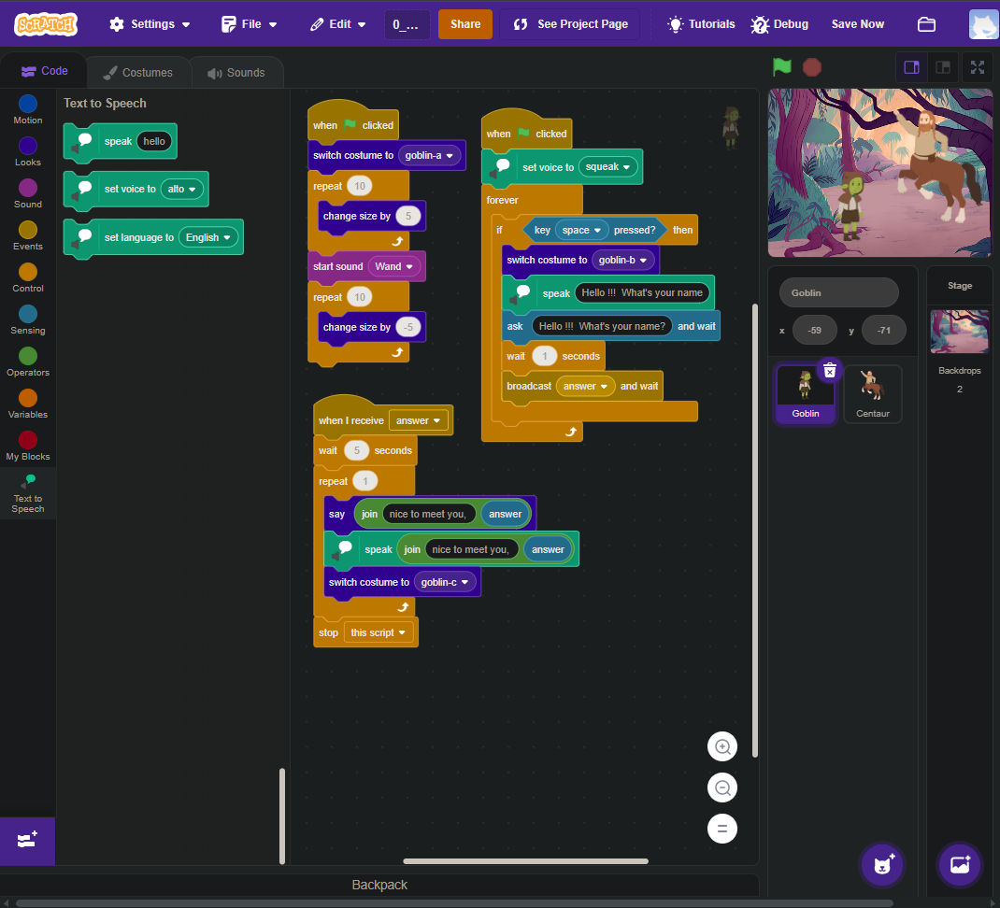
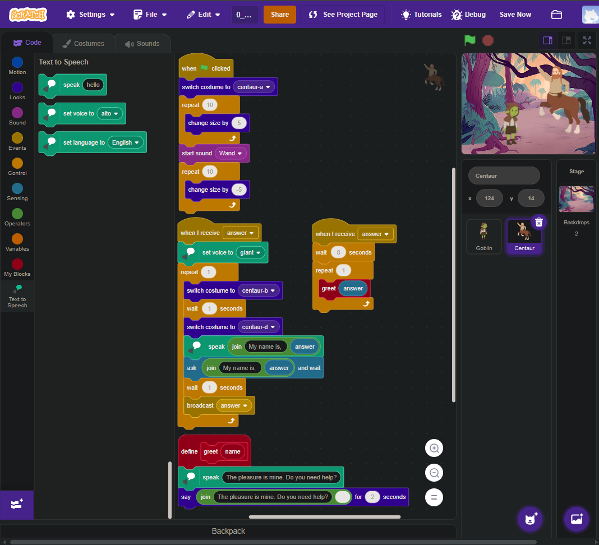

<DOCUMENT filename="README.md">

<p align="center">
  
</p>

<br>

# CS50 - Class 0: Scratch Activity

## Introduction to Computer Science

### Week 0 – Scratch

Taught by **Dr. David J. Malan, Ph.D.**

<br>

Below is the result of the completed activity:

<br>

> 🎯 Activity Objective :
>
> - Understand the fundamentals of `computer programming` using `visual programming`.
> - Apply programming building blocks: `functions`, `conditionals`, `loops`, and `variables`.
> - Develop `problem-solving skills` through interactive projects.
> - Create an original **_[Scratch](https://scratch.mit.edu/)_** project meeting specific requirements.
> - Experience `computational thinking` and `algorithm design` in a visual environment.

<br>

### 🧩 Activity Requirements

- Use at least two sprites, with at least one not being a cat.
- Have at least three scripts in total.
- Include at least one conditional, one loop, and one variable.
- Use at least one custom block that you create (via Make a Block), which must take at least one input.
- Project must be more complex than most examples shown in class but can be simpler than _Oscartime_ and _Ivy's Hardest Game_.

---

<table align="center">
  <tr>
    <td align="center">
      <a href="../materials/images/result_activity_1.png">
        
      </a>
    </td>
    <td align="center">
      <a href="../materials/images/result_activity_2.png">
        
      </a>
    </td>
  </tr>   
</table>

---

### 📚 Prerequisites

- [ ] Before starting this project, you should have basic knowledge in:

- **Computer Science Fundamentals:** Understanding of `input ➡ output` model.
- **Binary System:** Basics of bits, bytes, ASCII, and Unicode.
- **Algorithmic Thinking:** Step-by-step problem solving.
- **Pseudocode:** Ability to express logic in human-readable steps.
- **Scratch Interface:** Familiarity with _Scratch.mit .edu_ environment.

---

### 🛠️ Technologies Used

The project was developed using:

[](https://scratch.mit.edu/)&nbsp;&nbsp;&nbsp;&nbsp;&nbsp;&nbsp;[](https://developers.google.com/blockly)&nbsp;&nbsp;&nbsp;&nbsp;&nbsp;&nbsp;[](https://www.media.mit.edu/)

---

### 📂 Activity Structure

```bash
class0_scratch/
├── exercises/
│   ├── scripts_and_corrections/
│   │   ├── 0_Result_0_scratch.pdf
│   │   └── CS50_ CLASS_0_exerc_1_Scratch_Project.pdf   # Project requirements summary
│   └── src/
│       └── 0_Scratch_Project.sb3                       # Scratch project file
├── materials/
│   ├── images/
│   └── CS50_ CLASS_0_SCRATCH.pdf
└── README.md                                           # This file
```

---

### ⚙️ Setup and Execution

- [ ] &nbsp;&nbsp;&nbsp;Prerequisites :

✔️ - Access to Scratch website at **scratch.mit .edu** .

✔️ - GitHub account for submission (if the requirements are being followed).

<br>

- [x] &nbsp;&nbsp;&nbsp;Recommended workflow (as per instructions):

```scratch
// Step 1: Visit https://scratch.mit.edu/
// Step 2: Click "Create" to start new project
// Step 3: Add at least two sprites
// Step 4: Implement three scripts using:

when green flag clicked
say [Hello, world!] for (2) seconds

when [space] key pressed
change [score v] by (1)

when I receive [start v]
repeat (10)
  move (10) steps
  if on edge, bounce
end

// Step 5: Create custom block:
define dance (times)
repeat (times)
  turn cw (15) degrees
  wait (0.5) seconds
  turn ccw (15) degrees
  wait (0.5) seconds
end

// Step 6: Test and debug your project
// Step 7: Save project (.sb3 file)
// Step 8: Submit via CS50 submission system
```

---

### 🔬 Tests Performed

✔️ - Activity validations :

- [x] &nbsp;&nbsp;&nbsp;At least two sprites (one non-cat) present.
- [x] &nbsp;&nbsp;&nbsp;Minimum three scripts implemented.
- [x] &nbsp;&nbsp;&nbsp;Conditional statement used (if-then).
- [x] &nbsp;&nbsp;&nbsp;Loop structure implemented (repeat/forever).
- [x] &nbsp;&nbsp;&nbsp;Variable created and utilized.
- [x] &nbsp;&nbsp;&nbsp;Custom block with parameter created.
- [x] &nbsp;&nbsp;&nbsp;Project complexity appropriate (neither too simple nor too complex).
- [x] &nbsp;&nbsp;&nbsp;Project is interactive and functional.

---

### 🧠 Skills Developed

✔️ - By completing this activity, you will have acquired the following skills and sub-skills:

- Visual Programming: Creating programs using drag-and-drop blocks.
- Algorithm Design: Breaking problems into step-by-step instructions.
- Sprite Management: Controlling multiple characters/objects.
- Event Handling: Responding to user inputs (clicks, key presses).
- Variable Usage: Storing and modifying data.
- Custom Functions: Creating reusable code blocks with parameters.
- Debugging Skills: Testing and fixing program errors.
- Project Planning: Designing and implementing complete projects.
- Computational Thinking: Solving problems like a computer scientist.

---

### 📜 License

This is an academic activity developed as part of the course.

The Scratch project follows the educational purposes of the course and is intended for learning and portfolio building. Scratch projects are typically shared under the Scratch community guidelines. For educational reuse, please maintain attribution to the original author and context.

---

<h4 align="center">
  👤 Developed by 
<h4/>
<br>

<table align="center">
  <tr>
    <td align="center">
      <a href="https://www.linkedin.com/in/edmar-radanovis/">
        <br>
        <sub><b>Edmar Radanovis</b></sub><br>
        <sub>Full Stack Developer &nbsp;&</sub><br>
        <sub>Bachelor's degree candidate in</sub><br>
        <sub>Software Engineering</sub>
      </a>
    </td>
    <td align="center">
      <a href="https://edwebdev.vercel.app/">
        <br>
        <sub><b>Ed Web Dev</b></sub><br>
      </a>
    </td>
  </tr>
</table>

<br>
<br>

[⬆ Back to top](#cs50---class-0-scratch-activity)

</DOCUMENT>
