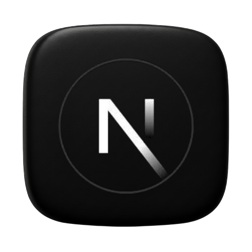
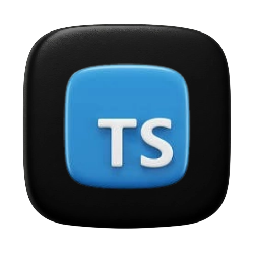
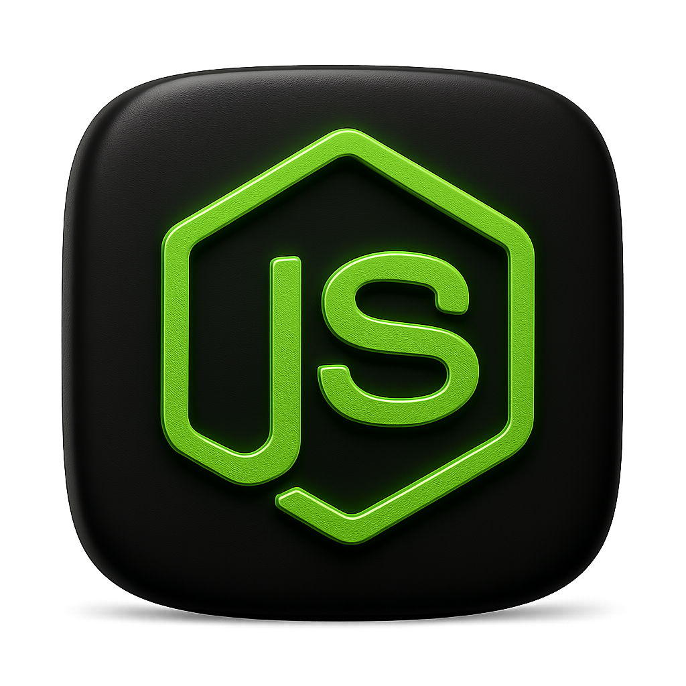

<DOCUMENT filename="README.md">

<p align="center">
  
  
  
  
  
</p>

<br>

# CS50 - Final Project: Finance Control EWD

## Introduction to Computer Science

### Final Project – Full-Stack Financial Management SaaS

### 🎥 Video Demo: https://www.youtube.com/shorts/npEfUt9KIfc

<br>

Below is the result of the completed final project:

<br>

> 🎯 Learning Objectives Applied:
>
> > - Build a `full-stack web application` integrating frontend, backend, and database
> > - Implement `user authentication` and `session management`
> > - Design and query `relational databases` with SQL through an ORM
> > - Create `responsive user interfaces` with modern web technologies
> > - Integrate `external APIs` for enhanced functionality
> > - Apply `software engineering principles` to a complete project
> > - Deploy a `production-ready application` with proper infrastructure

> Description:
>
> > - Finance Control EWD is my final project for Harvard's CS50 course. It is a comprehensive full-stack web application for financial management, designed to apply and consolidate the computer science concepts learned throughout the course.

> Project Overview
>
> > - This application serves as a Software-as-a-Service (SaaS) platform for personal and business financial tracking. Users can manage transactions, generate AI-powered financial reports, and visualize their financial data through an intuitive dashboard.

<br>

### 📋 Project Overview

|      Aspect      | Description                                                                | CS50 Concepts Applied                   |
| :--------------: | -------------------------------------------------------------------------- | --------------------------------------- |
| **Application**  | Financial Management SaaS for personal and business finance tracking       | Full-stack development, Database design |
| **Architecture** | Monolithic Next.js application with server-side rendering                  | Web programming, Server-client model    |
|   **Database**   | PostgreSQL with Prisma ORM for data persistence                            | SQL, Data modeling, CRUD operations     |
|   **Features**   | AI reports, transaction management, user authentication, responsive design | Algorithms, Security, UI/UX design      |

---

<p align="center">

</p>
<table align="center">
  <tr>
    <td>
      
    </td>
    <td>
      
    </td>
  </tr>
</table>
<table align="center">
  <tr>
    <td>
      
    </td>
    <td>
      
    </td>
  </tr>
</table>
<br>
<br>
<div align="center">

Click here to try it out .. thanks for your interest!  
( 🖱️ Ctrl + click to open in a new tab or visit [www.financecontrol-ewd.com.br](https://www.financecontrol-ewd.com.br) ).

</div>

---

### 🛠️ Technologies Used

The project was developed using:

- [x] **Frontend**:&nbsp;&nbsp;&nbsp;&nbsp;&nbsp;&nbsp;[](https://nextjs.org/)&nbsp;&nbsp;[](https://reactjs.org)&nbsp;&nbsp;[](https://tailwindcss.com/)&nbsp;&nbsp;[](https://ui.shadcn.com/)

- [x] **Backend & Database**:&nbsp;&nbsp;&nbsp;[](https://nodejs.org)&nbsp;&nbsp;[](https://zod.dev/)&nbsp;&nbsp;[](https://www.postgresql.org/)&nbsp;&nbsp;[](https://neon.tech/)&nbsp;&nbsp;[](https://www.prisma.io/)

- [x] **Authentication & Payments**:&nbsp;&nbsp;&nbsp;[](https://clerk.com/)&nbsp;&nbsp;&nbsp;&nbsp;&nbsp;[](https://stripe.com/)

- [x] **AI & Reporting**:&nbsp;&nbsp;&nbsp;&nbsp;&nbsp;&nbsp;[](https://platform.openai.com)&nbsp;&nbsp;&nbsp;&nbsp;&nbsp;&nbsp;[](https://github.com/remarkjs/react-markdown)

- [x] **Optimization & Utilities**:&nbsp;&nbsp;&nbsp; [](https://upstash.com/)&nbsp;&nbsp;[](https://www.cloudflare.com)

- [x] **Testing& Linting**:&nbsp;&nbsp;&nbsp;&nbsp;&nbsp;&nbsp;🐶[](https://typicode.github.io/husky/#/)&nbsp;&nbsp;[](https://www.npmjs.com/package/git-commit-msg-linter)&nbsp;&nbsp;[](https://www.npmjs.com/package/lint-staged)

- [x] **Hosting and Deployment**:&nbsp;&nbsp;&nbsp;&nbsp;&nbsp;&nbsp;[](https://vercel.com/)&nbsp;&nbsp;&nbsp;or&nbsp;&nbsp;&nbsp;[](https://render.com)

- [x] **Development Tools & Design**:&nbsp;&nbsp;&nbsp;&nbsp;[](https://code.visualstudio.com/)&nbsp;&nbsp;[](https://figma.com/)&nbsp;&nbsp;[](https://eraser.ai)&nbsp;&nbsp;[](https://cs50.dev/)

---

### 📂 Project Structure

```bash
project/
├── app/
│   ├── (home)/
│   │   ├── _actions/
│   │   │   ├── generate-ai-report/
│   │   │   │   ├── index.ts
│   │   │   │   └── schema.ts
│   │   │   └── get-user-plan/
│   │   │       └── index.ts
│   │   ├── _components/
│   │   │   ├── ai-report-button.tsx
│   │   │   ├── expenses-per-category.tsx
│   │   │   ├── last-transactions.tsx
│   │   │   ├── percentage-item.tsx
│   │   │   ├── summary-card.tsx
│   │   │   ├── summary-cards.tsx
│   │   │   ├── time-select.tsx
│   │   │   └── transactions-pie-chart.tsx
│   │   └── page.tsx
│   ├── _actions/
│   │   └── upsert-transaction/
│   │       ├── index.ts
│   │       └── schema.ts
│   ├── _components/
│   │   ├── ui/
│   │   │   ├── alert-dialog.tsx
│   │   │   ├── badge.tsx
│   │   │   ├── button.tsx
│   │   │   ├── calendar.tsx
│   │   │   ├── card.tsx
│   │   │   ├── chart.tsx
│   │   │   ├── data-table.tsx
│   │   │   ├── date-picker.tsx
│   │   │   ├── dialog.tsx
│   │   │   ├── form.tsx
│   │   │   ├── input.tsx
│   │   │   ├── label.tsx
│   │   │   ├── popover.tsx
│   │   │   ├── progress.tsx
│   │   │   ├── scroll-area.tsx
│   │   │   ├── select.tsx
│   │   │   ├── sonner.tsx
│   │   │   ├── spinner.tsx
│   │   │   ├── table.tsx
│   │   │   └── tooltip.tsx
│   │   ├── add-transaction-button.tsx
│   │   ├── footer.tsx
│   │   ├── idle-timeout-wrapper.tsx
│   │   ├── money-input.tsx
│   │   ├── navbar.tsx
│   │   └── upsert-transaction-dialog.tsx
│   ├── _constants/
│   │   └── transactions.ts
│   ├── _data/
│   │   ├── can-user-add-transaction/
│   │   │   └── index.ts
│   │   ├── can-user-view-history/
│   │   │   └── index.ts
│   │   ├── get-current-month-transactions/
│   │   │   └── index.ts
│   │   └── get-dashboard/
│   │       ├── index.ts
│   │       └── types.ts
│   ├── _hooks/
│   │   └── useIdleTimeout.ts
│   ├── _lib/
│   │   ├── prisma.ts
│   │   └── utils.ts
│   ├── _utils/
│   │   ├── currency.ts
│   │   └── metadata.ts
│   ├── api/
│   │   └── webhooks/
│   │       └── stripe/
│   │           └── route.ts
│   ├── cancellation/
│   │   └── page.tsx
│   ├── confirmation/
│   │   └── page.tsx
│   ├── fonts/
│   ├── login/
│   │   └── page.tsx
│   ├── subscription/
│   │   ├── _actions/
│   │   │   └── create-stripe-checkout/
│   │   │       └── index.ts
│   │   ├── _components/
│   │   │   ├── acquire-plan-button.tsx
│   │   │   └── subscription-plans.tsx
│   │   └── page.tsx
│   ├── transactions/
│   │   ├── _columns/
│   │   │   └── index.tsx
│   │   ├── _components/
│   │   │   ├── delete-transaction-button.tsx
│   │   │   ├── edit-transaction-button.tsx
│   │   │   └── type-badge.tsx
│   │   ├── actions/
│   │   │   └── delete-transaction/
│   │   │       ├── index.ts
│   │   │       └── schema.ts
│   │   └── page.tsx
│   ├── favicon.ico
│   ├── globals.css
│   └── layout.tsx
├── prisma/
│   ├── migrations/
│   └── schema.prisma
├── public/
│   ├── github/
├── .env.example
├── .eslintrc.json
├── .gitignore
├── .prettierrc.json
├── LICENSE
├── README.md
├── components.json
├── lintstagedrc.json
├── middleware.ts
├── next.config.mjs
├── package-lock.json
├── package.json
├── postcss.config.mjs
├── tailwind.config.ts
└── tsconfig.json
```

---

### 🧩 Key Features

- **Transaction Management**: Full CRUD operations for financial transactions with categorization
- **AI-Powered Reporting**: Integration with OpenAI API to generate insightful financial analysis
- **User Authentication**: Secure login and session management
- **Responsive Design**: Mobile-friendly interface across all devices
- **Real-time Dashboard**: Visual charts and progress indicators for financial overview
- **Database Integration**: PostgreSQL database with Prisma ORM for data persistence

---

### 🔍 Detailed Implementation

📍 &nbsp; **Backend & Database**

- Database: PostgreSQL hosted on Neon with Prisma ORM
- CS50 Connection: Applies database concepts to production environment
- Schema: Includes tables for users, transactions, categories, and reports

📍 &nbsp; **Frontend & User Interface**

- Framework: Next.js and React with server-side rendering
- Styling: Tailwind CSS for utility-first design
- Responsive Design: Mobile-first approach across all devices

📍 &nbsp; **API Integration**

- OpenAI API: AI-generated financial insights and reports
- Payment APIs: Subscription management and payment processing
- Authentication: Secure user management services

---

### ⚙️ Setup and Execution

- [ ] &nbsp;&nbsp;&nbsp;Prerequisites :

✔️ - Node.js (version >= 16).

✔️ - PostgreSQL database (or Neon account).

✔️ - Modern web browser.

#### Installation

```bash
# Clone the repository
git clone https://github.com/ed-radanovis/Financial_Management_SaaS_Finance-Control-EWD.git

# Navigate to project directory
cd Financial_Management_SaaS_Finance-Control-EWD

# Install dependencies
npm install

# Set up environment variables
cp .env.example .env
# Edit .env with your credentials

# Run database migrations
npx prisma migrate dev

# Start development server
npm run dev
```

---

### 🔬 Validation and Testing

The application has been thoroughly tested for:

- **Functionality**: All features work as intended across different user scenarios
- **Security**: User data protection and secure authentication
- **Performance**: Efficient loading and response times
- **Usability**: Intuitive interface and clear user feedback
- **Compatibility**: Cross-browser and cross-device functionality

---

### 🧠 Skills Developed

> Through this project, I applied and expanded upon the following CS50-taught skills:

<br>

🧩 **Programming & Algorithm Design**

- Implementing complex business logic for financial calculations
- Designing efficient algorithms for data processing and reporting
- Applying computational thinking to real-world problems

<br>

🧩 **Web Development**

- Building responsive user interfaces with modern frameworks
- Implementing client-server communication patterns
- Creating RESTful API endpoints for data exchange

<br>

🧩 **Database Management**

- Designing relational database schemas
- Writing optimized SQL queries through an ORM
- Implementing data validation and integrity checks

<br>

🧩 **Software Engineering**

- Applying version control with Git
- Writing maintainable, documented code
- Implementing testing and debugging strategies
- Deploying applications to production environments

---

### 📜 Academic Context

This project applies CS50 concepts:

1. **C Programming**: Foundational logic and algorithms
2. **Python**: Higher-level programming and web development
3. **SQL & Databases**: Data modeling and query optimization
4. **Web Programming**: HTML, CSS, JavaScript, full-stack development
5. **Flask Framework**: Web frameworks and server-client architecture

> [!IMPORTANT]
> This project follows CS50's academic integrity policies and represents my original work for the final project requirement. All code has been developed to demonstrate the skills and concepts learned throughout the course.

---

### 📝 Reflection

Building Finance Control EWD allowed me to apply CS50's theoretical concepts to a practical, real-world application. The project challenged me to integrate multiple technologies, design scalable architecture, and create a user-friendly product. This experience has solidified my understanding of full-stack development and prepared me for more complex software engineering challenges.

---

<h4 align="center">👤 Developed by</h4>

<table align="center">
  <tr>
    <td align="center">
      <a href="https://www.linkedin.com/in/edmar-radanovis/">
        <br>
        <sub><b>Edmar Radanovis</b></sub><br>
        <sub>Full Stack Developer &nbsp;&</sub><br>
        <sub>Bachelor's degree candidate in</sub><br>
        <sub>Software Engineering</sub>
      </a>
    </td>
    <td align="center">
      <a href="https://edwebdev.vercel.app/">
        <br>
        <sub><b>Ed Web Dev</b></sub><br>
      </a>
    </td>
  </tr>
</table>

<br>
<br>

[⬆ Back to top](#cs50---final-project-finance-control-ewd)

</DOCUMENT>
