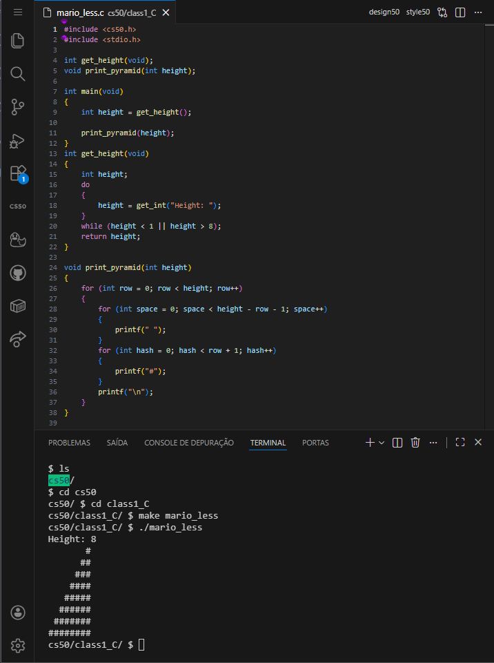
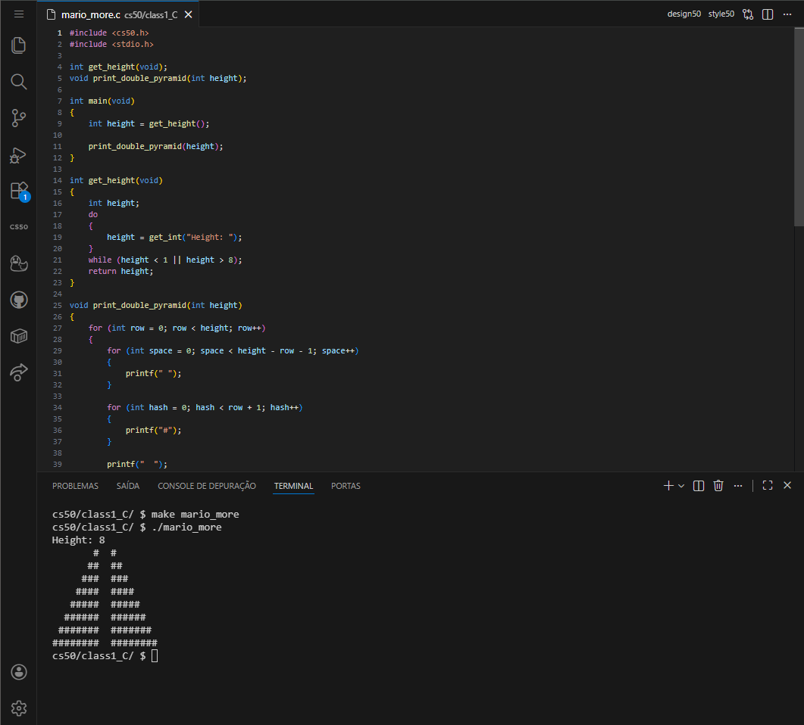
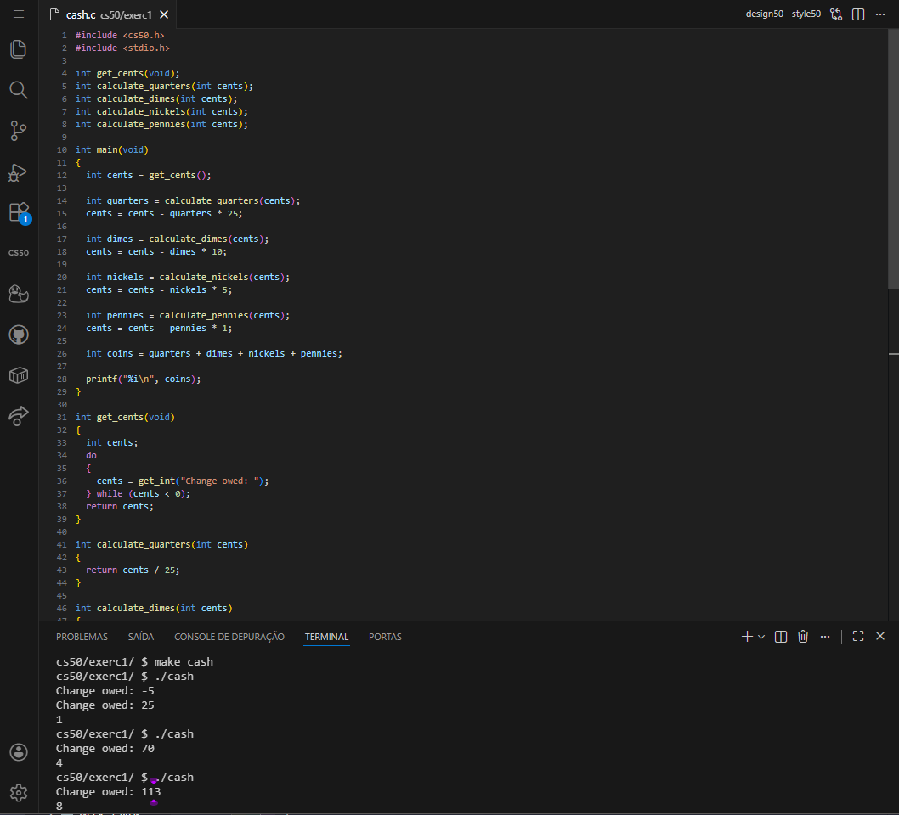
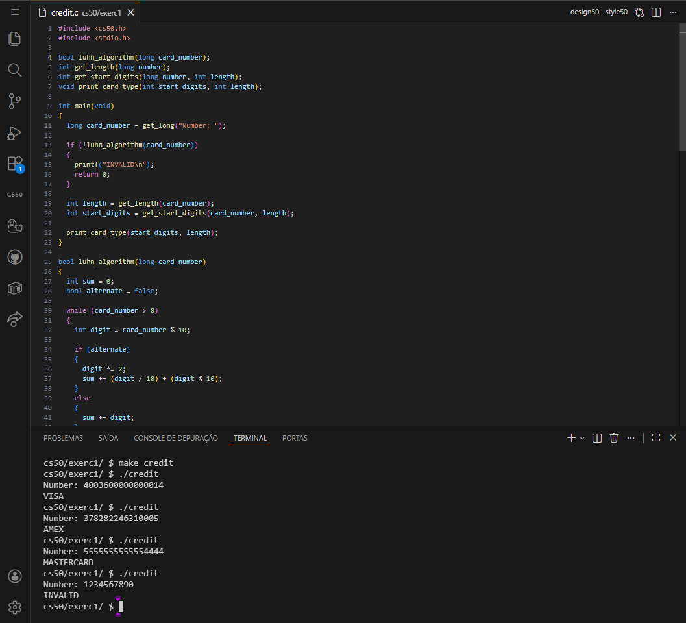
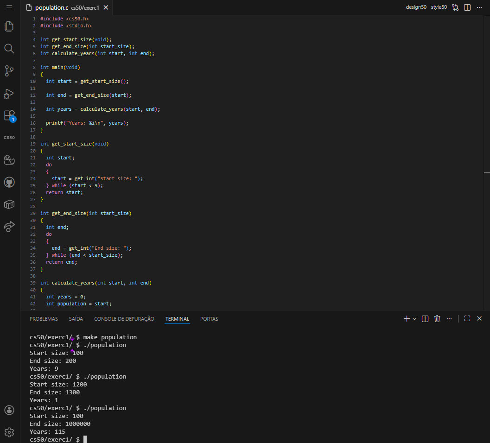
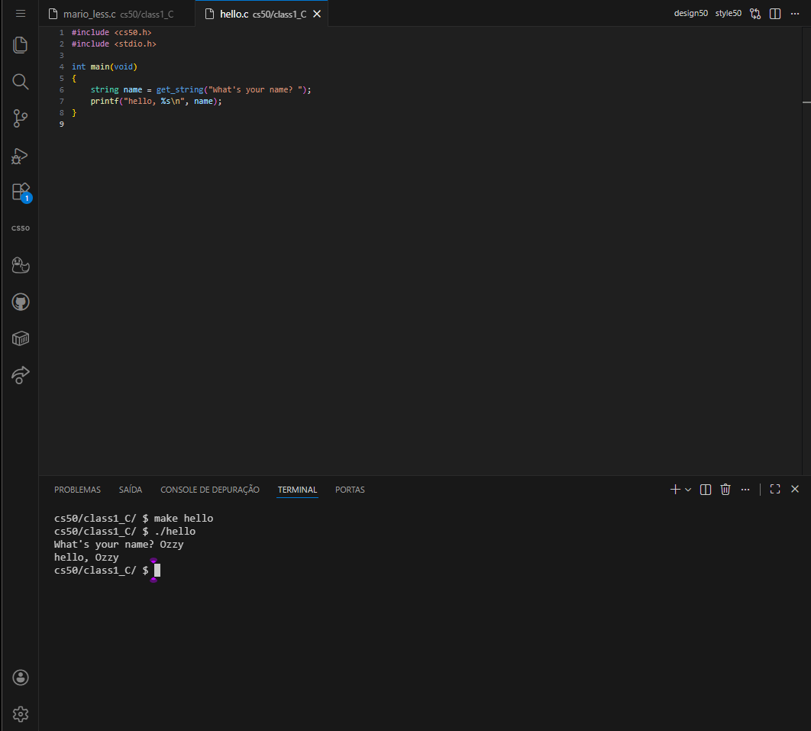

<DOCUMENT filename="README.md">

<p align="center">
  
</p>

<br>

# CS50 - Class 1: C Programming Activities

## Introduction to Computer Science

### Week 1 – C Programming Fundamentals

Taught by **Dr. David J. Malan, Ph.D.**

<br>

Below are the results of the completed activities:

<br>

> 🎯 Learning Objectives :
>
> > - Transition from `visual programming (Scratch)` to `text-based programming`**[(C)](https://en.cppreference.com/)**.
> > - Understand `data types`, `variables`, `conditionals`, and `loops` in **[C](https://en.cppreference.com/)**.
> > - Implement `algorithms` for problem-solving using **[C](https://en.cppreference.com/)** syntax.
> > - Develop `debugging skills` and `code validation` techniques.
> > - Apply `computational thinking` to practical programming challenges.

<br>

### 📋 Activities Overview

|    Activity    | Description                           | Key Concepts                        | Status |
| :------------: | ------------------------------------- | ----------------------------------- | :----: |
| **Mario Less** | Print right-aligned pyramid of hashes | Loops, Conditionals, User Input     |   ✔    |
| **Mario More** | Print double pyramid with gap         | Nested Loops, Pattern Design        |   ✔    |
|    **Cash**    | Calculate minimum coins for change    | Greedy Algorithms, Integer Math     |   ✔    |
|   **Credit**   | Validate credit card numbers          | Luhn Algorithm, String Manipulation |   ✔    |
| **Population** | Calculate population growth years     | While Loops, Validation, Math       |   ✔    |

---

<table align="center">
  <tr>
    <td align="center">
      <a href="../materials/images/result_activity_1.png">
        
      </a>
      <br>
      <sub><b>Mario Less</b></sub>
      <br>
      <br>
      <a href="../materials/images/result_activity_2.png">
        
      </a>
      <br>
      <sub><b>Mario More</b></sub>
    </td>
    <td align="center">
      <a href="../materials/images/result_activity_3.png">
        
      </a>
      <br>
      <sub><b>Cash</b></sub>
      <br>
      <br>
      <a href="../materials/images/result_activity_4.png">
        
      </a>
      <br>
      <sub><b>Credit</b></sub>
    </td>
    <td align="center">
      <a href="../materials/images/result_activity_5.png">
        
      </a>
      <br>
      <sub><b>Population</b></sub>
      <br>
      <br>
      <a href="../materials/images/result_activity_0.png">
        
      </a>
      <br>
      <sub><b>Hello</b></sub>
    </td>
  </tr>  
</table>

---

### 📚 Prerequisites

- [ ] Before starting these activities, you should have basic knowledge in:

- **C Programming Basics:** Syntax, `main()` function, `#include` directives.
- **CS50 Environment:** Familiarity with `cs50.dev` VS Code interface.
- **Compilation Process:** Understanding of `make` and `./` execution
- **Scratch Fundamentals:** Experience from Week 0 (functions, loops, variables).
- **Basic Algorithms:** Step-by-step problem solving approach.

---

### 🛠️ Technologies Used

All activities were developed using:

[](https://en.cppreference.com/w/c/language)&nbsp;&nbsp;&nbsp;&nbsp;&nbsp;&nbsp;[](https://cs50.readthedocs.io/library/c/)&nbsp;&nbsp;&nbsp;&nbsp;&nbsp;&nbsp;[](https://code.visualstudio.com/)&nbsp;&nbsp;&nbsp;&nbsp;&nbsp;&nbsp;[](https://gcc.gnu.org/)

---

### 📂 Activity Structure

```bash
week_1_C
├── exercises/
│   ├── scripts_and_corrections/
│   ├── src/
│   │   ├── 0helloitsme.c
│   │   ├── 1mario_less.c
│   │   ├── 2mario_more.c
│   │   ├── 3cash.c
│   │   ├── 4credit.c
│   │   └── 5population.c
│   └── README.md                         # This file
└── materials/
    ├── images/
    ├── src/
    └── CS50_class_1_C.pdf
```

---

### 🔍 Activities Details

<br>

📍 &nbsp;**1. Mario Less**

- Objective: Print a right-aligned pyramid of hashes based on user input (1-8).

```c
// Key implementation
for (int row = 0; row < height; row++)
{
    for (int space = 0; space < height - row - 1; space++)
        printf(" ");
    for (int hash = 0; hash < row + 1; hash++)
        printf("#");
    printf("\n");
}
```

<br>

📍 &nbsp;**2. Mario More**

- Objective: Print double pyramids with a 2-space gap.

```c
// Key implementation
printf("  "); // Gap between pyramids
```

<br>

📍 &nbsp;**3. Cash**

- Objective: Calculate minimum coins using greedy algorithm (25¢, 10¢, 5¢, 1¢).

```c
// Key implementation
coins += cents / 25; cents %= 25;  // Quarters
coins += cents / 10; cents %= 10;  // Dimes
coins += cents / 5;  cents %= 5;   // Nickels
coins += cents;                    // Pennies
```

<br>

📍 &nbsp;**4. Credit**

- Objective: Validate credit card numbers using Luhn's Algorithm.

```c
// Key implementation - Luhn Algorithm
if (alternate)
{
    digit *= 2;
    sum += (digit / 10) + (digit % 10);
}
```

<br>

📍 &nbsp;**5. Population**

- Objective: Calculate years for llama population growth.

```c
// Key implementation
while (population < end_size)
{
    population += (population / 3) - (population / 4);
    years++;
}
```

---

### ⚙️ Setup and Execution

- [ ] &nbsp;&nbsp;&nbsp;Prerequisites :

✔️ - CS50 VS Code environment at `cs50.dev`.

✔️ - Basic understanding of C syntax and compilation.

<br>

- [x] &nbsp;&nbsp;&nbsp;Workflow for each activity :

```bash
# 1. Navigate to activity directory
$ cd week_1_C/exercises/mario_less/

# 2. Compile the program
$ make mario_less

# 3. Execute the program
$ ./mario_less
Height: 4
   #
  ##
 ###
####

# 4. Test with CS50 tools
$ style50 mario.c
$ check50 cs50/problems/2025/x/mario/less
$ submit50 cs50/problems/2025/x/mario/less
```

---

### 🔬 Validation Tests

✔️ - Mario Less & More :

- [x] &nbsp;&nbsp;&nbsp;Validates input (1-8, rejects invalid).
- [x] &nbsp;&nbsp;&nbsp;Prints correct pyramid patterns.
- [x] &nbsp;&nbsp;&nbsp;Right-aligned formatting.

<br>

✔️ - Cash :

- [x] &nbsp;&nbsp;&nbsp;Implements greedy algorithm correctly.
- [x] &nbsp;&nbsp;&nbsp;Handles edge cases (0, negative values).
- [x] &nbsp;&nbsp;&nbsp;Calculates minimum coins accurately.

<br>

✔️ - Credit :

- [x] &nbsp;&nbsp;&nbsp;Validates card numbers with Luhn Algorithm.
- [x] &nbsp;&nbsp;&nbsp;Identifies AMEX, MasterCard, Visa correctly.
- [x] &nbsp;&nbsp;&nbsp;Rejects invalid numbers.

<br>

✔️ - Population :

- [x] &nbsp;&nbsp;&nbsp;Validates start size (≥9) and end size (≥ start).
- [x] &nbsp;&nbsp;&nbsp;Calculates growth years accurately.
- [x] &nbsp;&nbsp;&nbsp;Handles integer truncation correctly.

---

### 🧠 Skills Developed

> By completing this activities, you will have acquired the following skills and sub-skills:

🧩 - C Programming Fundamentals :

- Syntax and structure of C programs.
- Data types (`int`, `float`, `long`, `bool`, `char`).
- Control structures (`if`, `else`, `while`, `for`).
- Function declaration and prototyping.

<br>

🧩 - Algorithm Implementation :

- Pattern generation with nested loops.
- _Greedy_ algorithm design.
- _Luhn_ algorithm for validation.
- Mathematical calculations with integers.

<br>

🧩 - Problem-Solving Skills :

- Breaking complex problems into smaller steps.
- Input validation and error handling.
- Testing and debugging techniques.
- Optimization and efficiency considerations.

<br>

🧩 - CS50 Specific Skills :

- Using CS50 library functions (`get_int()` , `get_long()`).
- Working with `check50` for automated testing.
- Following CS50 style guidelines with `style50`.
- Proper submission with `submit50`.

---

### 📜 Academic Context

These activities are part of Harvard University's CS50: Introduction to Computer Science course. They represent fundamental programming concepts taught in Week 1, transitioning students from visual programming (Scratch) to text-based programming (C).

> [!IMPORTANT]
> The code follows CS50's academic integrity policies and is intended for educational purposes. Each activity builds upon previous concepts, creating a comprehensive learning progression in C programming fundamentals.

---

<h4 align="center">
  👤 Developed by 
<h4/>
<br>

<table align="center">
  <tr>
    <td align="center">
      <a href="https://www.linkedin.com/in/edmar-radanovis/">
        <br>
        <sub><b>Edmar Radanovis</b></sub><br>
        <sub>Full Stack Developer &nbsp;&</sub><br>
        <sub>Bachelor's degree candidate in</sub><br>
        <sub>Software Engineering</sub>
      </a>
    </td>
    <td align="center">
      <a href="https://edwebdev.vercel.app/">
        <br>
        <sub><b>Ed Web Dev</b></sub><br>
      </a>
    </td>
  </tr>
</table>

<br>
<br>

[⬆ Back to top](#cs50---class-1-c-programming-activities)

</DOCUMENT>
