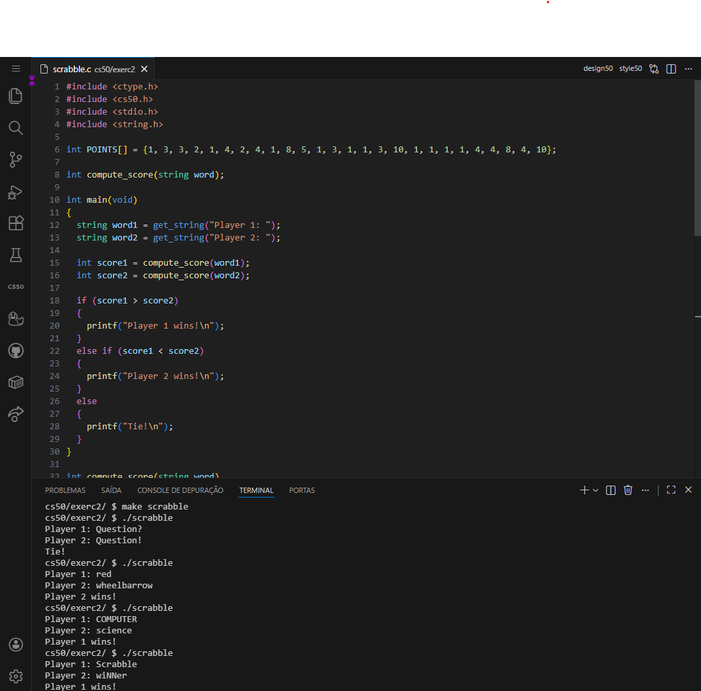
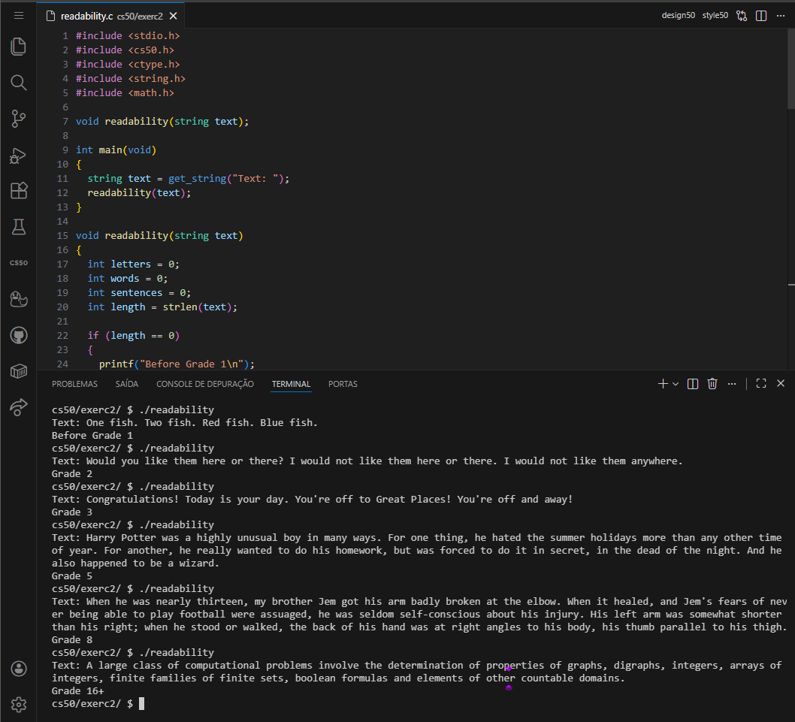
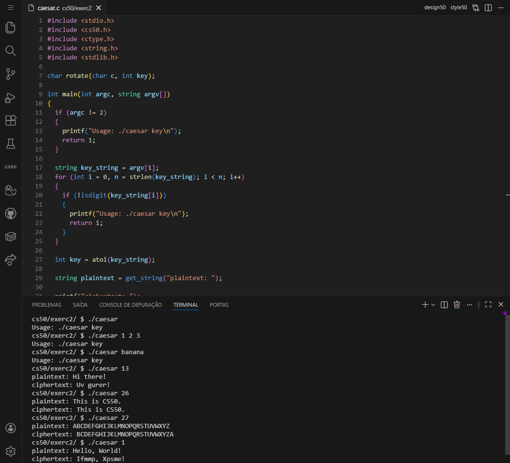
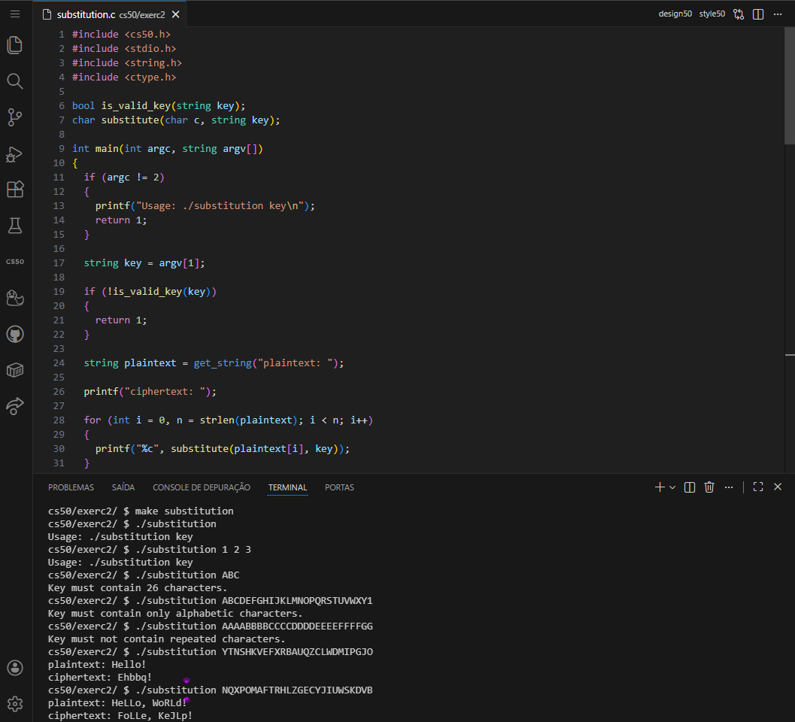

<DOCUMENT filename="README.md">

<p align="center">
  
</p>

<br>

# CS50 - Class 2: Arrays and Strings Activities

## Introduction to Computer Science

### Week 2 – Arrays, Strings, and Cryptography

Taught by **Dr. David J. Malan, Ph.D.**

<br>

Below are the results of the completed activities:

<br>

> 🎯 Learning Objectives :
>
> > - Master `arrays` and `string manipulation` in **[C](https://en.cppreference.com/)**.
> > - Implement `cryptographic algorithms` (Caesar and Substitution ciphers).
> > - Develop `text analysis tools` using the _Coleman-Liau_ index.
> > - Understand `command-line arguments` and `program validation`.
> > - Apply `algorithmic thinking` to real-world problems like readability scoring and word games.

<br>

### 📋 Activities Overview

|     Activity     | Description                                            | Key Concepts                                                  | Status |
| :--------------: | ------------------------------------------------------ | ------------------------------------------------------------- | :----: |
|   **Scrabble**   | Calculate word scores and determine winner             | Arrays, Character mapping, Point systems                      |   ✔    |
| **Readability**  | Calculate reading grade level using Coleman-Liau index | String analysis, Formulas, Math                               |   ✔    |
|    **Caesar**    | Implement Caesar cipher for text encryption            | Cryptography, Character rotation, Modulo arithmetic           |   ✔    |
| **Substitution** | Implement substitution cipher with custom key          | Advanced cryptography, Key validation, Character substitution |   ✔    |

---

<table align="center">
  <tr>
    <td align="center">
      <a href="../materials/images/result_activity_0.png">
        
      </a>
      <br>
      <sub><b>Scrabble</b></sub>
      <br>
      <br>
      <a href="../materials/images/result_activity_1.png">
        
      </a>
      <br>
      <sub><b>Readability</b></sub>
    </td>
    <td align="center">
      <a href="../materials/images/result_activity_2.png">
        
      </a>
      <br>
      <sub><b>Caesar</b></sub>
      <br>
      <br>
      <a href="../materials/images/result_activity_3.png">
        
      </a>
      <br>
      <sub><b>Substitution</b></sub>
    </td>
  </tr>  
</table>

---

### 📚 Prerequisites

- [ ] Before starting these activities, you should have basic knowledge in:

- **C Programming Fundamentals:** Variables, loops, conditionals from Week 1.
- **Arrays and Strings:** Basic understanding of character arrays and string manipulation.
- **Functions:** Declaration, prototyping, and parameter passing
- **CS50 Environment:** Familiarity with `cs50.dev`, `make`, and command-line execution.
- **Basic Algorithms:** Problem decomposition and stepwise refinement.

---

### 🛠️ Technologies Used

All activities were developed using:

[](https://en.cppreference.com/w/c/language)&nbsp;&nbsp;&nbsp;&nbsp;&nbsp;&nbsp;[](https://cs50.readthedocs.io/library/c/)&nbsp;&nbsp;&nbsp;&nbsp;&nbsp;&nbsp;[](https://code.visualstudio.com/)&nbsp;&nbsp;&nbsp;&nbsp;&nbsp;&nbsp;[](https://gcc.gnu.org/)

---

### 📂 Activity Structure

```bash
week_2_Arrays/
├── exercises/
│   ├── scripts_and_corrections/
│   ├── src/
│   │   ├── 0scrabble.c
│   │   ├── 1readability.c
│   │   ├── 2caesar.c
│   │   └── 3substitution.c
│   └── README.md                        # This file
└── materials/
    ├── images/
    ├── src/
    ├── CS50_class_2_arrays.pdf
    └── CS50_class_2_decimal_ASCII_chart.pdf
```

---

### 🔍 Activities Details

<br>

📍 &nbsp;**0. Scrabble**

- Objective: Calculate word scores based on letter values and determine the winner between two players.

```c
// Key implementation - Score calculation using arrays
if (isupper(word[i])) {
    score += POINTS[word[i] - 'A'];
}
else if (islower(word[i])) {
    score += POINTS[word[i] - 'a'];
}
```

<br>

📍 &nbsp;**1. Readability**

- Objective: Calculate the approximate grade level needed to comprehend a text using the Coleman-Liau index.

```c
// Key implementation - Coleman-Liau formula
float L = (letters / (float)words) * 100;
float S = (sentences / (float)words) * 100;
int index = round(0.0588 * L - 0.296 * S - 15.8);
```

<br>

📍 &nbsp;**2. Caesar**

- Objective: Implement Caesar cipher encryption with command-line key validation.

```c
// Key implementation - Character rotation with wrap-around
if (isupper(c)) {
    return ((c - 'A' + key) % 26) + 'A';
}
else if (islower(c)) {
    return ((c - 'a' + key) % 26) + 'a';
}
```

<br>

📍 &nbsp;**3. Substitution**

- Objective: Implement substitution cipher with 26-character key validation and case preservation.

```c
// Key implementation - Luhn Algorithm
if (alternate)
{
    digit *= 2;
    sum += (digit / 10) + (digit % 10);
}
```

---

### ⚙️ Setup and Execution

- [ ] &nbsp;&nbsp;&nbsp;Prerequisites :

✔️ - CS50 VS Code environment at `cs50.dev`.

✔️ - Understanding of arrays, strings, and functions in C.

<br>

- [x] &nbsp;&nbsp;&nbsp;Workflow for each activity :

```bash
# 1. Navigate to activity directory
$ cd week_2_Arrays/exercises/readability/

# 2. Compile the program
$ make readability

# 3. Execute the program
$ ./readability
Text: When he was nearly thirteen, my brother Jem got his arm badly broken at the elbow.
Grade 8

# 4. Test with CS50 tools
$ style50 readability.c
$ check50 cs50/problems/2025/x/readability
$ submit50 cs50/problems/2025/x/readability
```

---

### 🔬 Validation Tests

✔️ - Scrabble :

- [x] &nbsp;&nbsp;&nbsp;Calculates word scores based on letter values.
- [x] &nbsp;&nbsp;&nbsp;Handles uppercase and lowercase letters.
- [x] &nbsp;&nbsp;&nbsp;Correctly determines winner or tie.

<br>

✔️ - Readability :

- [x] &nbsp;&nbsp;&nbsp;Correctly counts letters, words, and sentences.
- [x] &nbsp;&nbsp;&nbsp;Applies Coleman-Liau formula accurately.
- [x] &nbsp;&nbsp;&nbsp;Outputs proper grade levels (Before Grade 1 to Grade 16+).

<br>

✔️ - Caesar :

- [x] &nbsp;&nbsp;&nbsp;Validates command-line arguments and key format.
- [x] &nbsp;&nbsp;&nbsp;Correctly rotates characters with wrap-around.
- [x] &nbsp;&nbsp;&nbsp;Preserves case and non-alphabetic characters.

<br>

✔️ - Substitution :

- [x] &nbsp;&nbsp;&nbsp;Validates 26-character key (unique alphabetic characters).
- [x] &nbsp;&nbsp;&nbsp;Implements case-insensitive substitution.
- [x] &nbsp;&nbsp;&nbsp;Preserves case and non-alphabetic characters.

---

### 🧠 Skills Developed

> By completing this activities, you will have acquired the following skills and sub-skills:

🧩 - String and Array Manipulation :

- Character-by-character string processing.
- Array indexing and element access.
- ASCII character arithmetic and conversion.
- Multi-dimensional arrays for complex data.

<br>

🧩 - Cryptographic Algorithms :

- Caesar cipher implementation with modular arithmetic.
- Substitution cipher with key validation.
- Character mapping and transformation.
- Case preservation in cryptographic operations.

<br>

🧩 - Text Analysis and Processing :

- Statistical text analysis (letter, word, sentence counts).
- Implementation of readability formulas.
- Input validation and error handling.
- Mathematical computations with floating-point precision.

<br>

🧩 - Program Design and Validation :

- Command-line argument processing.
- Complex input validation (keys, text formats).
- Modular program design with helper functions.
- Comprehensive testing with edge cases.

---

### 📜 Academic Context

These activities are part of Harvard University's CS50: Introduction to Computer Science course. They represent essential concepts in data structures and algorithms taught in Week 2, focusing on arrays, strings, and their applications in cryptography and text analysis.

> [!IMPORTANT]
> The code follows CS50's academic integrity policies and demonstrates practical applications of array manipulation, string processing, and algorithmic problem-solving in C programming.

---

<h4 align="center">
  👤 Developed by 
<h4/>
<br>

<table align="center">
  <tr>
    <td align="center">
      <a href="https://www.linkedin.com/in/edmar-radanovis/">
        <br>
        <sub><b>Edmar Radanovis</b></sub><br>
        <sub>Full Stack Developer &nbsp;&</sub><br>
        <sub>Bachelor's degree candidate in</sub><br>
        <sub>Software Engineering</sub>
      </a>
    </td>
    <td align="center">
      <a href="https://edwebdev.vercel.app/">
        <br>
        <sub><b>Ed Web Dev</b></sub><br>
      </a>
    </td>
  </tr>
</table>

<br>
<br>

[⬆ Back to top](#cs50---class-2-arrays-and-strings-activities)

</DOCUMENT>
