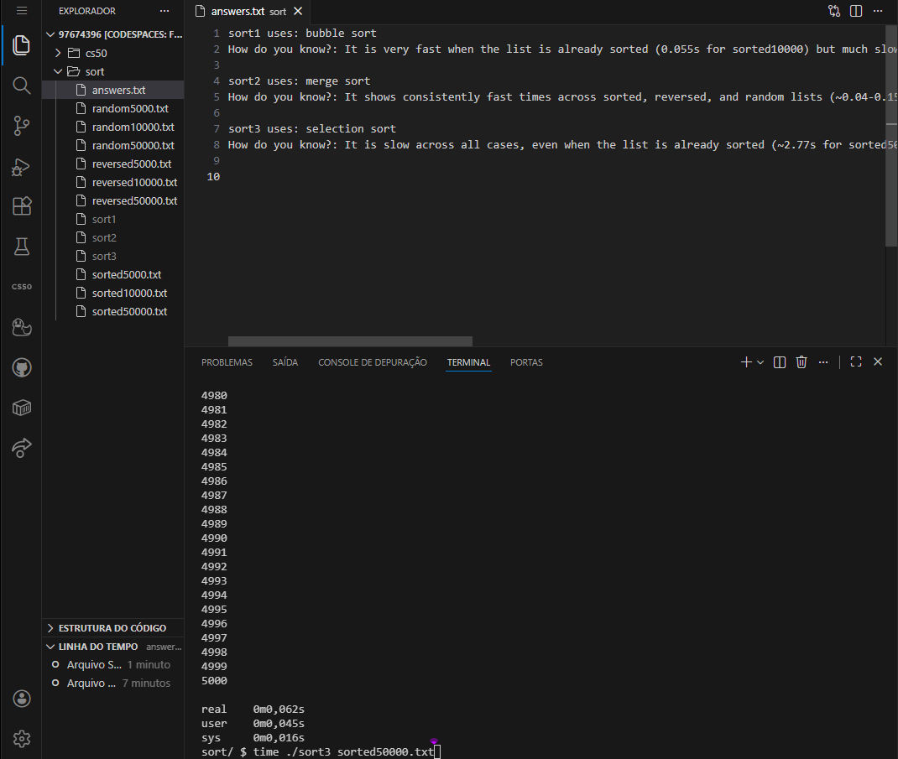
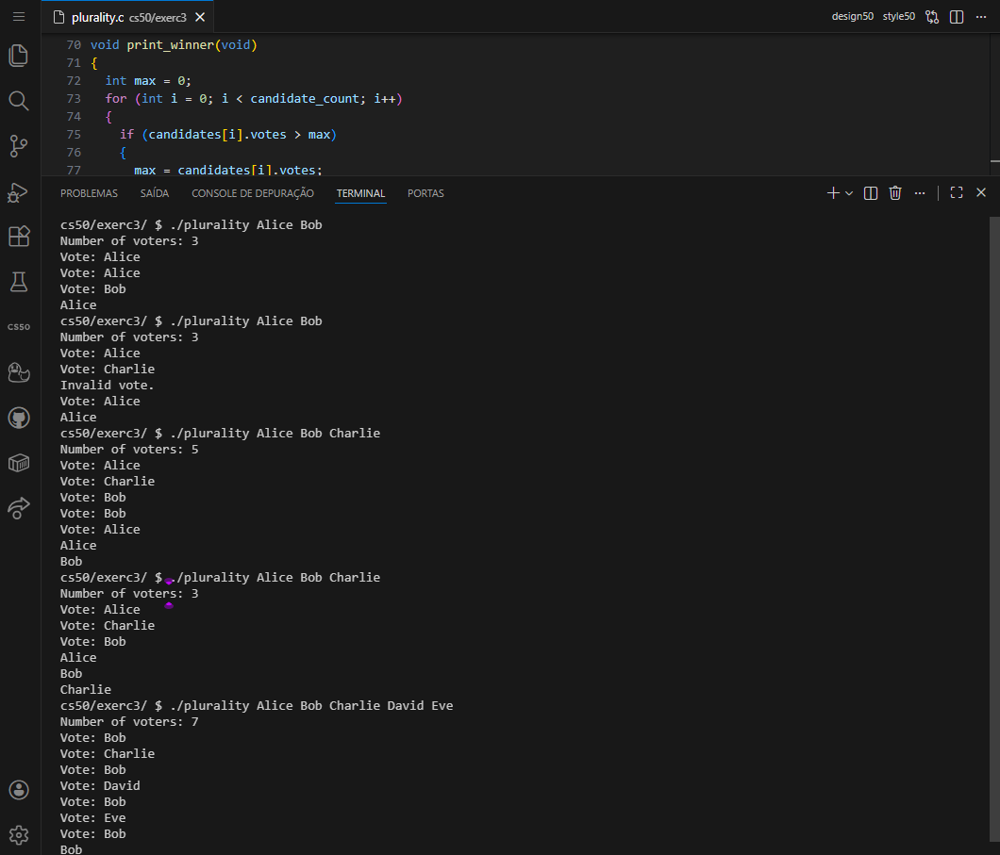
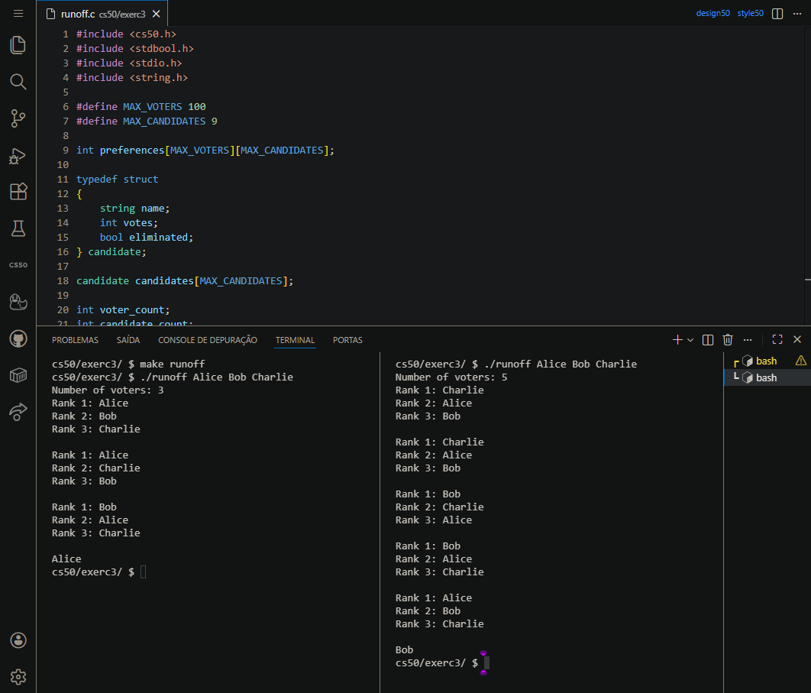
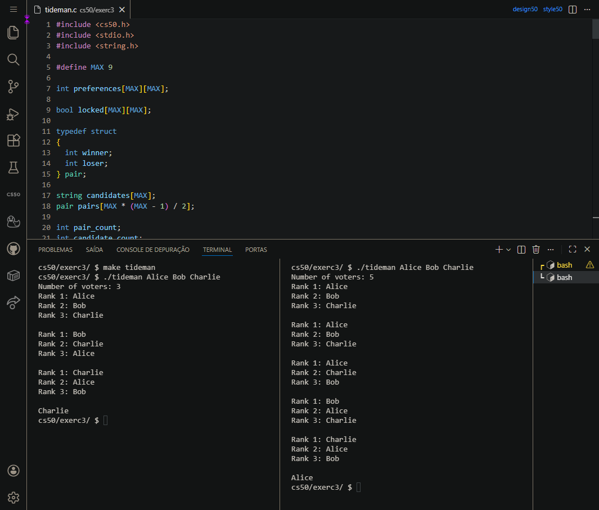

<DOCUMENT filename="README.md">

<p align="center">
  
</p>

<br>

# CS50 - Class 3: Algorithms and Voting Systems

## Introduction to Computer Science

### Week 3 – Algorithm Design and Implementation

Taught by **Dr. David J. Malan, Ph.D.**

<br>

Below are the results of the completed activities:

<br>

> 🎯 Learning Objectives :
>
> > - Understand `algorithm efficiency` using `Big O notation`.
> > - Implement `search algorithms` (linear and binary search).
> > - Analyze and implement `sorting algorithms` (selection, bubble, merge).
> > - Apply `recursive thinking` to problem-solving.
> > - Simulate `complex voting systems` with preference-based algorithms.
> > - Develop `graph-based algorithms` for social choice theory.

<br>

### 📋 Activities Overview

|   Activity    | Description                             | Key Concepts                      | Status |
| :-----------: | --------------------------------------- | --------------------------------- | :----: |
|   **Sort**    | Analyze and identify sorting algorithms | Big O, Algorithm Analysis         |   ✔    |
| **Plurality** | Implement simple majority voting        | Arrays, Structs, Basic Algorithms |   ✔    |
|  **Runoff**   | Simulate instant-runoff voting          | Preference Ranking, Elimination   |   ✔    |
|  **Tideman**  | Implement ranked-pairs voting system    | Graph Theory, Cycle Detection     |   ✔    |

---

<table align="center">
  <tr>
    <td align="center">
      <a href="../materials/images/result_activity_0.png">
        
      </a>
      <br>
      <sub><b>Sorted</b></sub>
      <br>
      <br>
      <a href="../materials/images/result_activity_1.png">
        
      </a>
      <br>
      <sub><b>Plurality</b></sub>
    </td>
    <td align="center">
      <a href="../materials/images/result_activity_2.png">
        
      </a>
      <br>
      <sub><b>Runoff</b></sub>
      <br>
      <br>
      <a href="../materials/images/result_activity_3.png">
        
      </a>
      <br>
      <sub><b>Tideman</b></sub>
    </td>
  </tr>  
</table>

---

### 📚 Prerequisites

- [ ] Before starting these activities, you should have basic knowledge in:

- **C Programming:** Arrays, structs, functions, and control structures.
- **CS50 Library:** Familiarity with `get_int()`, `get_string()`, and `printf()`.
- **Algorithm Concepts:** Basic understanding of time complexity and efficiency.
- **Compilation Process:** Using `make` and executing programs with `./`.
- **Week 1 & 2 Fundamentals:** Variables, loops, conditionals, and functions.

---

### 🛠️ Technologies Used

All activities were developed using:

[](https://en.cppreference.com/w/c/language)&nbsp;&nbsp;&nbsp;&nbsp;&nbsp;&nbsp;[](https://cs50.readthedocs.io/library/c/)&nbsp;&nbsp;&nbsp;&nbsp;&nbsp;&nbsp;[](https://code.visualstudio.com/)&nbsp;&nbsp;&nbsp;&nbsp;&nbsp;&nbsp;[](https://gcc.gnu.org/)

---

### 📂 Activity Structure

```bash
week_3_algorithms/
├── exercises/
│   ├── scripts_and_corrections/
│   ├── src/
│   │   ├── sort/
│   │   ├── 1plurality.c
│   │   ├── 2runoff.c
│   │   └── 3tideman.c
│   └── README.md                        # This file
└── materials/
    ├── images/
    ├── src/
    └── CS50_class_3_algorithms.pdf
```

---

### 🔍 Activities Details

<br>

📍 &nbsp;**0. Sort - Algorithm Analysis**

- Objective: Analyze compiled sorting programs to identify which algorithm (selection, bubble, or merge sort) each implements.

```bash
# Testing approach
$ time ./sort1 reversed10000.txt
$ time ./sort2 random50000.txt
$ time ./sort3 sorted50000.txt
```

<br>

📍 &nbsp;**1. Plurality - Simple Majority Voting**

- Objective: Implement a plurality voting system where each voter votes for one candidate.

```c
// Key implementation - vote function
bool vote(string name)
{
    for (int i = 0; i < candidate_count; i++)
    {
        if (strcmp(candidates[i].name, name) == 0)
        {
            candidates[i].votes++;
            return true;
        }
    }
    return false;
}
```

<br>

📍 &nbsp;**2. Runoff - Instant-Runoff Voting**

- Objective: Simulate ranked-choice voting with elimination rounds.

```c
// Key implementation - tabulate function
void tabulate(void)
{
    for (int i = 0; i < voter_count; i++)
    {
        for (int j = 0; j < candidate_count; j++)
        {
            int candidate_idx = preferences[i][j];
            if (!candidates[candidate_idx].eliminated)
            {
                candidates[candidate_idx].votes++;
                break;
            }
        }
    }
}
```

<br>

📍 &nbsp;**3. Tideman - Ranked-Pairs Voting**

- Objective: Implement the Tideman (ranked-pairs) voting method using graph theory.

```c
// Key implementation - lock_pairs function
void lock_pairs(void)
{
    for (int i = 0; i < pair_count; i++)
    {
        if (!creates_cycle(pairs[i].winner, pairs[i].loser))
        {
            locked[pairs[i].winner][pairs[i].loser] = true;
        }
    }
}

// Cycle detection helper
bool creates_cycle(int winner, int loser)
{
    if (loser == winner) return true;

    for (int i = 0; i < candidate_count; i++)
    {
        if (locked[loser][i])
        {
            if (creates_cycle(winner, i)) return true;
        }
    }
    return false;
}
```

---

### ⚙️ Setup and Execution

- [ ] &nbsp;&nbsp;&nbsp;Prerequisites :

✔️ - CS50 VS Code environment at `cs50.dev`.

✔️ - Basic understanding of C syntax, compilation, and debugging.

✔️ - Familiarity with command-line compilation using `make` and `gcc`.

<br>

- [x] &nbsp;&nbsp;&nbsp;Workflow for each activity :

```bash
# 1. Sort - Algorithm Analysis
$ cd week_3_algorithms/exercises/sort/
$ ./sort1 reversed10000.txt
$ cat answers.txt

# 2. Plurality - Simple Voting
$ cd ../plurality/
$ make plurality
$ ./plurality Alice Bob Charlie
Number of voters: 3
Vote: Alice
Vote: Bob
Vote: Alice
Alice

# 3. Runoff - Ranked-Choice Voting
$ cd ../runoff/
$ make runoff
$ ./runoff Alice Bob Charlie
Number of voters: 5
Rank 1: Alice
Rank 2: Charlie
Rank 3: Bob
...

# 4. Tideman - Complex Voting System
$ cd ../tideman/
$ make tideman
$ ./tideman Alice Bob Charlie
Number of voters: 3
Rank 1: Alice
Rank 2: Charlie
Rank 3: Bob
...
```

---

### 🔬 Validation Tests

✔️ - Sort Analysis :

- [x] &nbsp;&nbsp;&nbsp;Correctly identifies selection sort algorithm.
- [x] &nbsp;&nbsp;&nbsp;Correctly identifies bubble sort algorithm.
- [x] &nbsp;&nbsp;&nbsp;Correctly identifies merge sort algorithm.
- [x] &nbsp;&nbsp;&nbsp;Provides reasoning based on time complexity analysis.

<br>

✔️ - Plurality :

- [x] &nbsp;&nbsp;&nbsp;Handles valid votes correctly.
- [x] &nbsp;&nbsp;&nbsp;Rejects invalid candidate names.
- [x] &nbsp;&nbsp;&nbsp;Correctly identifies single winner.
- [x] &nbsp;&nbsp;&nbsp;Handles ties with multiple winners.

<br>

✔️ - Runoff :

- [x] &nbsp;&nbsp;&nbsp;Correctly tabulates first-choice votes.
- [x] &nbsp;&nbsp;&nbsp;Eliminates candidate with fewest votes.
- [x] &nbsp;&nbsp;&nbsp;Redistributes votes correctly.
- [x] &nbsp;&nbsp;&nbsp;Declares winner when majority reached.
- [x] &nbsp;&nbsp;&nbsp;Handles ties appropriately.

<br>

✔️ - Tideman :

- [x] &nbsp;&nbsp;&nbsp;Correctly records voter preferences.
- [x] &nbsp;&nbsp;&nbsp;Creates pairs based on preference margins.
- [x] &nbsp;&nbsp;&nbsp;Sorts pairs by strength of victory.
- [x] &nbsp;&nbsp;&nbsp;Locks pairs without creating cycles.
- [x] &nbsp;&nbsp;&nbsp;Identifies source of graph as winner.

---

### 🧠 Skills Developed

> By completing these activities, you will have acquired the following skills and sub-skills:

<br>

🧩 - Algorithm Analysis :

- Understanding of Big O, Omega, and Theta notations.
- Analyzing time complexity of different algorithms.
- Comparing algorithm efficiency across different inputs.
- Practical performance testing with timing tools.

<br>

🧩 - Voting System Implementation :

- Simple majority voting systems.
- Ranked-choice voting algorithms.
- Preference-based election methods.
- Graph theory applications in social choice.

<br>

🧩 - Advanced C Programming :

- Working with 2D arrays and matrices.
- Implementing graph data structures.
- Recursive algorithm design.
- Complex struct manipulation.
- Memory-efficient data representation.

<br>

🧩 - Problem-Solving Strategies :

- Breaking complex problems into manageable parts.
- Implementing multi-step algorithms.
- Debugging recursive functions.
- Testing edge cases in voting systems.
- Validating algorithm correctness.

<br>

🧩 - CS50-Specific Competencies :

- Using CS50's automated testing tools.
- Following CS50 style guidelines.
- Understanding academic integrity policies.
- Proper submission procedures.

---

### 📜 Academic Context

These activities are part of Harvard University's CS50: Introduction to Computer Science course. They represent the algorithmic thinking concepts taught in Week 3, focusing on:

1. **Algorithm Efficiency**: Understanding how to measure and compare algorithm performance.
2. **Sorting Algorithms**: Practical experience with different sorting strategies.
3. **Voting Systems**: Application of algorithms to real-world social choice problems.
4. **Graph Theory**: Introduction to graphs and cycles in algorithm design.

> [!IMPORTANT]
> The implementations follow CS50's academic integrity policies and are intended for educational purposes. Each activity builds upon algorithmic concepts, creating a comprehensive learning progression from basic sorting to complex voting systems.

---

<h4 align="center">
  👤 Developed by 
<h4/>
<br>

<table align="center">
  <tr>
    <td align="center">
      <a href="https://www.linkedin.com/in/edmar-radanovis/">
        <br>
        <sub><b>Edmar Radanovis</b></sub><br>
        <sub>Full Stack Developer &nbsp;&</sub><br>
        <sub>Bachelor's degree candidate in</sub><br>
        <sub>Software Engineering</sub>
      </a>
    </td>
    <td align="center">
      <a href="https://edwebdev.vercel.app/">
        <br>
        <sub><b>Ed Web Dev</b></sub><br>
      </a>
    </td>
  </tr>
</table>

<br>
<br>

[⬆ Back to top](#cs50---class-3-algorithms-and-voting-systems)

</DOCUMENT>
