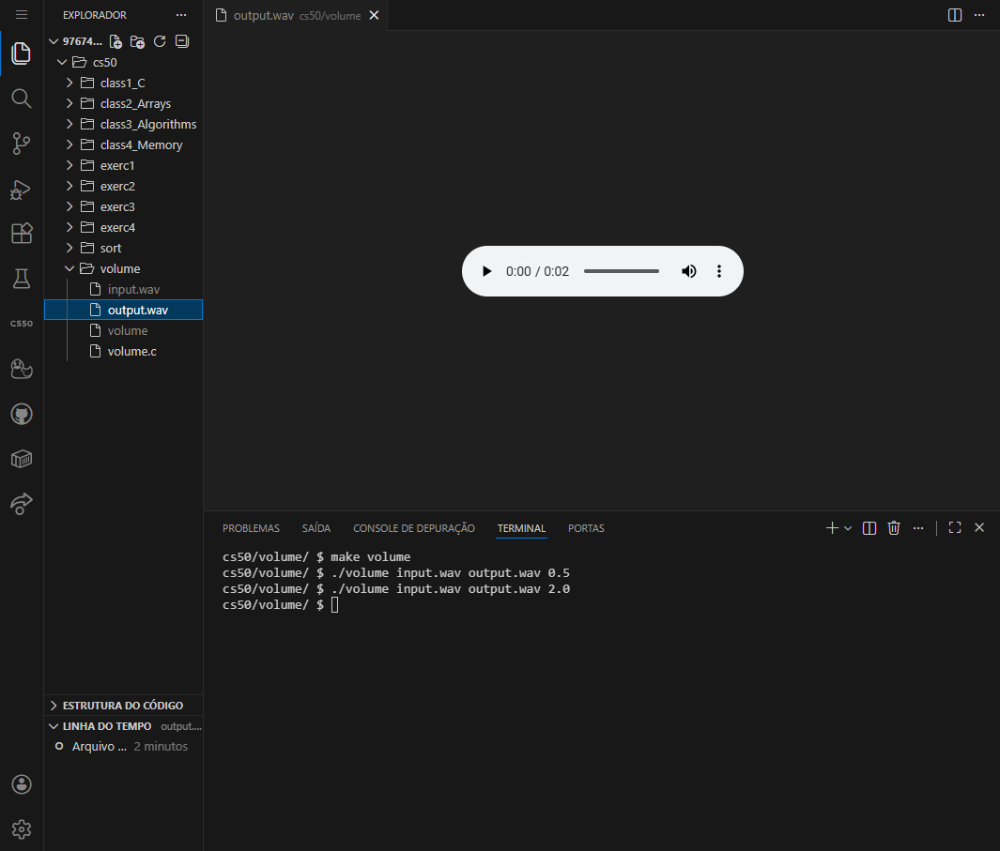
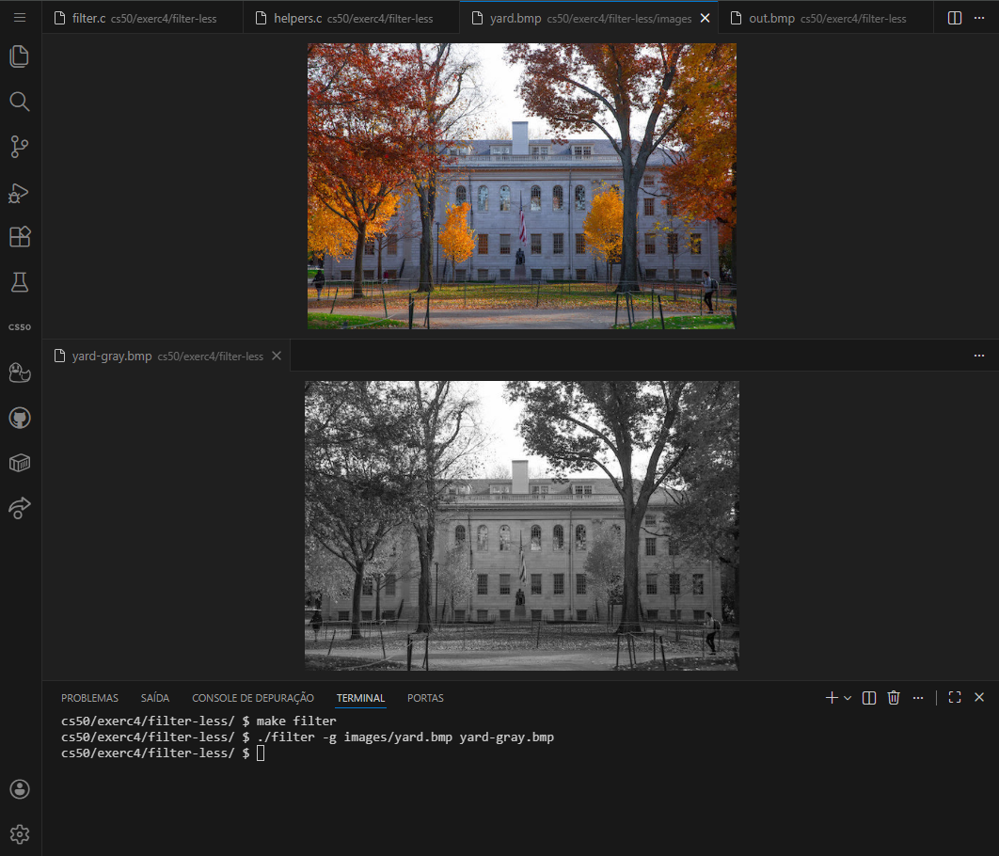
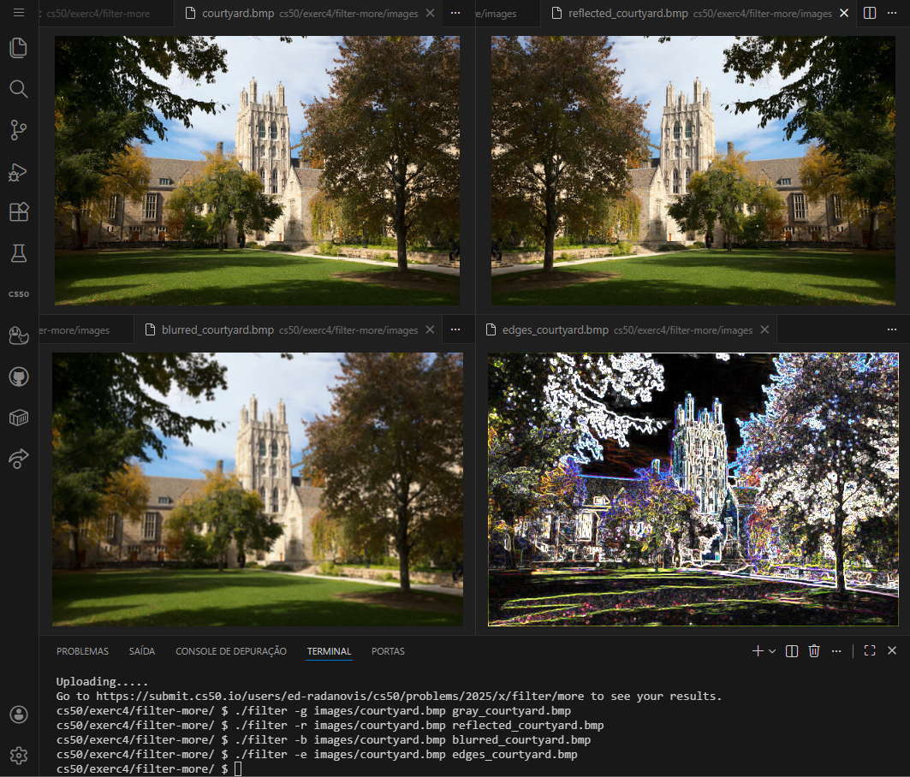
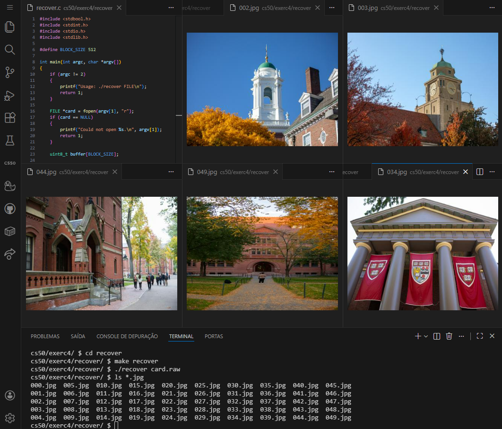

<DOCUMENT filename="README.md">

<p align="center">
  
</p>

<br>

# CS50 - Class 4: Memory and Data Structures

## Introduction to Computer Science

### Week 4 – Memory Management, Pointers, and File I/O

Taught by **Dr. David J. Malan, Ph.D.**

<br>

Below are the results of the completed activities:

<br>

> 🎯 Learning Objectives :
>
> > - Understand `memory allocation` and `pointer arithmetic` in **[C](https://en.cppreference.com/)**.
> > - Master `hexadecimal notation` for memory addressing.
> > - Implement `bitmap manipulation` for image processing.
> > - Develop `memory-safe programs` using Valgrind.
> > - Create `file recovery tools` from forensic images.
> > - Apply `buffer management` techniques for data processing.

<br>

### 📋 Activities Overview

|    Activity     | Description                                   | Key Concepts                        | Status |
| :-------------: | --------------------------------------------- | ----------------------------------- | :----: |
|   **Volume**    | Manipulate WAV audio file volume              | File I/O, Pointers, Data Structures |   ✔    |
| **Filter-less** | Implement basic image filters (grayscale)     | 2D Arrays, Bitmap Processing        |   ✔    |
| **Filter-more** | Advanced image filters (blur, edges, reflect) | Pixel Manipulation, Sobel Operator  |   ✔    |
|   **Recover**   | Forensic JPEG recovery from memory card       | File Signatures, Buffer Management  |   ✔    |

---

<table align="center">
  <tr>
    <td align="center">
      <a href="../materials/images/result_activity_0.png">
        
      </a>
      <br>
      <sub><b>Volume</b></sub>
      <br>
      <br>
      <a href="../materials/images/result_activity_1.png">
        
      </a>
      <br>
      <sub><b>Filter less</b></sub>
    </td>
    <td align="center">
      <a href="../materials/images/result_activity_2.png">
        
      </a>
      <br>
      <sub><b>Filter more</b></sub>
      <br>
      <br>
      <a href="../materials/images/result_activity_3.png">
        
      </a>
      <br>
      <sub><b>Recover</b></sub>
    </td>
  </tr>  
</table>

---

### 📚 Prerequisites

- [ ] Before starting these activities, you should have basic knowledge in:

- **C Programming:** Functions, loops, conditionals, and arrays.
- **Memory Concepts:** Variables, data types, and basic memory layout.
- **File Operations:** Basic understanding of file reading/writing in C.
- **CS50 Library:** Familiarity with `get_string()`, `printf()`, and basic I/O.
- **Week 3 Fundamentals:** Algorithm analysis and problem-solving strategies.

---

### 🛠️ Technologies Used

All activities were developed using:

[](https://en.cppreference.com/w/c/language)&nbsp;&nbsp;&nbsp;&nbsp;&nbsp;&nbsp;[](https://cs50.readthedocs.io/library/c/)&nbsp;&nbsp;&nbsp;&nbsp;&nbsp;&nbsp;[](https://code.visualstudio.com/)&nbsp;&nbsp;&nbsp;&nbsp;&nbsp;&nbsp;[](https://valgrind.org/)

---

### 📂 Activity Structure

```bash
week_4_memory/
├── exercises/
│   ├── scripts_and_corrections/
│   ├── src/
│   │   ├── 0volume/
│   │   │   ├── 0volume.c
│   │   │   ├── input.wav
│   │   │   ├── output2-0.wav
│   │   │   └── output_0-5.wav
│   │   ├── 1filter_less/
│   │   │   ├── images/
│   │   │   ├── 1filter_less.c
│   │   │   ├── Makefile
│   │   │   ├── bmp.h
│   │   │   ├── helpers.c
│   │   │   └── helpers.h
│   │   ├── 2filter_more/
│   │   │   ├── images/
│   │   │   ├── Makefile
│   │   │   ├── bmp.h
│   │   │   ├── filter.c
│   │   │   ├── helpers.c
│   │   │   └── helpers.h
│   │   └── 3recover/
│   │       ├── recovered images/
│   │       ├── card.raw
│   │       └── recover.c
│   └── README.md                           # This file
└── materials/
    ├── images/
    ├── src/
    └── CS50_class_4_a_memory.pdf
```

---

### 🔍 Activities Details

<br>

📍 &nbsp;**0. Volume - Audio File Manipulation**

- Objective: Modify the volume of WAV audio files by scaling audio samples.

```c
// Key implementation - volume scaling
int main(int argc, char *argv[])
{
    // Check command-line arguments
    if (argc != 4)
    {
        printf("Usage: ./volume input.wav output.wav factor\n");
        return 1;
    }

    // Open input and output files
    FILE *input = fopen(argv[1], "r");
    FILE *output = fopen(argv[2], "w");

    // Copy header from input to output
    uint8_t header[HEADER_SIZE];
    fread(header, HEADER_SIZE, 1, input);
    fwrite(header, HEADER_SIZE, 1, output);

    // Read samples, apply volume factor, write to output
    int16_t buffer;
    while (fread(&buffer, sizeof(int16_t), 1, input))
    {
        buffer *= factor;
        fwrite(&buffer, sizeof(int16_t), 1, output);
    }
}
```

<br>

📍 &nbsp;**1. Filter-less - Basic Image Processing**

- Objective: Implement grayscale conversion for BMP images.

```c
// Key implementation - grayscale filter
void grayscale(int height, int width, RGBTRIPLE image[height][width])
{
    for (int i = 0; i < height; i++)
    {
        for (int j = 0; j < width; j++)
        {
            // Calculate average of RGB values
            int average = round((image[i][j].rgbtRed +
                                 image[i][j].rgbtGreen +
                                 image[i][j].rgbtBlue) / 3.0);

            // Set all channels to the average
            image[i][j].rgbtRed = average;
            image[i][j].rgbtGreen = average;
            image[i][j].rgbtBlue = average;
        }
    }
}
```

<br>

📍 &nbsp;**2. Filter-more - Advanced Image Filters**

- Objective: Implement reflection, blur, and edge detection filters.

```c
// Key implementation - Sobel edge detection
void edges(int height, int width, RGBTRIPLE image[height][width])
{
    // Sobel kernels
    int Gx[3][3] = {{-1, 0, 1}, {-2, 0, 2}, {-1, 0, 1}};
    int Gy[3][3] = {{-1, -2, -1}, {0, 0, 0}, {1, 2, 1}};

    // Create temporary image copy
    RGBTRIPLE temp[height][width];
    for (int i = 0; i < height; i++)
    {
        for (int j = 0; j < width; j++)
        {
            temp[i][j] = image[i][j];
        }
    }

    // Apply Sobel operator to each pixel
    for (int i = 0; i < height; i++)
    {
        for (int j = 0; j < width; j++)
        {
            int Gx_red = 0, Gx_green = 0, Gx_blue = 0;
            int Gy_red = 0, Gy_green = 0, Gy_blue = 0;

            // Check 3x3 neighborhood
            for (int di = -1; di <= 1; di++)
            {
                for (int dj = -1; dj <= 1; dj++)
                {
                    int ni = i + di;
                    int nj = j + dj;

                    // Handle edge pixels (treat as black)
                    int red = 0, green = 0, blue = 0;
                    if (ni >= 0 && ni < height && nj >= 0 && nj < width)
                    {
                        red = temp[ni][nj].rgbtRed;
                        green = temp[ni][nj].rgbtGreen;
                        blue = temp[ni][nj].rgbtBlue;
                    }

                    // Apply Sobel kernels
                    Gx_red += red * Gx[di + 1][dj + 1];
                    Gy_red += red * Gy[di + 1][dj + 1];
                    // Repeat for green and blue channels...
                }
            }

            // Calculate final value and cap at 255
            int red = round(sqrt(Gx_red*Gx_red + Gy_red*Gy_red));
            image[i][j].rgbtRed = red > 255 ? 255 : red;
            // Repeat for green and blue channels...
        }
    }
}
```

<br>

📍 &nbsp;**3. Recover - Forensic JPEG Recovery**

- Objective: Recover JPEG files from a forensic memory card image.

```c
// Key implementation - JPEG recovery
int main(int argc, char *argv[])
{
    // Validate command-line arguments
    if (argc != 2)
    {
        printf("Usage: ./recover FILE\n");
        return 1;
    }

    // Open forensic image
    FILE *card = fopen(argv[1], "r");
    if (card == NULL)
    {
        printf("Could not open %s.\n", argv[1]);
        return 1;
    }

    // Buffer for 512-byte blocks
    uint8_t buffer[512];
    FILE *jpeg = NULL;
    int file_count = 0;
    bool found_jpeg = false;

    // Read through memory card
    while (fread(buffer, 1, 512, card) == 512)
    {
        // Check for JPEG signature
        if (buffer[0] == 0xff && buffer[1] == 0xd8 &&
            buffer[2] == 0xff && (buffer[3] & 0xf0) == 0xe0)
        {
            // Close previous JPEG if open
            if (found_jpeg) fclose(jpeg);
            else found_jpeg = true;

            // Create new JPEG file
            char filename[8];
            sprintf(filename, "%03d.jpg", file_count++);
            jpeg = fopen(filename, "w");
        }

        // Write to current JPEG file
        if (found_jpeg) fwrite(buffer, 1, 512, jpeg);
    }

    // Cleanup
    if (found_jpeg) fclose(jpeg);
    fclose(card);
    return 0;
}
```

---

### ⚙️ Setup and Execution

- [ ] &nbsp;&nbsp;&nbsp;Prerequisites :

✔️ - CS50 VS Code environment at `cs50.dev`.

✔️ - Basic understanding of C pointers and memory management.

✔️ - Familiarity with hexadecimal notation and bitwise operations.

✔️ - Understanding of file formats (WAV, BMP, JPEG).

<br>

- [x] &nbsp;&nbsp;&nbsp;Workflow for each activity :

```bash
# 0. Volume - Audio Manipulation
$ cd week_4_memory/exercises/src/volume/
$ make volume
$ ./volume input.wav output.wav 1.5

# 1. Filter-less - Basic Image Filters
$ cd ../filter-less/
$ make filter
$ ./filter -g images/yard.bmp gray_yard.bmp

# 2. Filter-more - Advanced Image Filters
$ cd ../filter-more/
$ make filter
$ ./filter -b images/courtyard.bmp blurred_courtyard.bmp
$ ./filter -e images/tower.bmp edges_tower.bmp
$ ./filter -r images/stadium.bmp reflected_stadium.bmp

# 3. Recover - JPEG Recovery
$ cd ../recover/
$ make recover
$ ./recover card.raw
$ ls *.jpg  # Should show 000.jpg through 049.jpg
```

---

### 🔬 Validation Tests

✔️ - Volume :

- [x] &nbsp;&nbsp;&nbsp;Correctly reads WAV file header.
- [x] &nbsp;&nbsp;&nbsp;Properly copies header to output file.
- [x] &nbsp;&nbsp;&nbsp;Accurately scales audio samples.
- [x] &nbsp;&nbsp;&nbsp;Handles edge cases (empty files, invalid factors).
- [x] &nbsp;&nbsp;&nbsp;Maintains audio file integrity.

<br>

✔️ - Filter-less :

- [x] &nbsp;&nbsp;&nbsp;Correctly converts color images to grayscale.
- [x] &nbsp;&nbsp;&nbsp;Properly handles BMP file structure.
- [x] &nbsp;&nbsp;&nbsp;Manages image padding correctly.
- [x] &nbsp;&nbsp;&nbsp;Preserves image dimensions.
- [x] &nbsp;&nbsp;&nbsp;Produces valid BMP output files.

<br>

✔️ - Filter-more :

- [x] &nbsp;&nbsp;&nbsp;Implements grayscale conversion correctly.
- [x] &nbsp;&nbsp;&nbsp;Performs horizontal reflection accurately.
- [x] &nbsp;&nbsp;&nbsp;Applies box blur with correct 3x3 neighborhood.
- [x] &nbsp;&nbsp;&nbsp;Implements Sobel edge detection properly.
- [x] &nbsp;&nbsp;&nbsp;Handles image edges and corners correctly.
- [x] &nbsp;&nbsp;&nbsp;Caps RGB values at 255.

<br>

✔️ - Recover :

- [x] &nbsp;&nbsp;&nbsp;Accepts exactly one command-line argument.
- [x] &nbsp;&nbsp;&nbsp;Detects JPEG signatures correctly.
- [x] &nbsp;&nbsp;&nbsp;Creates sequentially named JPEG files.
- [x] &nbsp;&nbsp;&nbsp;Recovers all 50 JPEGs from card.raw.
- [x] &nbsp;&nbsp;&nbsp;Handles memory card reading in 512-byte blocks.
- [x] &nbsp;&nbsp;&nbsp;Properly closes all file handles.

---

### 🧠 Skills Developed

> By completing these activities, you will have acquired the following skills and sub-skills:

<br>

🧩 - Memory Management :

- Understanding of pointers and addresses.
- Dynamic memory allocation with `malloc()` and `free()`.
- Avoiding memory leaks with Valgrind.
- Handling garbage values and uninitialized memory.
- Implementing safe memory practices.

<br>

🧩 - File I/O Operations :

- Reading and writing binary files.
- Understanding file headers and metadata.
- Manipulating WAV, BMP, and JPEG formats.
- Implementing buffer-based file processing.
- Managing file pointers and streams.

<br>

🧩 - Data Structure Implementation :

- Working with 2D arrays for image processing.
- Creating and manipulating structs.
- Implementing complex algorithms on pixel data.
- Managing multi-dimensional data efficiently.

<br>

🧩 - Image Processing Techniques :

- Color space conversions (RGB to grayscale).
- Spatial filtering (blur, edge detection).
- Geometric transformations (reflection).
- Sobel operator implementation.
- Bitmap manipulation and processing.

<br>

🧩 - Forensic Data Recovery :

- File signature detection.
- Buffer management for data recovery.
- Handling raw memory images.
- Implementing file carving algorithms.
- Managing recovered file sequences.

<br>

🧩 - Debugging and Optimization :

- Using Valgrind for memory debugging.
- Optimizing nested loops for performance.
- Handling edge cases in algorithms.
- Testing with various input sizes.
- Validating output correctness.

---

### 📜 Academic Context

These activities are part of Harvard University's CS50: Introduction to Computer Science course. They represent the memory management and data structure concepts taught in Week 4, focusing on:

1. **Memory Fundamentals**: Understanding how data is stored and accessed in computer memory.
2. **Pointer Operations**: Mastering pointer arithmetic and memory addressing.
3. **File Processing**: Working with different file formats at the byte level.
4. **Image Manipulation**: Applying algorithms to process visual data.
5. **Data Recovery**: Implementing forensic tools for file recovery.

> [!IMPORTANT]
> The implementations follow CS50's academic integrity policies and are intended for educational purposes. Each activity builds upon memory concepts, creating a comprehensive learning progression from basic pointer operations to complex image processing and data recovery systems.

---

<h4 align="center">
  👤 Developed by 
<h4/>
<br>

<table align="center">
  <tr>
    <td align="center">
      <a href="https://www.linkedin.com/in/edmar-radanovis/">
        <br>
        <sub><b>Edmar Radanovis</b></sub><br>
        <sub>Full Stack Developer &nbsp;&</sub><br>
        <sub>Bachelor's degree candidate in</sub><br>
        <sub>Software Engineering</sub>
      </a>
    </td>
    <td align="center">
      <a href="https://edwebdev.vercel.app/">
        <br>
        <sub><b>Ed Web Dev</b></sub><br>
      </a>
    </td>
  </tr>
</table>

<br>
<br>

[⬆ Back to top](#cs50---class-4-memory-and-data-structures)

</DOCUMENT>
