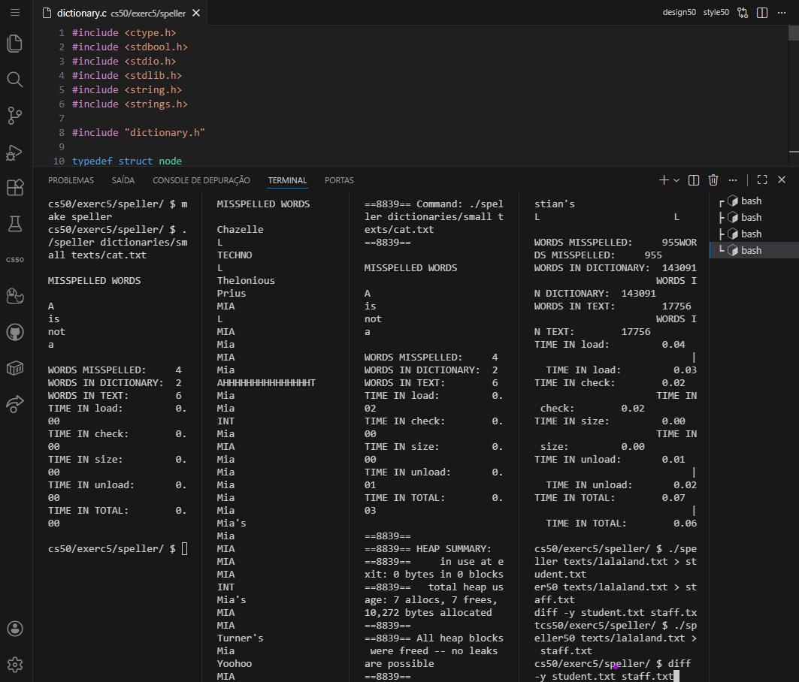

<DOCUMENT filename="README.md">

<p align="center">
  
</p>

<br>

# CS50 - Class 5: Data Structures

## Introduction to Computer Science

### Week 5 – Inheritance Simulation & Spell Checker Implementation

Taught by **Dr. David J. Malan, Ph.D.**

<br>

Below are the results of the completed activities:

<br>

> 🎯 Learning Objectives :
>
> > - Simulate `biological inheritance` using `recursive data structures` in **[C](https://en.cppreference.com/)**.
> > - Implement a `spell checker` with `hash tables` for optimal performance.
> > - Master `dynamic memory management` with complex linked structures.
> > - Design `custom hash functions` to minimize collisions.
> > - Analyze `time complexity` of data structure operations.
> > - Develop `memory-safe programs` using Valgrind for debugging.

<br>

### 📋 Activities Overview

|    Activity     | Description                                        | Key Concepts                        | Status |
| :-------------: | -------------------------------------------------- | ----------------------------------- | :----: |
| **Inheritance** | Simulate blood type inheritance across generations | Recursion, Structs, Pointers        |   ✔    |
|   **Speller**   | Implement a high-performance spell checker         | Hash Tables, File I/O, Optimization |   ✔    |

---

<table align="center">
  <tr>
    <td align="center">
      <a href="../materials/images/result_activity_0.png">
        
      </a>
      <br>
      <sub><b>Inheritance</b></sub>
    </td>
    <td align="center">
      <a href="../materials/images/result_activity_1.png">
        
      </a>
      <br>
      <sub><b>Speller</b></sub>
    </td>
  </tr>  
</table>

---

### 📚 Prerequisites

- [ ] Before starting these activities, you should have basic knowledge in:

- **C Programming:** Functions, loops, conditionals, arrays, and pointers.
- **Data Structures:** Linked lists, trees, hash tables (Week 5 concepts).
- **Dynamic Memory:** `malloc`, `free`, memory management.
- **File Operations:** Reading and writing files in C.
- **CS50 Library:** Familiarity with `get_int()`, `printf()`, and basic I/O.
- **Algorithm Analysis:** Big O notation, time complexity.

---

### 🛠️ Technologies Used

All activities were developed using:

[](https://en.cppreference.com/w/c/language)&nbsp;&nbsp;&nbsp;&nbsp;&nbsp;&nbsp;[](https://cs50.readthedocs.io/library/c/)&nbsp;&nbsp;&nbsp;&nbsp;&nbsp;&nbsp;[](https://code.visualstudio.com/)&nbsp;&nbsp;&nbsp;&nbsp;&nbsp;&nbsp;[](https://valgrind.org/)

---

### 📂 Activity Structure

```bash
week_5_data_structures/
├── exercises/
│   ├── scripts_and_corrections/
│   ├── src/
│   │   ├── 1speller/
│   │   │   ├── dictionaries/
│   │   │   │   ├── large
│   │   │   │   └── small
│   │   │   ├── keys/
│   │   │   ├── texts/
│   │   │   ├── Makefile
│   │   │   ├── dictionary.c
│   │   │   ├── dictionary.h
│   │   │   ├── speller.c
│   │   │   └── speller50
│   │   └── 0inheritance.c
│   └── README.md                            # This file
└── materials/
    ├── images/
    ├── src/
    └── CS50_class_5_data_structure.pdf
```

---

### 🔍 Activities Details

<br>

📍 &nbsp;**0. Inheritance - Blood Type Inheritance Simulation**

- Objective: Simulate the inheritance of blood types across family generations using recursive data structures.

```c
// Key implementation - recursive family creation
typedef struct person
{
    struct person *parents[2];
    char alleles[2];
}
person;

// Create a new family with specified generations
person *create_family(int generations)
{
    // Allocate memory for new person
    person *new_person = malloc(sizeof(person));

    // Base case: no parents
    if (generations == 1)
    {
        // Set parent pointers to NULL
        new_person->parents[0] = NULL;
        new_person->parents[1] = NULL;

        // Randomly assign alleles
        new_person->alleles[0] = random_allele();
        new_person->alleles[1] = random_allele();
    }
    else
    {
        // Recursively create parents
        new_person->parents[0] = create_family(generations - 1);
        new_person->parents[1] = create_family(generations - 1);

        // Inherit alleles from parents
        new_person->alleles[0] = new_person->parents[0]->alleles[random() % 2];
        new_person->alleles[1] = new_person->parents[1]->alleles[random() % 2];
    }

    return new_person;
}

// Free all family memory recursively
void free_family(person *p)
{
    if (p == NULL)
    {
        return;
    }

    // Free parents recursively
    free_family(p->parents[0]);
    free_family(p->parents[1]);

    // Free child
    free(p);
}
```

<br>

📍 &nbsp;**1. Speller - High-Performance Spell Checker**

- Objective: Implement a spell checker using hash tables with custom hash functions for optimal performance.

```c
// Key implementation - hash table with chaining
typedef struct node
{
    char word[LENGTH + 1];
    struct node *next;
}
node;

// Hash table
node *table[N];

// Custom hash function - djb2 algorithm
unsigned int hash(const char *word)
{
    unsigned long hash = 5381;
    int c;

    while ((c = *word++))
    {
        hash = ((hash << 5) + hash) + tolower(c); // hash * 33 + c
    }

    return hash % N;
}

// Load dictionary into hash table
bool load(const char *dictionary)
{
    // Open dictionary file
    FILE *file = fopen(dictionary, "r");
    if (file == NULL)
    {
        return false;
    }

    char word[LENGTH + 1];

    // Read words from file
    while (fscanf(file, "%s", word) != EOF)
    {
        // Create new node
        node *n = malloc(sizeof(node));
        if (n == NULL)
        {
            return false;
        }

        // Copy word into node
        strcpy(n->word, word);

        // Hash word to get index
        unsigned int index = hash(word);

        // Insert node into hash table
        n->next = table[index];
        table[index] = n;

        // Increment word count
        word_count++;
    }

    fclose(file);
    return true;
}

// Check if word is in dictionary
bool check(const char *word)
{
    // Hash word to get index
    unsigned int index = hash(word);

    // Traverse linked list at index
    for (node *cursor = table[index]; cursor != NULL; cursor = cursor->next)
    {
        if (strcasecmp(cursor->word, word) == 0)
        {
            return true;
        }
    }

    return false;
}

// Unload dictionary from memory
bool unload(void)
{
    for (int i = 0; i < N; i++)
    {
        node *cursor = table[i];

        while (cursor != NULL)
        {
            node *temp = cursor;
            cursor = cursor->next;
            free(temp);
        }
    }

    return true;
}
```

---

### ⚙️ Setup and Execution

- [ ] &nbsp;&nbsp;&nbsp;Prerequisites :

✔️ - CS50 VS Code environment at `cs50.dev`.

✔️ - Understanding of pointers, structs, and dynamic memory.

✔️ - Familiarity with hash tables and linked lists.

✔️ - Basic knowledge of file I/O operations.

<br>

- [x] &nbsp;&nbsp;&nbsp;Workflow for each activity :

```bash
# 0. Inheritance - Blood Type Simulation
$ cd week_5_data_structures/exercises/src/inheritance/
$ make inheritance
$ ./inheritance
# Output shows blood types across 3 generations

# 1. Speller - Spell Checker
$ cd ../speller/
$ make speller
# Test with small dictionary
$ ./speller dictionaries/small texts/cat.txt
# Test with large dictionary
$ ./speller dictionaries/large texts/lalaland.txt
# Performance benchmark
$ time ./speller dictionaries/large texts/shakespeare.txt
```

---

🔬 Validation Tests

✔️ - Inheritance :

- [x] &nbsp;&nbsp;&nbsp;Correctly creates family tree with specified generations.
- [x] &nbsp;&nbsp;&nbsp;Properly allocates memory for all family members.
- [x] &nbsp;&nbsp;&nbsp;Implements blood type inheritance rules correctly.
- [x] &nbsp;&nbsp;&nbsp;Handles random allele assignment for oldest generation.
- [x] &nbsp;&nbsp;&nbsp;Frees all allocated memory without leaks (Valgrind clean).
- [x] &nbsp;&nbsp;&nbsp;Prints family tree in correct format.

<br>

✔️ - Speller :

- [x] &nbsp;&nbsp;&nbsp;Loads dictionary correctly into hash table.
- [x] &nbsp;&nbsp;&nbsp;Implements case-insensitive word checking.
- [x] &nbsp;&nbsp;&nbsp;Custom hash function minimizes collisions.
- [x] &nbsp;&nbsp;&nbsp;Correctly identifies misspelled words.
- [x] &nbsp;&nbsp;&nbsp;Handles apostrophes in words properly.
- [x] &nbsp;&nbsp;&nbsp;Returns accurate word count from dictionary.
- [x] &nbsp;&nbsp;&nbsp;Unloads all memory without leaks (Valgrind clean).
- [x] &nbsp;&nbsp;&nbsp;Meets performance benchmarks (sub-second total time).

---

### 🧠 Skills Developed

> By completing these activities, you will have acquired the following skills and sub-skills:

<br>

🧩 - Recursive Data Structures :

- Implementing recursive family trees.
- Managing hierarchical data with pointers.
- Traversing recursive structures.
- Freeing recursive memory allocations.

<br>

🧩 - Hash Table Implementation :

- Designing custom hash functions.
- Implementing hash table with chaining.
- Handling hash collisions.
- Optimizing hash table performance.
- Balancing memory usage vs. speed.

<br>

🧩 - Advanced Memory Management :

- Complex dynamic memory allocation.
- Recursive memory deallocation.
- Memory leak detection with Valgrind.
- Pointer arithmetic in data structures.

<br>

🧩 - Algorithm Optimization :

- Time complexity analysis (O(1) vs O(n)).
- Performance benchmarking.
- Trade-off analysis for data structures.
- Real-world algorithm design.

<br>

🧩 - File Processing & Data Loading :

- Efficient dictionary loading.
- Large file processing techniques.
- Memory-efficient data structures.
- Stream-based file operations.

<br>

🧩 - Software Engineering Practices :

- Modular code design.
- Performance testing and optimization.
- Memory safety verification.
- Real-world application development.

---

### 📜 Academic Context

These activities are part of Harvard University's CS50: Introduction to Computer Science course. They represent the culmination of data structure concepts taught in Week 5, focusing on:

1. **Recursive Data Structures**: Simulating real-world inheritance patterns.
2. **Hash Table Applications**: Building high-performance text processing tools.
3. **Memory Optimization**: Balancing speed and memory usage in real applications.
4. **Algorithm Design**: Creating efficient solutions to complex problems.
5. **Software Engineering**: Developing robust, maintainable C programs.

> [!IMPORTANT]
> The implementations follow CS50's academic integrity policies and are intended for educational purposes. Each exercise applies theoretical data structure concepts to practical problems, creating a comprehensive learning experience from abstract theory to working implementations.

---

<h4 align="center">
  👤 Developed by 
<h4/>
<br>

<table align="center">
  <tr>
    <td align="center">
      <a href="https://www.linkedin.com/in/edmar-radanovis/">
        <br>
        <sub><b>Edmar Radanovis</b></sub><br>
        <sub>Full Stack Developer &nbsp;&</sub><br>
        <sub>Bachelor's degree candidate in</sub><br>
        <sub>Software Engineering</sub>
      </a>
    </td>
    <td align="center">
      <a href="https://edwebdev.vercel.app/">
        <br>
        <sub><b>Ed Web Dev</b></sub><br>
      </a>
    </td>
  </tr>
</table>

<br>
<br>

[⬆ Back to top](#cs50---class-5-data-structures)

</DOCUMENT>
