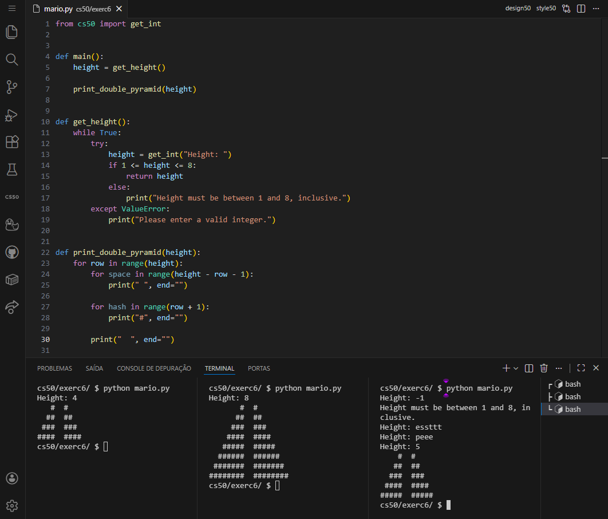
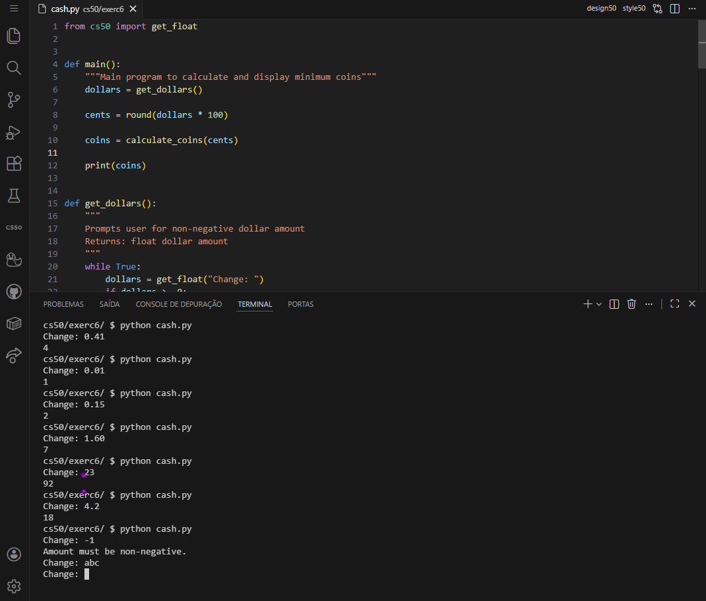
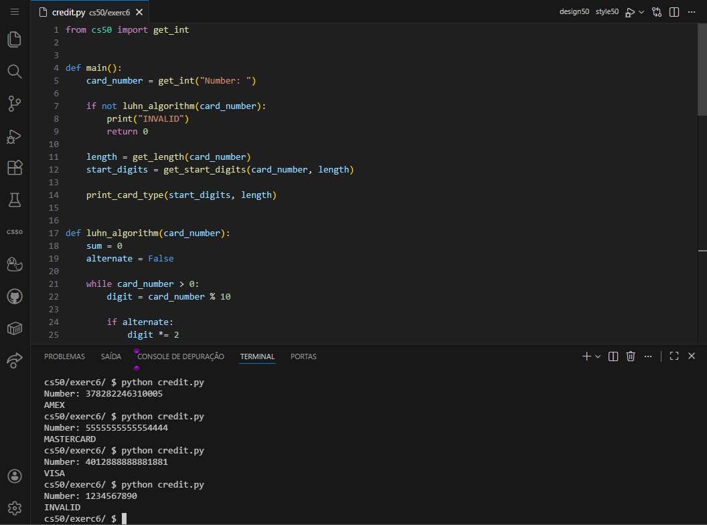
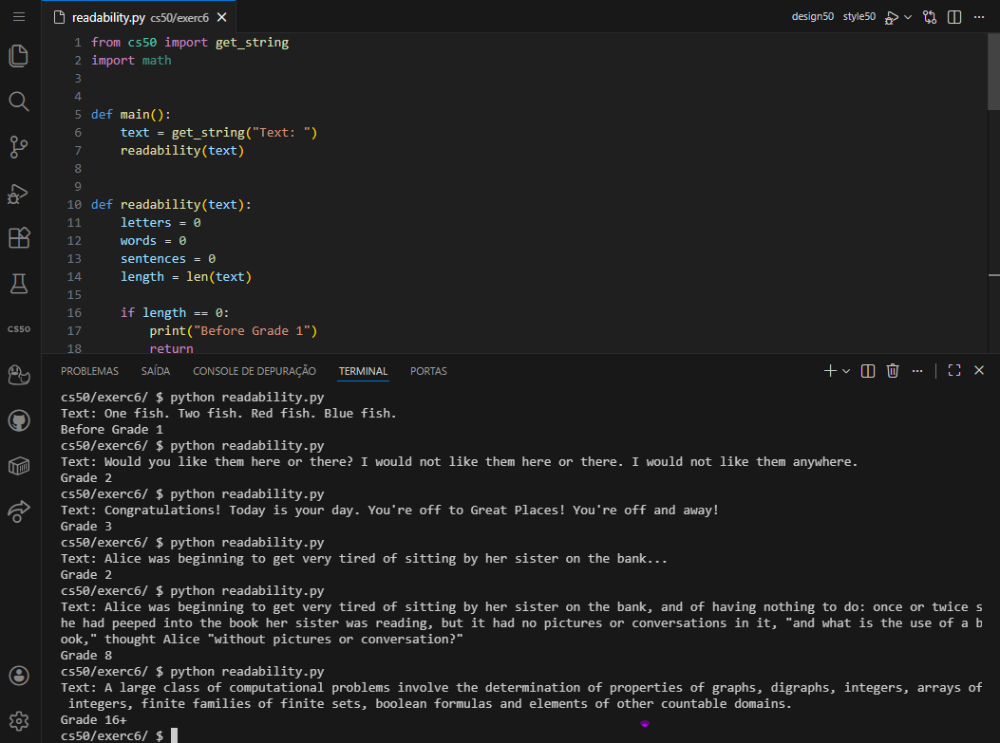
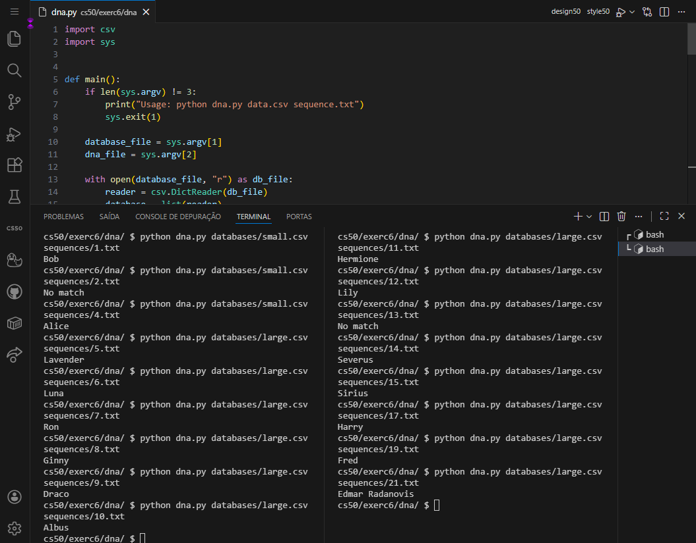

<DOCUMENT filename="README.md">

<p align="center">
  
</p>

<br>

# CS50 - Class 6: Python Programming

## Introduction to Computer Science

### Week 6 – Python Fundamentals & Data Processing

Taught by **Dr. David J. Malan, Ph.D.**

<br>

Below are the results of the completed activities:

<br>

> 🎯 Learning Objectives :
>
> > - Transition from **_[C](https://en.cppreference.com/)_** to **_[Python](https://www.python.org/)_** programming paradigms.
> > - Implement algorithms using Python's `high-level abstractions`.
> > - `Process` and `analyze data` with Python's built-in data structures.
> > - Work with command-line arguments and file I/O in Python.
> > - Utilize `Python libraries` for CSV processing and DNA analysis.
> > - Write clean, maintainable Python code following style guidelines.

<br>

### 📋 Activities Overview

|           Activity           | Description                                           | Key Concepts                                            | Status |
| :--------------------------: | ----------------------------------------------------- | ------------------------------------------------------- | :----: |
|       **Mario (Less)**       | Create a right-aligned pyramid with hashes            | Loops, Input validation, String manipulation            |   ✔    |
|       **Mario (More)**       | Create dual pyramids with spacing                     | Nested loops, Pattern generation, Alignment             |   ✔    |
|           **Cash**           | Calculate minimum coins for change                    | Floating-point arithmetic, Greedy algorithm             |   ✔    |
|          **Credit**          | Validate credit card numbers using Luhn's algorithm   | String processing, Conditional logic                    |   ✔    |
|       **Readability**        | Compute text difficulty using Coleman-Liau formula    | Text analysis, Character counting, Math operations      |   ✔    |
|           **DNA**            | Match DNA sequences to individuals using STR analysis | CSV processing, String matching, Command-line arguments |   ✔    |
| **Custom Character Creator** | Extended tool for creating custom DNA profiles        | File generation, User interaction, Data formatting      |   ✔    |

---

<table align="center">
  <tr>
    <td align="center">
      <a href="../materials/images/result_activity_1.png">
        
      </a>
      <br>
      <sub><b>Mario Less</b></sub>
      <br>
      <br>
      <a href="../materials/images/result_activity_2.png">
        
      </a>
      <br>
      <sub><b>Mario More</b></sub>
    </td>
    <td align="center">
      <a href="../materials/images/result_activity_3.png">
        
      </a>
      <br>
      <sub><b>Cash</b></sub>
      <br>
      <br>
      <a href="../materials/images/result_activity_4.png">
        
      </a>
      <br>
      <sub><b>Credit</b></sub>
    </td>
    <td align="center">
      <a href="../materials/images/result_activity_5.png">
        
      </a>
      <br>
      <sub><b>Readability</b></sub>
      <br>
      <br>
      <a href="../materials/images/result_activity_6.png">
        
      </a>
      <br>
      <sub><b>DNA</b></sub>
    </td>
  </tr>  
</table>

---

### 📚 Prerequisites

- [ ] Before starting these activities, you should have basic knowledge in:

- **C Programming:** Functions, loops, conditionals, and algorithms from previous weeks.
- **Python Basics:** Variables, data types, and basic I/O operations.
- **Command Line:** Navigating directories and running Python scripts.
- **Algorithm Design:** Understanding of algorithms like Luhn's algorithm and greedy approaches.
- **Text Processing:** Basic string manipulation concepts.
- **Data Structures:** Lists, dictionaries, and their operations.

---

### 🛠️ Technologies Used

All activities were developed using:

[](https://www.python.org/)&nbsp;&nbsp;&nbsp;&nbsp;&nbsp;&nbsp;[](https://cs50.readthedocs.io/libraries/cs50/python/)&nbsp;&nbsp;&nbsp;&nbsp;&nbsp;&nbsp;[](https://code.visualstudio.com/)&nbsp;&nbsp;&nbsp;&nbsp;&nbsp;&nbsp;[](https://docs.python.org/3/library/csv.html)

---

### 📂 Activity Structure

```bash
week_6_python/
├── exercises/
│   ├── scripts_and_corrections/
│   ├── src/
│   │   ├── 6dna/
│   │   │   ├── databases/
│   │   │   │   ├── large.csv
│   │   │   │   └── small.csv
│   │   │   ├── sequences/
│   │   │   ├── create_new_character.py        # Extended tool for custom DNA profiles
│   │   │   └── dna.py
│   │   ├── 0hello.py
│   │   ├── 1mario_less.py
│   │   ├── 2mario_more.py
│   │   ├── 3cash.py
│   │   ├── 4credit.py
│   │   └── 5readability.py
│   └── README.md                              # This file
└── materials/
    ├── images/
    ├── src/
    │   ├── 1/
    │   ├── 2/
    │   ├── 3/
    │   ├── 4/
    │   └── 5/
    │       ├── filter/
    │       ├── integer/
    │       ├── moo/
    │       ├── qr/
    │       └── speller/
    │           ├── dictionaries/
    │           ├── texts/
    │           ├── dictionary.py
    │           └── speller.py
    └── CS50_class_6_python.pdf
```

---

### 🔍 Activities Details

<br>

📍 &nbsp;**1. Mario (Less) - Right-Aligned Pyramid**

- Objective: Create a right-aligned pyramid of hashes based on user input height (1-8).

```python
# Key implementation - Right-aligned pyramid generation
def main():
    # Get valid height from user
    while True:
        try:
            height = int(input("Height: "))
            if 1 <= height <= 8:
                break
        except ValueError:
            pass

    # Print pyramid
    for i in range(1, height + 1):
        spaces = height - i
        hashes = i
        print(" " * spaces + "#" * hashes)
```

<br>

📍 &nbsp;**2. Mario (More) - Dual Pyramids with Spacing**

- Objective: Create two pyramids with a 2-space gap between them.

```python
# Key implementation - Dual pyramid generation
def main():
    # Get valid height from user
    while True:
        try:
            height = int(input("Height: "))
            if 1 <= height <= 8:
                break
        except ValueError:
            pass

    # Print dual pyramids
    for i in range(1, height + 1):
        spaces = height - i
        hashes = i
        print(" " * spaces + "#" * hashes + "  " + "#" * hashes)
```

<br>

📍 &nbsp;**3. Cash - Minimum Coins Calculator**

- Objective: Calculate the minimum number of coins required for change using quarters, dimes, nickels, and pennies.

```python
# Key implementation - Greedy algorithm for change calculation
def main():
    # Get valid change amount
    while True:
        try:
            dollars = float(input("Change owed: "))
            if dollars > 0:
                break
        except ValueError:
            pass

    # Convert to cents
    cents = round(dollars * 100)

    # Calculate coins
    coins = 0
    denominations = [25, 10, 5, 1]

    for denom in denominations:
        coins += cents // denom
        cents %= denom

    print(coins)
```

<br>

📍 &nbsp;**4. Credit - Credit Card Validator**

- Objective: Validate credit card numbers using Luhn's algorithm and identify card type (AMEX, MasterCard, Visa).

```python
# Key implementation - Luhn's algorithm and card type identification
def luhn_algorithm(card_number):
    total = 0
    alternate = False

    while card_number > 0:
        digit = card_number % 10

        if alternate:
            digit *= 2
            total += (digit // 10) + (digit % 10)
        else:
            total += digit

        alternate = not alternate
        card_number //= 10

    return (total % 10 == 0)

def main():
    # Get card number and validate
    card_str = input("Number: ").strip()

    if not card_str.isdigit() or len(card_str) not in [13, 15, 16]:
        print("INVALID")
        return

    card_number = int(card_str)

    if not luhn_algorithm(card_number):
        print("INVALID")
        return

    # Determine card type
    length = len(card_str)
    first_two = int(card_str[:2])

    if length == 15 and first_two in [34, 37]:
        print("AMEX")
    elif length == 16 and 51 <= first_two <= 55:
        print("MASTERCARD")
    elif length in [13, 16] and card_str[0] == '4':
        print("VISA")
    else:
        print("INVALID")
```

<br>

📍 &nbsp;**5. Readability - Text Difficulty Calculator**

- Objective: Compute the reading grade level of text using the Coleman-Liau formula.

```python
# Key implementation - Coleman-Liau index calculation
def main():
    text = input("Text: ")

    letters = sum(1 for char in text if char.isalpha())
    words = len(text.split())
    sentences = text.count('.') + text.count('!') + text.count('?')

    # Avoid division by zero
    if words == 0:
        print("Before Grade 1")
        return

    # Calculate Coleman-Liau index
    L = (letters / words) * 100
    S = (sentences / words) * 100
    index = round(0.0588 * L - 0.296 * S - 15.8)

    # Output grade level
    if index < 1:
        print("Before Grade 1")
    elif index >= 16:
        print("Grade 16+")
    else:
        print(f"Grade {index}")
```

<br>

📍 &nbsp;**6. DNA - DNA Sequence Matcher**

- Objective: Match DNA sequences to individuals by analyzing Short Tandem Repeats (STRs).

```python
# Key implementation - STR analysis and CSV matching
import csv
import sys

def longest_match(sequence, subsequence):
    """Returns length of longest run of subsequence in sequence."""
    longest_run = 0
    sub_len = len(subsequence)

    for i in range(len(sequence)):
        count = 0
        while True:
            start = i + count * sub_len
            end = start + sub_len
            if sequence[start:end] == subsequence:
                count += 1
            else:
                break
        longest_run = max(longest_run, count)

    return longest_run

def main():
    # Validate command-line arguments
    if len(sys.argv) != 3:
        print("Usage: python dna.py data.csv sequence.txt")
        sys.exit(1)

    # Read database and DNA sequence
    with open(sys.argv[1], 'r') as db_file:
        database = list(csv.DictReader(db_file))

    with open(sys.argv[2], 'r') as seq_file:
        dna_sequence = seq_file.read().strip()

    # Get STR names and calculate matches
    str_names = list(database[0].keys())[1:]
    str_counts = {}

    for str_name in str_names:
        str_counts[str_name] = longest_match(dna_sequence, str_name)

    # Find matching individual
    for person in database:
        match = True
        for str_name in str_names:
            if int(person[str_name]) != str_counts[str_name]:
                match = False
                break

        if match:
            print(person['name'])
            return

    print("No match")
```

<br>

📍 &nbsp;**🌟 Bonus: create_new_character.py - Custom DNA Profile Creator**

- Not part of the original assignment - Extended tool for creating custom DNA profiles and testing the DNA matcher.

```python
# Extended functionality - Custom character and DNA sequence generator
def create_custom_character():
    """Creates a custom DNA profile for testing the DNA matcher."""

    print("\n" + "=" * 60)
    print("CUSTOM DNA CHARACTER CREATOR")
    print("=" * 60)

    # Get character details
    name = input("\nCharacter name: ").strip()

    # Available STRs from large.csv
    available_strs = ['AGATC', 'TTTTTTCT', 'AATG', 'TCTAG', 'GATA', 'TATC', 'GAAA', 'TCTG']
    str_counts = {}

    print("\nEnter STR counts (1-100):")
    for str_seq in available_strs:
        while True:
            try:
                count = int(input(f"  {str_seq}: "))
                if 1 <= count <= 100:
                    str_counts[str_seq] = count
                    break
                print("    Please enter a number between 1 and 100")
            except ValueError:
                print("    Please enter a valid number")

    # Generate DNA sequence
    import random
    bases = ['A', 'C', 'G', 'T']
    dna_parts = []

    # Build realistic DNA sequence
    dna_parts.append(''.join(random.choice(bases) for _ in range(200)))

    for str_seq in available_strs:
        dna_parts.append(''.join(random.choice(bases) for _ in range(100)))
        dna_parts.append(str_seq * str_counts[str_seq])

    dna_parts.append(''.join(random.choice(bases) for _ in range(200)))
    dna_sequence = ''.join(dna_parts)

    # Save files
    filename = f"sequences/{name.replace(' ', '_').lower()}.txt"
    with open(filename, 'w') as f:
        f.write(dna_sequence)

    print(f"\n✅ Sequence saved to: {filename}")
    print(f"   Length: {len(dna_sequence)} bases")

    # Generate CSV line
    counts_ordered = [str(str_counts[str_seq]) for str_seq in available_strs]
    csv_line = f"{name},{','.join(counts_ordered)}"

    print(f"\n📋 Add this line to databases/large.csv:")
    print(f"{csv_line}")
    print(f"\n🧪 Test with: python dna.py databases/large.csv {filename}")
```

---

### ⚙️ Setup and Execution

- [ ] &nbsp;&nbsp;&nbsp;Prerequisites :

✔️ - CS50 VS Code environment at `cs50.dev`.

✔️ - Python 3.x installed and accessible from command line.

✔️ - Basic understanding of Python syntax and data structures.

✔️ - Familiarity with command-line interface.

<br>

- [x] &nbsp;&nbsp;&nbsp;Workflow for each activity :

```bash
# 1. Mario (Less)
$ cd mario-less/
$ python mario.py
Height: 4
   #
  ##
 ###
####

# 2. Mario (More)
$ cd ../mario-more/
$ python mario.py
Height: 4
   #  #
  ##  ##
 ###  ###
####  ####

# 3. Cash
$ cd ../cash/
$ python cash.py
Change owed: 0.41
4

# 4. Credit
$ cd ../credit/
$ python credit.py
Number: 378282246310005
AMEX

# 5. Readability
$ cd ../readability/
$ python readability.py
Text: One fish. Two fish. Red fish. Blue fish.
Before Grade 1

# 6. DNA
$ cd ../dna/
$ python dna.py databases/small.csv sequences/1.txt
Bob

# Bonus: Custom Character Creator
$ python create_new_character.py
# Follow interactive prompts to create custom DNA profile
```

---

### 🔬 Validation Tests

✔️ **Mario (Less) & (More)** :

- [x] &nbsp;&nbsp;&nbsp;Validates input height between 1 and 8.
- [x] &nbsp;&nbsp;&nbsp;Rejects non-numeric and out-of-range inputs.
- [x] &nbsp;&nbsp;&nbsp;Creates correctly aligned pyramids.
- [x] &nbsp;&nbsp;&nbsp;No extra spaces at end of lines.
- [x] &nbsp;&nbsp;&nbsp;Proper spacing between dual pyramids.

<br>

✔️ **Cash** :

- [x] &nbsp;&nbsp;&nbsp;Accepts dollar amounts with decimal points.
- [x] &nbsp;&nbsp;&nbsp;Rejects negative and non-numeric inputs.
- [x] &nbsp;&nbsp;&nbsp;Correctly calculates minimum coins using greedy algorithm.
- [x] &nbsp;&nbsp;&nbsp;Handles floating-point precision issues.

<br>

✔️ **Credit** :

- [x] &nbsp;&nbsp;&nbsp;Implements Luhn's algorithm correctly.
- [x] &nbsp;&nbsp;&nbsp;Identifies AMEX, MasterCard, and Visa cards.
- [x] &nbsp;&nbsp;&nbsp;Returns "INVALID" for invalid cards.
- [x] &nbsp;&nbsp;&nbsp;Handles different card number lengths.
- [x] &nbsp;&nbsp;&nbsp;Validates starting digits correctly.

<br>

✔️ **Readability** :

- [x] &nbsp;&nbsp;&nbsp;Counts letters, words, and sentences accurately.
- [x] &nbsp;&nbsp;&nbsp;Calculates Coleman-Liau index correctly.
- [x] &nbsp;&nbsp;&nbsp;Handles edge cases (empty text, no words).
- [x] &nbsp;&nbsp;&nbsp;Outputs appropriate grade levels (Before Grade 1, Grade X, Grade 16+).
- [x] &nbsp;&nbsp;&nbsp;Rounds index to nearest integer.

<br>

✔️ **DNA** :

- [x] &nbsp;&nbsp;&nbsp;Handles command-line arguments correctly.
- [x] &nbsp;&nbsp;&nbsp;Reads CSV and text files properly.
- [x] &nbsp;&nbsp;&nbsp;Finds longest STR matches accurately.
- [x] &nbsp;&nbsp;&nbsp;Matches profiles with exact STR counts.
- [x] &nbsp;&nbsp;&nbsp;Returns "No match" when no profile matches.
- [x] &nbsp;&nbsp;&nbsp;Uses provided longest_match function correctly.

<br>

✔️ **Custom Character Creator** :

- [x] &nbsp;&nbsp;&nbsp;Generates valid DNA sequences with specified STR counts.
- [x] &nbsp;&nbsp;&nbsp;Creates properly formatted CSV entries.
- [x] &nbsp;&nbsp;&nbsp;Produces testable sequences that work with dna.py.
- [x] &nbsp;&nbsp;&nbsp;Provides clear instructions for testing.
- [x] &nbsp;&nbsp;&nbsp;Handles user input validation.

---

### 🧠 Skills Developed

> By completing these activities, you will have acquired the following skills and sub-skills:

<br>

🧩 **Python Programming Fundamentals** :

- Syntax and structure of Python programs.
- Input/output operations with user interaction.
- Working with different data types (strings, integers, floats).
- Control structures (loops, conditionals) in Python.

<br>

🧩 **Algorithm Implementation in Python** :

- Translating C algorithms to Python.
- Implementing mathematical formulas.
- Working with string processing algorithms.
- Handling edge cases and error conditions.

<br>

🧩 **Data Processing & Analysis** :

- Text analysis and character counting.
- CSV file processing with Python's csv module.
- DNA sequence analysis and pattern matching.
- Data validation and cleaning.

<br>

🧩 **File I/O Operations** :

- Reading and writing text files.
- Processing CSV data.
- Command-line argument handling.
- Working with file paths and directories.

<br>

🧩 **Problem-Solving with Python** :

- Breaking down complex problems into Python solutions.
- Debugging Python code.
- Testing and validating implementations.
- Creating reusable code components.

<br>

🧩 **Software Engineering Practices** :

- Writing clean, readable Python code.
- Following Python style guidelines (PEP 8).
- Creating modular programs with functions.
- Documenting code with comments.
- Building extended tools beyond requirements.

---

### 📜 Academic Context

These activities are part of Harvard University's CS50: Introduction to Computer Science course. They represent the transition from low-level C programming to high-level Python programming, focusing on:

1. **Language Transition**: Applying programming concepts learned in C to Python.
2. **Pythonic Solutions**: Learning Python's idiomatic ways of solving problems.
3. **Data Processing**: Using Python's powerful built-in data structures for real-world problems.
4. **File Operations**: Processing various file formats (CSV, text) in Python.
5. **Extended Learning**: Going beyond requirements to build custom tools (create_new_character.py).

The implementations demonstrate how Python simplifies many programming tasks while maintaining algorithmic rigor. Each exercise shows the power of Python's abstractions while reinforcing fundamental computer science concepts.

The custom character creator tool (create_new_character.py) demonstrates proactive learning by extending the DNA assignment to create a practical utility for testing and exploration.

> [!IMPORTANT]
> The implementations follow CS50's academic integrity policies and are intended for educational purposes. Each exercise applies theoretical programming concepts to practical problems, creating a comprehensive learning experience from abstract theory to working implementations.

---

<h4 align="center">
  👤 Developed by 
<h4/>
<br>

<table align="center">
  <tr>
    <td align="center">
      <a href="https://www.linkedin.com/in/edmar-radanovis/">
        <br>
        <sub><b>Edmar Radanovis</b></sub><br>
        <sub>Full Stack Developer &nbsp;&</sub><br>
        <sub>Bachelor's degree candidate in</sub><br>
        <sub>Software Engineering</sub>
      </a>
    </td>
    <td align="center">
      <a href="https://edwebdev.vercel.app/">
        <br>
        <sub><b>Ed Web Dev</b></sub><br>
      </a>
    </td>
  </tr>
</table>

<br>
<br>

[⬆ Back to top](#cs50---class-6-python-programming)

</DOCUMENT>
