<DOCUMENT filename="README.md">

<p align="center">
  
</p>

<br>

# CS50 - Class 7: Databases and SQL

## Introduction to Computer Science

### Week 7 – Database Design, SQL Queries, and Relational Data

Taught by **Dr. David J. Malan, Ph.D.**

<br>

Below are the results of the completed activities:

<br>

> 🎯 Learning Objectives :
>
> > - Understand `relational database` concepts and design principles.
> > - Master **_[SQL](https://www.w3schools.com/sql/)_** `syntax` for data manipulation and querying.
> > - Implement complex `JOIN operations` to relate multiple tables.
> > - Develop `efficient queries` using indexes and optimization techniques.
> > - Create `Python-SQL integrations` for application development.
> > - Apply `data analysis techniques` to real-world datasets.

<br>

### 📋 Activities Overview

|    Activity    | Description                                   | Key Concepts                     | Status |
| :------------: | --------------------------------------------- | -------------------------------- | :----: |
|   **Songs**    | Analyze Spotify's top 100 songs of 2018       | Basic SQL Queries, Aggregation   |   ✔    |
|   **Movies**   | Query IMDb movie database with 13 challenges  | JOINs, Subqueries, Filtering     |   ✔    |
| **Fiftyville** | Solve a mystery crime using SQL investigation | Complex Analysis, Multiple Joins |   ✔    |

---

<table align="center">
  <tr>
    <td align="center">
      <a href="../materials/images/result_activity_songs_0.png">
        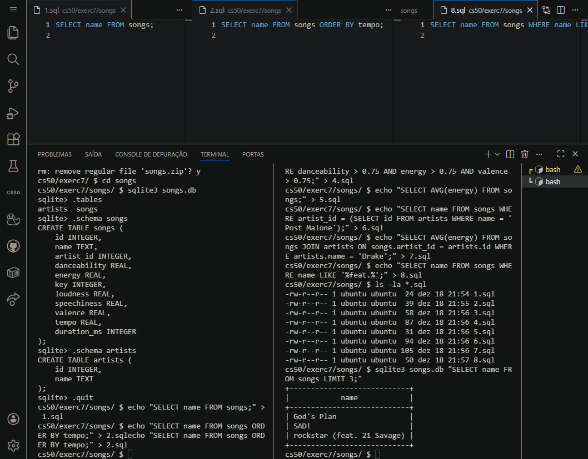
      </a>
      <br>
      <sub><b>Songs ➡ Database schema exploration</b></sub>
      <br>
      <br>
      <a href="../materials/images/result_activity_songs_1.png">
        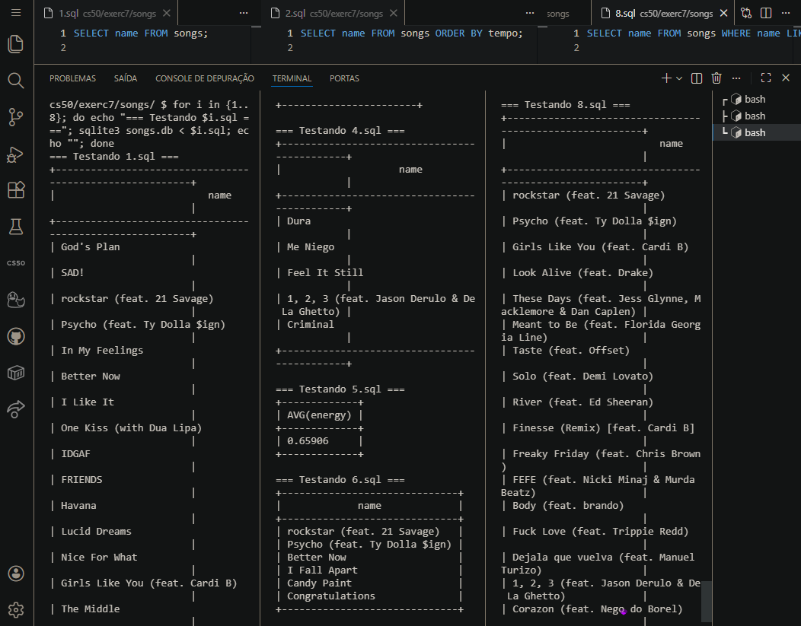
      </a>
      <br>
      <sub><b>Songs ➡ Query testing and validation</b></sub>
      <br>
      <br>
       <a href="../materials/images/result_activity_songs_2.png">
        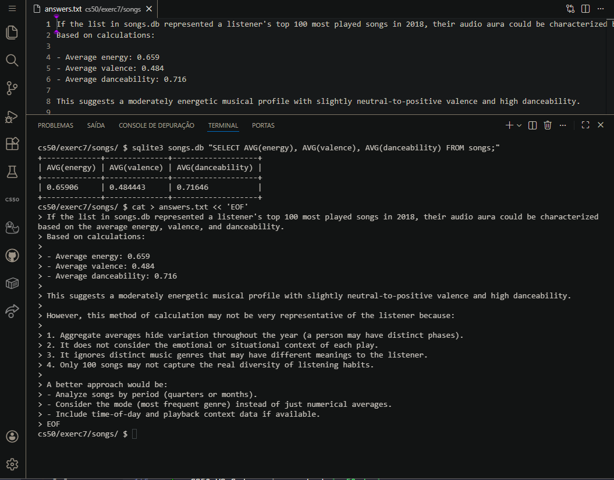
      </a>
      <br>
      <sub><b>Songs ➡ Audio aura calculation and analysis</b></sub>
    </td>
    <td align="center">
      <a href="../materials/images/result_activity_movies_0.png">
        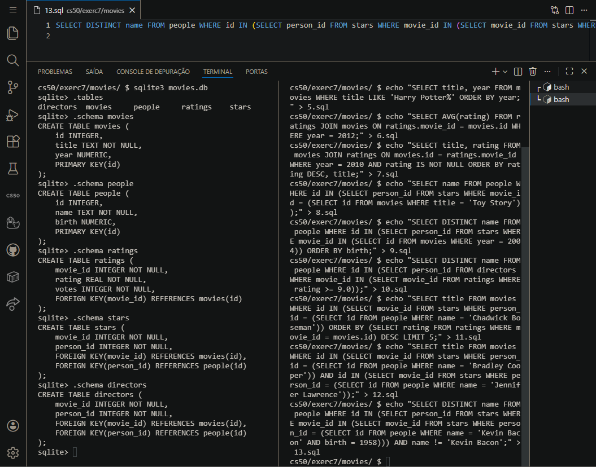
      </a>
      <br>
      <sub><b>Movies ➡ Database structure examination</b></sub>
      <br>
      <br>
      <a href="../materials/images/result_activity_movies_1.png">
        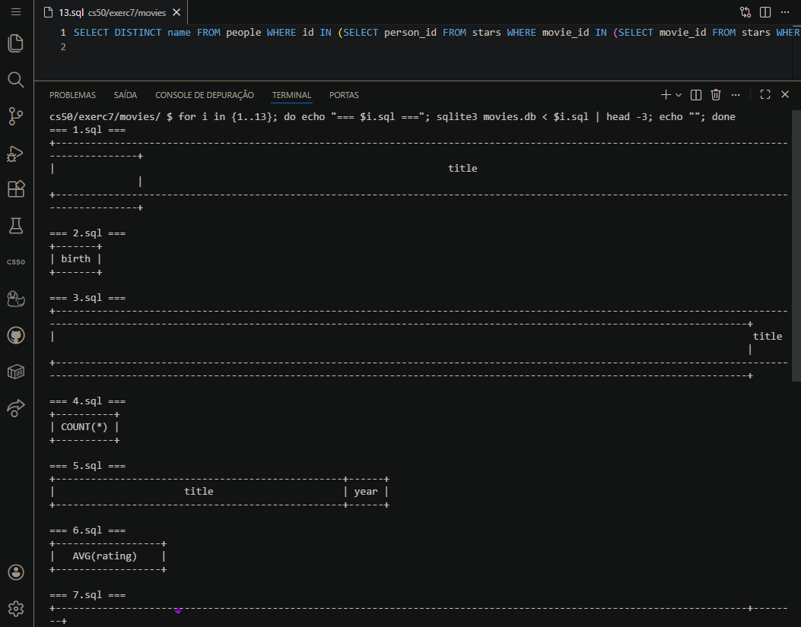
      </a>
      <br>
      <sub><b>Movies ➡ Complex query development</b></sub>
      <br>
      <br>
       <a href="../materials/images/result_activity_movies_2.png">
        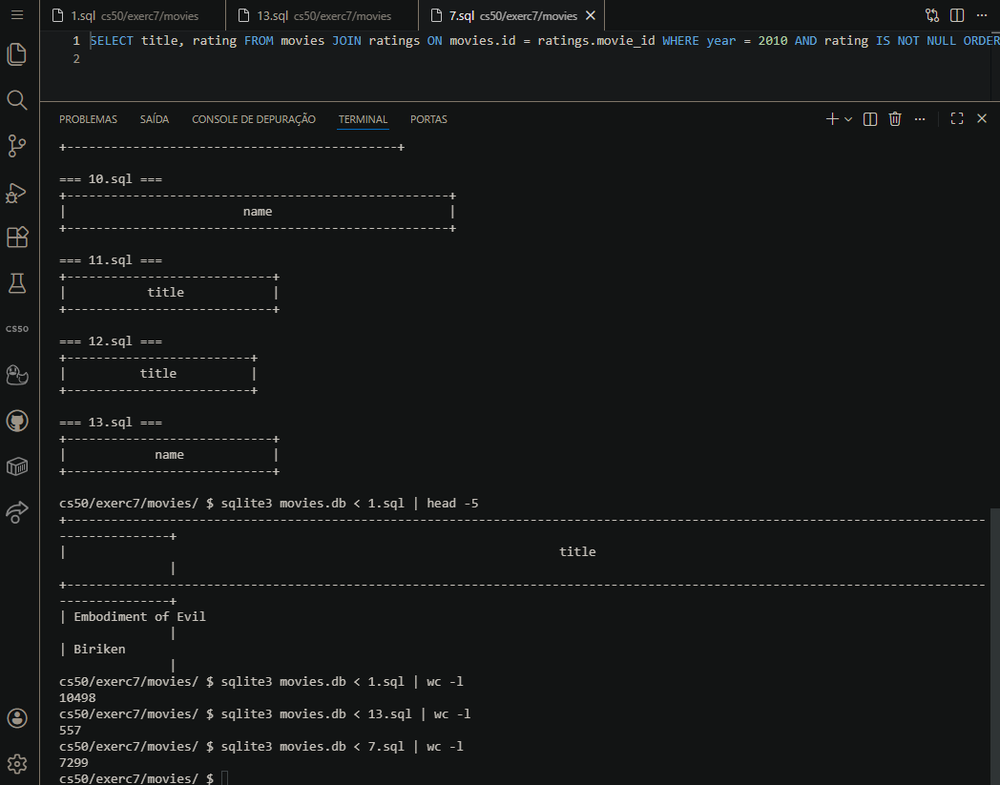
      </a>
      <br>
      <sub><b>Movies ➡ Line count verification and validation</b></sub>
    </td>
  </tr>
</table>
<br>
<br>
<table>
  <tr>
    <td align="center">
      <a href="../materials/images/result_activity_fiftyville_0.png">
        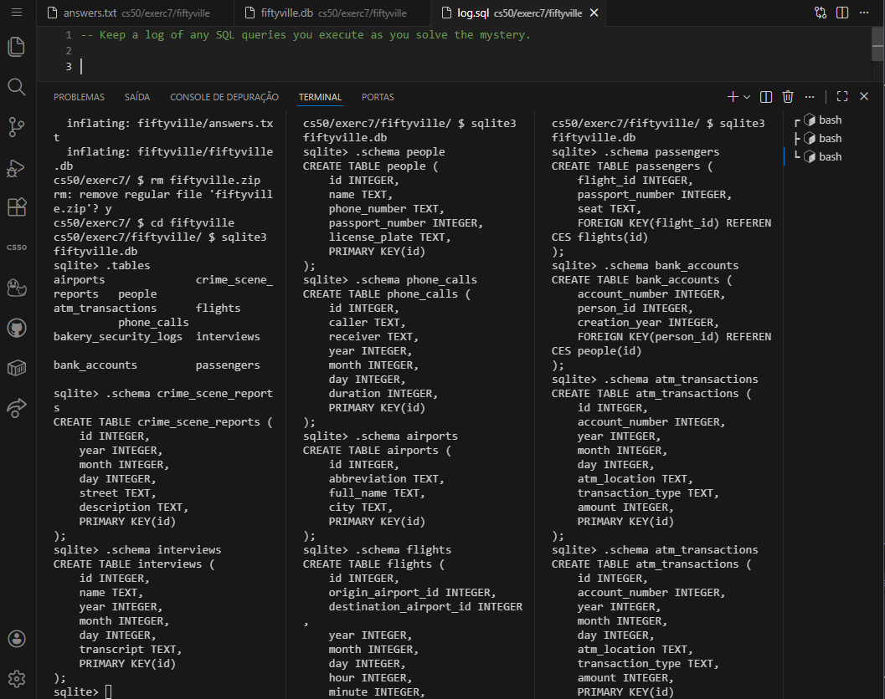
      </a>
      <br>
      <sub><b>Fiftyville ➡ Crime scene investigation start</b></sub>
      <br>
      <br>
      <a href="../materials/images/result_activity_fiftyville_1.png">
        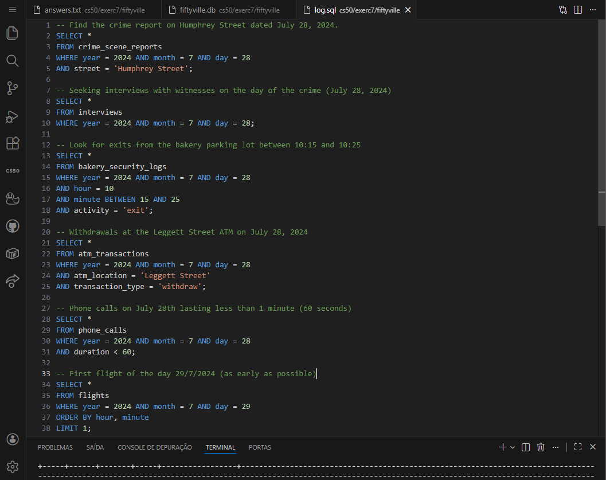
      </a>
      <br>
      <sub><b>Fiftyville ➡ Witness interviews and clue gathering</b></sub>
      <br>
      <br>
       <a href="../materials/images/result_activity_fiftyville_2.png">
        
      </a>
      <br>
      <sub><b>Fiftyville ➡ Initial suspect identification</b></sub>
       <p align="left">
    
    </p>
    </td>
    <td align="center">
      <a href="../materials/images/result_activity_fiftyville_3.png">
        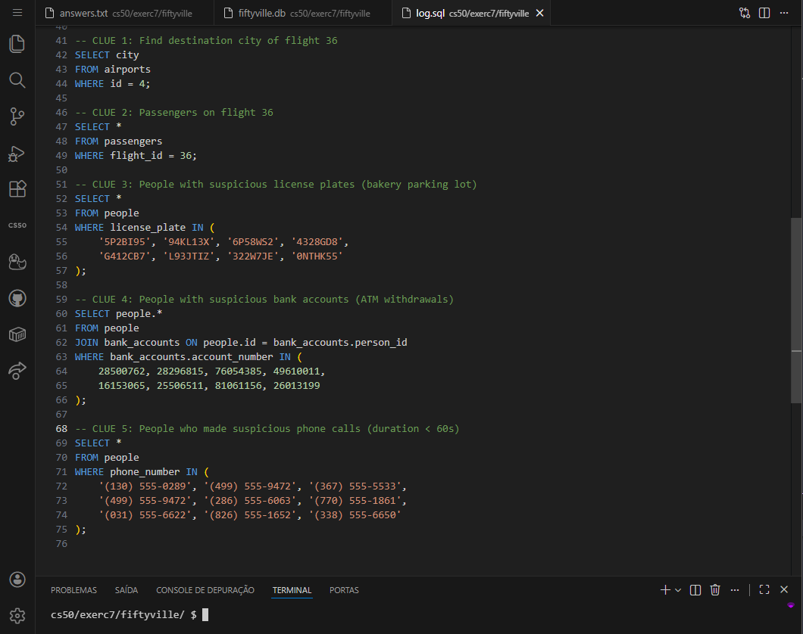
      </a>
      <br>
      <sub><b>Fiftyville ➡ Data filtering and evidence correlation</b></sub>
      <br>
      <br>
      <a href="../materials/images/result_activity_fiftyville_4.png">
        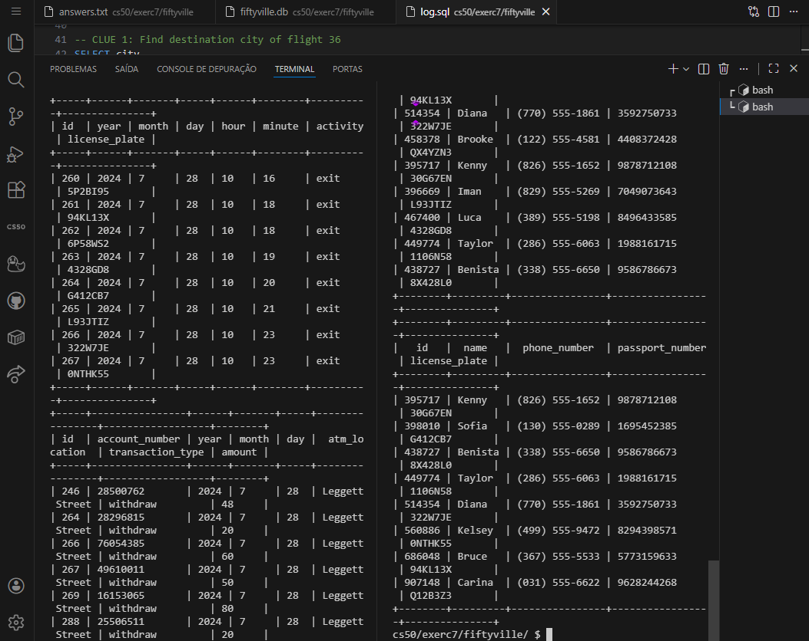
      </a>
      <br>
      <sub><b>Fiftyville ➡ Cross-referencing multiple data sources</b></sub>
      <br>
      <br>
       <a href="../materials/images/result_activity_fiftyville_5.png">
        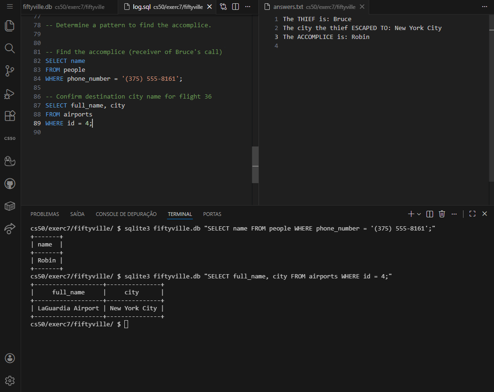
      </a>
      <br>
      <sub><b>Fiftyville ➡ Accomplice identification and case resolution</b></sub>
      <p align="right">
    
    </p>
    </td>
  </tr>  
</table>

---

### 📚 Prerequisites

- [ ] Before starting these activities, you should have basic knowledge in:

- **Python Programming:** Variables, loops, conditionals, and functions.
- **Data Structures:** Lists, dictionaries, and basic data manipulation.
- **CS50 Library:** Familiarity with `SQL()` function for database connections.
- **Week 6 Fundamentals:** File I/O and data processing in Python.
- **Basic SQL Concepts:** Tables, columns, and simple SELECT queries.

---

### 🛠️ Technologies Used

All activities were developed using:

[](https://www.sqlite.org/)&nbsp;&nbsp;&nbsp;&nbsp;&nbsp;&nbsp;[](https://cs50.readthedocs.io/libraries/cs50/python/#cs50.SQL)&nbsp;&nbsp;&nbsp;&nbsp;&nbsp;&nbsp;[](https://code.visualstudio.com/)&nbsp;&nbsp;&nbsp;&nbsp;&nbsp;&nbsp;[](https://www.python.org/)

---

### 📂 Activity Structure

```bash
week_7_databaseSQL/
├── exercises/
│   ├── scripts_and_corrections/
│   ├── src/
│   │   ├── fiftyville/
│   │   ├── movies/
│   │   └── songs/
│   └── README.md                               # This file
└── materials/
    ├── images/
    ├── src/
    │   ├── favorites/
    │   └── imdb/
    └── CS50_class_7_databaseSQL.pdf
```

---

### 🔍 Activities Details

<br>

📍 &nbsp;**0. Songs - Spotify Data Analysis**

- Objective: Write SQL queries to analyze the top 100 Spotify songs of 2018.

```sql
-- Key queries

-- List all songs in the database
SELECT name FROM songs;

-- Find songs with high danceability, energy, and valence
SELECT name
FROM songs
WHERE danceability > 0.75
  AND energy > 0.75
  AND valence > 0.75;

-- Calculate average energy of Drake's songs
SELECT AVG(energy)
FROM songs
JOIN artists ON songs.artist_id = artists.id
WHERE artists.name = 'Drake';

-- Key audio aura analysis

-- Calculate audio aura metrics
SELECT
    AVG(energy) AS avg_energy,
    AVG(valence) AS avg_valence,
    AVG(danceability) AS avg_danceability
FROM songs;
```

<br>

📍 &nbsp;**1. Movies - IMDb Database Queries**

- Objective: Write 13 SQL queries to extract information from IMDb movie database.

```sql
-- Key queries

-- Find movies released in 2008
SELECT title FROM movies WHERE year = 2008;

-- Find Emma Stone's birth year
SELECT birth FROM people WHERE name = 'Emma Stone';

-- List actors in Toy Story
SELECT name FROM people
WHERE id IN (
    SELECT person_id FROM stars
    WHERE movie_id = (
        SELECT id FROM movies
        WHERE title = 'Toy Story'
    )
);

-- Find movies with both Bradley Cooper and Jennifer Lawrence
SELECT title FROM movies
WHERE id IN (
    SELECT movie_id FROM stars
    WHERE person_id = (
        SELECT id FROM people
        WHERE name = 'Bradley Cooper'
    )
) AND id IN (
    SELECT movie_id FROM stars
    WHERE person_id = (
        SELECT id FROM people
        WHERE name = 'Jennifer Lawrence'
    )
);
```

<br>

📍 &nbsp;**2. Fiftyville - Crime Investigation**

- Objective: Solve a mystery by querying a crime database to identify thief, escape city, and accomplice.

```sql
-- Investigation Process:

-- Start with crime scene report
SELECT * FROM crime_scene_reports
WHERE year = 2024 AND month = 7 AND day = 28
AND street = 'Humphrey Street';

-- Gather witness interviews
SELECT * FROM interviews
WHERE year = 2024 AND month = 7 AND day = 28;

-- Follow parking lot clue
SELECT * FROM bakery_security_logs
WHERE year = 2024 AND month = 7 AND day = 28
AND hour = 10 AND minute BETWEEN 15 AND 25
AND activity = 'exit';

-- Follow ATM clue
SELECT * FROM atm_transactions
WHERE year = 2024 AND month = 7 AND day = 28
AND atm_location = 'Leggett Street'
AND transaction_type = 'withdraw';

-- Cross-reference all clues to identify thief
SELECT DISTINCT p.*
FROM people p
JOIN bank_accounts ba ON p.id = ba.person_id
JOIN bakery_security_logs bsl ON p.license_plate = bsl.license_plate
JOIN phone_calls pc ON p.phone_number = pc.caller
JOIN passengers ps ON p.passport_number = ps.passport_number
WHERE bsl.year = 2024 AND bsl.month = 7 AND bsl.day = 28
AND bsl.hour = 10 AND bsl.minute BETWEEN 15 AND 25
AND ba.account_number IN (
    SELECT account_number FROM atm_transactions
    WHERE year = 2024 AND month = 7 AND day = 28
    AND atm_location = 'Leggett Street'
    AND transaction_type = 'withdraw'
)
AND pc.year = 2024 AND pc.month = 7 AND pc.day = 28
AND pc.duration < 60
AND ps.flight_id = (
    SELECT id FROM flights
    WHERE year = 2024 AND month = 7 AND day = 29
    ORDER BY hour, minute
    LIMIT 1
);
```

---

### ⚙️ Setup and Execution

- [ ] &nbsp;&nbsp;&nbsp;Prerequisites :

✔️ - CS50 VS Code environment at `cs50.dev`.

✔️ - Basic understanding of SQL syntax and relational databases.

✔️ - Familiarity with Python for database connections (CS50 SQL library).

✔️ - Understanding of JOIN operations and subqueries.

<br>

- [x] &nbsp;&nbsp;&nbsp;Workflow for each activity :

```bash
# 0. Songs - Spotify Analysis
$ cd week_7_databaseSQL/exercises/0_songs/
$ sqlite3 songs.db
sqlite> .schema
sqlite> SELECT * FROM songs LIMIT 5;
sqlite> .read 1.sql

# 1. Movies - IMDb Queries
$ cd ../1_movies/
$ sqlite3 movies.db
sqlite> .tables
sqlite> .schema movies
sqlite> .read 1.sql

# 2. Fiftyville - Crime Investigation
$ cd ../2_fiftyville/
$ sqlite3 fiftyville.db
sqlite> .tables
sqlite> .schema crime_scene_reports
sqlite> .read log.sql
```

---

### 🔬 Validation Tests

✔️ - Songs :

- [x] &nbsp;&nbsp;&nbsp;Correctly lists all 100 song names.
- [x] &nbsp;&nbsp;&nbsp;Properly orders songs by tempo and duration.
- [x] &nbsp;&nbsp;&nbsp;Accurately filters songs by multiple attributes.
- [x] &nbsp;&nbsp;&nbsp;Calculates correct average energy values.
- [x] &nbsp;&nbsp;&nbsp;Uses JOIN operations for artist-based queries.
- [x] &nbsp;&nbsp;&nbsp;Provides thoughtful audio aura analysis.

<br>

✔️ - Movies :

- [x] &nbsp;&nbsp;&nbsp;Returns correct movie counts by year.
- [x] &nbsp;&nbsp;&nbsp;Accurately finds actor birth years.
- [x] &nbsp;&nbsp;&nbsp;Properly implements LIKE patterns for title matching.
- [x] &nbsp;&nbsp;&nbsp;Uses subqueries for complex relationships.
- [x] &nbsp;&nbsp;&nbsp;Implements multiple JOIN operations correctly.
- [x] &nbsp;&nbsp;&nbsp;Handles duplicate prevention in results.
- [x] &nbsp;&nbsp;&nbsp;Matches expected row counts for all 13 queries.

<br>

✔️ - Fiftyville :

- [x] &nbsp;&nbsp;&nbsp;Maintains detailed investigation log in `log.sql`.
- [x] &nbsp;&nbsp;&nbsp;Follows logical progression from crime scene to solution.
- [x] &nbsp;&nbsp;&nbsp;Uses proper SQL comments to document reasoning.
- [x] &nbsp;&nbsp;&nbsp;Correctly identifies all three mystery components.
- [x] &nbsp;&nbsp;&nbsp;Uses appropriate SQL style and formatting.
- [x] &nbsp;&nbsp;&nbsp;Submits complete `answers.txt` with correct solutions.

---

### 🧠 Skills Developed

> By completing these activities, you will have acquired the following skills and sub-skills:

<br>

🧩 - SQL Query Writing :

- Writing basic SELECT statements with WHERE clauses.
- Implementing ORDER BY for result sorting.
- Using LIMIT for result pagination.
- Creating complex JOIN operations (INNER, multiple tables).
- Writing subqueries for nested data retrieval.
- Using aggregate functions (COUNT, AVG, SUM).

<br>

🧩 - Database Design Understanding :

- Understanding primary and foreign key relationships.
- Recognizing one-to-one, one-to-many, and many-to-many relationships.
- Reading and interpreting database schemas.
- Understanding normalization principles.
- Identifying appropriate table structures.

<br>

🧩 - Data Analysis Techniques :

- Filtering data with complex conditions.
- Grouping and aggregating data with GROUP BY.
- Using HAVING clauses with aggregate functions.
- Performing data calculations within queries.
- Analyzing patterns in datasets.
- Drawing conclusions from query results.

<br>

🧩 - Problem-Solving with SQL :

- Breaking down complex problems into SQL queries.
- Using logical operators (AND, OR, NOT) effectively.
- Implementing pattern matching with LIKE and wildcards.
- Handling NULL values appropriately.
- Optimizing queries for performance.
- Debugging SQL syntax errors.

<br>

🧩 - Real-World Application :

- Analyzing music streaming data (Spotify).
- Querying movie databases (IMDb).
- Conducting forensic investigations with data.
- Building logical investigation workflows.
- Documenting query processes for reproducibility.
- Presenting findings from data analysis.

<br>

🧩 - Integration Skills :

- Understanding how SQL integrates with Python.
- Using CS50's SQL library for programmatic access.
- Recognizing when to use databases vs. flat files.
- Planning database-driven applications.
- Considering security implications (SQL injection).
- Optimizing database interactions.

---

### 📜 Academic Context

These activities are part of Harvard University's CS50: Introduction to Computer Science course. They represent the database and SQL concepts taught in Week 7, focusing on:

1. **Relational Database Fundamentals**: Understanding how data is organized in tables with relationships.
2. **SQL Mastery**: Learning the complete CRUD (Create, Read, Update, Delete) operations.
3. **Complex Query Construction**: Building sophisticated queries with JOINs, subqueries, and aggregation.
4. **Real-World Data Analysis**: Applying SQL skills to actual datasets from Spotify and IMDb.
5. **Problem-Solving Methodology**: Developing systematic approaches to data investigation.

> [!IMPORTANT]
> The implementations follow CS50's academic integrity policies and are intended for educational purposes. Each activity builds upon SQL concepts, creating a comprehensive learning progression from basic data retrieval to complex investigative analysis using real-world databases.

---

<h4 align="center">
  👤 Developed by 
<h4/>
<br>

<table align="center">
  <tr>
    <td align="center">
      <a href="https://www.linkedin.com/in/edmar-radanovis/">
        <br>
        <sub><b>Edmar Radanovis</b></sub><br>
        <sub>Full Stack Developer &nbsp;&</sub><br>
        <sub>Bachelor's degree candidate in</sub><br>
        <sub>Software Engineering</sub>
      </a>
    </td>
    <td align="center">
      <a href="https://edwebdev.vercel.app/">
        <br>
        <sub><b>Ed Web Dev</b></sub><br>
      </a>
    </td>
  </tr>
</table>

<br>
<br>

[⬆ Back to top](#cs50---class-7-databases-and-sql)

</DOCUMENT>
