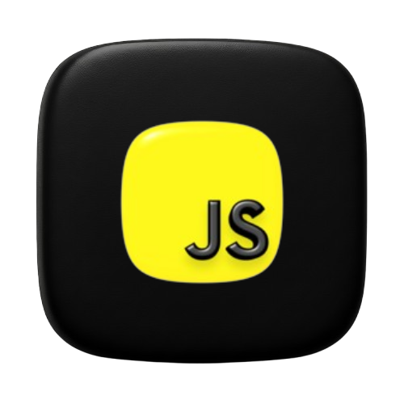
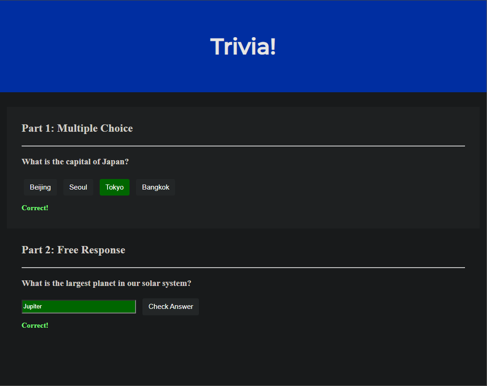
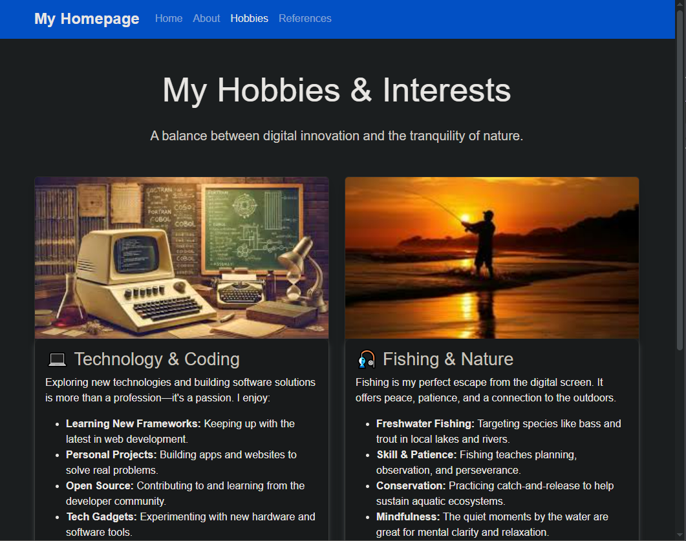

<DOCUMENT filename="README.md">

<p align="center">
  
  
  
</p>

<br>

# CS50 - Class 8: Web Programming

## Introduction to Computer Science

### Week 8 – HTML, CSS, JavaScript & Web Development

Taught by **Dr. David J. Malan, Ph.D.**

<br>

Below are the results of the completed activities:

<br>

> 🎯 Learning Objectives :
>
> > - Understand the `fundamental technologies of the web`: **_[HTML](https://developer.mozilla.org/en-US/docs/Web/HTML)_**, **_[CSS](https://developer.mozilla.org/en-US/docs/Web/CSS)_**, & **_[JavaScript](https://developer.mozilla.org/en-US/docs/Web/JavaScript)_**.
> > - Create `structured web pages` using semantic HTML5 elements.
> > - `Style websites` with CSS (both custom styles and **_[Bootstrap](https://getbootstrap.com/)_** framework).
> > - Add `interactivity and dynamic behavior` to web pages using JavaScript.
> > - Build `responsive designs` that work on mobile and desktop devices.
> > - `Validate and test` web pages for correctness and compatibility.

<br>

### 📋 Activities Overview

|   Activity   | Description                                                            | Key Concepts                                               | Status |
| :----------: | ---------------------------------------------------------------------- | ---------------------------------------------------------- | :----: |
|  **Trivia**  | Interactive quiz page with multiple-choice and free-response questions | HTML Forms, JavaScript Event Handling, DOM Manipulation    |   ✔    |
| **Homepage** | Personal portfolio website with multiple interconnected pages          | HTML5 Semantics, CSS Styling, Bootstrap, Responsive Design |   ✔    |

---

<p align="center">
  
</p>
<table align="center">
  <tr>
    <td align="center">
      <a href="../materials/images/result_activity_0.png">
        
      </a>
      <br>
      <sub><b>Trivia Quiz Interface</b></sub>
    </td>
    <td align="center">
      <a href="../materials/images/result_activity_1.png">
        
      </a>
      <br>
      <sub><b>Personal Homepage</b></sub>
    </td>
  </tr>  
</table>

---

### 📚 Prerequisites

- [ ] Before starting these activities, you should have basic knowledge in:

- **Programming Fundamentals:** Variables, conditionals, loops, and functions from previous weeks.
- **Internet Basics:** Understanding of how web browsers and servers communicate.
- **Text Editors:** Experience with code editors like VS Code.
- **File Management:** Navigating directories and managing files in a development environment.
- **Problem-Solving:** Logical thinking and debugging skills.

---

### 🛠️ Technologies Used

All activities were developed using:

[](https://developer.mozilla.org/en-US/docs/Web/HTML)&nbsp;&nbsp;&nbsp;&nbsp;&nbsp;&nbsp;[](https://developer.mozilla.org/en-US/docs/Web/CSS)&nbsp;&nbsp;&nbsp;&nbsp;&nbsp;&nbsp;[](https://developer.mozilla.org/en-US/docs/Web/JavaScript)&nbsp;&nbsp;&nbsp;&nbsp;&nbsp;&nbsp;[](https://getbootstrap.com/)&nbsp;&nbsp;&nbsp;&nbsp;&nbsp;&nbsp;[](https://cs50.dev/)&nbsp;&nbsp;&nbsp;&nbsp;&nbsp;&nbsp;[](https://code.visualstudio.com/)&nbsp;&nbsp;&nbsp;&nbsp;&nbsp;&nbsp;[](https://marketplace.visualstudio.com/items?itemName=ritwickdey.LiveServer)

---

### 📂 Activity Structure

```bash
week_8_HTML_CSS_JS/
├── exercises/
│   ├── scripts_and_corrections/
│   ├── src/
│   │   ├── homepage/
│   │   │   ├── images/
│   │   │   ├── about.html
│   │   │   ├── hobbies.html
│   │   │   ├── index.html
│   │   │   ├── references.html
│   │   │   ├── script.js
│   │   │   ├── specification.txt
│   │   │   └── styles.css
│   │   └── trivia/
│   │       ├── index.html
│   │       └── styles.css
│   └── README.md                            # This file
└── materials/
    ├── images/
    ├── src/
    │   ├── css/
    │   ├── html/
    │   ├── images/
    │   ├── js/
    │   └── videos/
    └── CS50_class_8_HTML_CSS_JS.pdf
```

---

### 🔍 Activities Details

<br>

📍 &nbsp;**0. Trivia - Interactive Quiz Web Page**

- Objective: Create a web page that lets users answer trivia questions with immediate feedback.

  - Key Features:

    - Multiple-choice section with at least three answer options.

    - Free-response section with text input.

    - Visual feedback (green/red colors) for correct/incorrect answers.

    - Dynamic text messages ("Correct!" / "Incorrect") displayed below questions.

```html
<!-- Key implementation - HTML structure for Trivia quiz -->
<!DOCTYPE html>
<html lang="en">
  <head>
    <link href="styles.css" rel="stylesheet" />
    <title>Trivia</title>
    <script>
      // JavaScript for handling quiz interactions
      document.addEventListener("DOMContentLoaded", function () {
        // Multiple choice buttons
        const correctButton = document.querySelector(".correct");
        const incorrectButtons = document.querySelectorAll(".incorrect");

        // Add event listeners to multiple choice buttons
        correctButton.addEventListener("click", function () {
          this.style.backgroundColor = "green";
          this.parentElement.querySelector(".feedback").innerHTML = "Correct!";
        });

        incorrectButtons.forEach((button) => {
          button.addEventListener("click", function () {
            this.style.backgroundColor = "red";
            this.parentElement.querySelector(".feedback").innerHTML =
              "Incorrect";
          });
        });

        // Free response checking
        document.querySelector("#check").addEventListener("click", function () {
          const input = document.querySelector("input");
          const feedback = input.parentElement.querySelector(".feedback");

          if (input.value.toLowerCase() === "switzerland") {
            input.style.backgroundColor = "green";
            feedback.innerHTML = "Correct!";
          } else {
            input.style.backgroundColor = "red";
            feedback.innerHTML = "Incorrect";
          }
        });
      });
    </script>
  </head>
  <body>
    <div class="container">
      <!-- Multiple Choice Section -->
      <div class="section">
        <h2>Part 1: Multiple Choice</h2>
        <h3>
          What is the approximate ratio of people to sheep in New Zealand?
        </h3>
        <button class="incorrect">6 people per 1 sheep</button>
        <button class="incorrect">3 people per 1 sheep</button>
        <button class="incorrect">1 person per 1 sheep</button>
        <button class="incorrect">1 person per 3 sheep</button>
        <button class="correct">1 person per 6 sheep</button>
        <p class="feedback"></p>
      </div>

      <!-- Free Response Section -->
      <div class="section">
        <h2>Part 2: Free Response</h2>
        <h3>In which country is it illegal to own only one guinea pig?</h3>
        <input type="text" />
        <button id="check">Check Answer</button>
        <p class="feedback"></p>
      </div>
    </div>
  </body>
</html>
```

<br>

📍 &nbsp;**1. Homepage - Personal Portfolio Website**

- Objective: Create a multi-page personal website using HTML, CSS, JavaScript, and Bootstrap.

  - Key Requirements Met:

    - 4 interconnected HTML pages (Home, About, Hobbies, References).

    - 10+ distinct HTML tags (`<nav>` , `<div>` , `<table>` , `` , `<footer>`, etc.).

    - Bootstrap integration for responsive design.

    - Custom CSS file with 5+ selectors and properties.

    - JavaScript interactivity (alert button, dynamic behavior).

    - Responsive design for mobile and desktop.

    - specification.txt documenting implementation details.

```html
<!-- Key implementation - Homepage structure with Bootstrap -->
<!DOCTYPE html>
<html lang="en">
  <head>
    <meta charset="UTF-8" />
    <meta name="viewport" content="width=device-width, initial-scale=1.0" />
    <title>My Homepage</title>
    <!-- Bootstrap 5 CSS -->
    <link
      href="https://cdn.jsdelivr.net/npm/bootstrap@5.3.3/dist/css/bootstrap.min.css"
      rel="stylesheet"
    />
    <!-- Custom CSS -->
    <link href="styles.css" rel="stylesheet" />
  </head>
  <body>
    <!-- Responsive Navigation Bar -->
    <nav class="navbar navbar-expand-lg navbar-dark bg-primary">
      <div class="container">
        <a class="navbar-brand" href="index.html">My Homepage</a>
        <button
          class="navbar-toggler"
          type="button"
          data-bs-toggle="collapse"
          data-bs-target="#navbarNav"
        >
          <span class="navbar-toggler-icon"></span>
        </button>
        <div class="collapse navbar-collapse" id="navbarNav">
          <ul class="navbar-nav">
            <li class="nav-item">
              <a class="nav-link active" href="index.html">Home</a>
            </li>
            <li class="nav-item">
              <a class="nav-link" href="about.html">About</a>
            </li>
            <li class="nav-item">
              <a class="nav-link" href="hobbies.html">Hobbies</a>
            </li>
            <li class="nav-item">
              <a class="nav-link" href="references.html">References</a>
            </li>
          </ul>
        </div>
      </div>
    </nav>

    <!-- Main Content with Bootstrap Grid -->
    <div class="container mt-5">
      <div class="row">
        <div class="col-md-4 mb-4">
          <div class="card">
            <div class="card-body">
              <h5 class="card-title">About Me</h5>
              <p class="card-text">Learn about my background and skills.</p>
              <a href="about.html" class="btn btn-primary">Go to About</a>
            </div>
          </div>
        </div>
        <!-- Additional cards for other pages -->
      </div>

      <!-- JavaScript Interactive Element -->
      <div class="text-center mt-5">
        <button id="alertButton" class="btn btn-success">
          Click for a Friendly Alert
        </button>
      </div>
    </div>

    <!-- Footer -->
    <footer class="bg-dark text-white text-center py-3 mt-5">
      <p>&copy; 2025 My Homepage. CS50 Exercise.</p>
    </footer>

    <!-- Bootstrap JS and Custom JS -->
    <script src="https://cdn.jsdelivr.net/npm/bootstrap@5.3.3/dist/js/bootstrap.bundle.min.js"></script>
    <script src="script.js"></script>
  </body>
</html>
```

<br>

```css
/* Key implementation - Custom CSS for Homepage */
/* 5+ CSS selectors with distinct properties */

/* 1. Tag selector */
body {
  font-family: "Arial", sans-serif;
  background-color: #f8f9fa;
}

/* 2. Class selector */
.navbar-brand {
  font-weight: bold;
  font-size: 1.5rem;
}

/* 3. ID selector */
#alertButton {
  padding: 12px 24px;
  font-size: 1.2rem;
  border-radius: 50px;
  transition: all 0.3s ease;
}

/* 4. Pseudo-class selector */
#alertButton:hover {
  background-color: #28a745;
  transform: scale(1.05);
}

/* 5. Child selector */
.card > .card-body {
  background-color: #ffffff;
  border-radius: 10px;
  box-shadow: 0 4px 8px rgba(0, 0, 0, 0.1);
}
```

<br>

```javascript
// Key implementation - JavaScript for interactivity
document.addEventListener("DOMContentLoaded", function () {
  const button = document.getElementById("alertButton");

  if (button) {
    button.addEventListener("click", function () {
      alert("Hello! Thanks for visiting my homepage! 😊");
    });
  }
});
```

---

### ⚙️ Setup and Execution

- [ ] &nbsp;&nbsp;&nbsp;Prerequisites :

✔️ - CS50 VS Code environment at `cs50.dev`.

✔️ - Modern web browser (Chrome, Firefox, Edge).

✔️ - Basic understanding of HTML structure.

✔️ - Familiarity with command-line interface.

<br>

- [x] &nbsp;&nbsp;&nbsp;Workflow for each activity :

```bash
# 1. Trivia Activity
$ cd trivia/
$ ls
index.html  styles.css

# Start local web server
$ http-server

# Open browser to: http://localhost:8080
# Test both correct and incorrect answers
# 1. Click correct answer (turns green, shows "Correct!")
# 2. Click incorrect answer (turns red, shows "Incorrect")
# 3. Type "Switzerland" in free response (turns green)
# 4. Type wrong answer (turns red)

# 2. Homepage Activity
$ cd ../homepage/
$ ls
index.html  about.html  hobbies.html  references.html
styles.css  script.js   specification.txt  images/

# Start local web server
$ http-server

# Open browser to: http://localhost:8080
# Test all features:
# 1. Navigation between all 4 pages
# 2. Responsive design (resize browser)
# 3. Interactive button (shows alert)
# 4. Bootstrap components working
# 5. Images loading correctly

# Validate HTML (for Homepage submission)
# Visit: https://validator.w3.org/#validate_by_input
# Copy/paste each HTML file to check for errors
```

---

### 🔬 Validation Tests

✔️ **Trivia** :

- [x] &nbsp;&nbsp;&nbsp;**Multiple Choice Section**:

  - At least three answer options provided
  - Exactly one correct answer
  - Correct answer turns green and shows "Correct!"
  - Incorrect answers turn red and show "Incorrect"
  - Feedback appears below the question

- [x] &nbsp;&nbsp;&nbsp;**Free Response Section**:

  - Text input field for answer
  - Check button to submit answer
  - Correct answer turns input green with "Correct!"
  - Incorrect answer turns input red with "Incorrect"
  - Case-insensitive comparison (optional enhancement)

- [x] &nbsp;&nbsp;&nbsp;**JavaScript Implementation**:
  - Uses `addEventListener` for interactivity
  - Modifies DOM elements dynamically
  - Provides immediate visual feedback
  - No page reload required

<br>

✔️ **Homepage** :

- [x] &nbsp;&nbsp;&nbsp;**HTML Requirements**:

  - Minimum 4 interconnected HTML pages
  - 10+ distinct HTML tags (beyond `<html>`, `<head>`, `<body>`, `<title>`)
  - Semantic HTML5 elements used appropriately
  - All pages accessible via navigation links

- [x] &nbsp;&nbsp;&nbsp;**CSS Requirements**:

  - Custom `styles.css` file
  - 5+ different CSS selectors (tag, class, ID, etc.)
  - 5+ different CSS properties
  - External stylesheet properly linked

- [x] &nbsp;&nbsp;&nbsp;**Bootstrap Integration**:

  - Bootstrap CSS and JS included via CDN
  - Responsive navigation bar
  - Grid system for layout
  - Bootstrap components (cards, buttons, etc.)
  - Works on mobile and desktop

- [x] &nbsp;&nbsp;&nbsp;**JavaScript Interactivity**:

  - At least one interactive feature
  - Separate JavaScript file
  - Event listeners for user interaction
  - Enhances user experience

- [x] &nbsp;&nbsp;&nbsp;**Documentation**:

  - Complete `specification.txt` file
  - Lists HTML tags, CSS properties
  - Describes JavaScript and Bootstrap usage

- [x] &nbsp;&nbsp;&nbsp;**Validation**:
  - HTML passes W3C validation
  - No critical errors in validator
  - Clean, well-indented code

---

### 🧠 Skills Developed

> By completing these activities, you will have acquired the following skills and sub-skills:

<br>

🧩 **Web Fundamentals** :

- Understanding the client-server model of the web
- How browsers render HTML, CSS, and JavaScript
- HTTP requests and responses
- File structure for web projects

<br>

🧩 **HTML5 & Semantic Markup** :

- Structuring web pages with proper HTML elements
- Using semantic tags (`<header>`, `<nav>`, `<main>`, `<footer>`)
- Creating forms, tables, and lists
- Adding images and links
- HTML validation and best practices

<br>

🧩 **CSS Styling & Layout** :

- Selectors and specificity in CSS
- Box model (margin, padding, border)
- Positioning and layout techniques
- Responsive design principles
- Custom styling vs. framework usage

<br>

🧩 **Bootstrap Framework** :

- Using CSS frameworks to accelerate development
- Responsive grid system
- Pre-styled components (navbars, cards, buttons)
- Utility classes for spacing, colors, and layout
- Mobile-first design approach

<br>

🧩 **JavaScript Interactivity** :

- DOM manipulation and traversal
- Event handling and listeners
- Dynamic content updates
- Form validation and user feedback
- Integrating JavaScript with HTML/CSS

<br>

🧩 **Web Development Workflow** :

- Local development with `http-server`
- Testing across different viewports
- HTML validation
- Project submission process
- Debugging web pages

<br>

🧩 **Full-Stack Awareness** :

- Understanding how front-end technologies work together
- Preparing for back-end integration
- Building multi-page applications
- Creating portfolio-ready projects

---

### 📜 Academic Context

These activities are part of Harvard University's CS50: Introduction to Computer Science course. They represent the introduction to web development, focusing on:

1. **Web Technologies Foundation**: Learning the three core technologies of the web (HTML, CSS, JavaScript) and how they interact.
2. **Front-End Development**: Creating user interfaces that are both functional and aesthetically pleasing.
3. **Responsive Design**: Ensuring websites work well on all devices through Bootstrap and CSS techniques.
4. **Interactive Web Pages**: Moving beyond static content to create engaging, dynamic user experiences.
5. **Professional Practices**: Following web standards, validating code, and creating documentation.

The Trivia activity demonstrates fundamental DOM manipulation and event handling, while the Homepage project showcases how to build a complete, multi-page website with modern web development practices.

Both exercises emphasize the importance of:

- **Separation of Concerns**: Keeping HTML (structure), CSS (presentation), and JavaScript (behavior) in separate files.
- **Accessibility**: Using semantic HTML for better screen reader support.
- **Validation**: Ensuring code follows web standards.
- **User Experience**: Creating intuitive, responsive interfaces.

The Homepage project in particular serves as a practical portfolio piece that demonstrates proficiency in front-end web development—a valuable asset for any aspiring developer.

> [!IMPORTANT]
> These implementations follow CS50's academic integrity policies and are intended for educational purposes. Each exercise applies web development concepts to practical problems, creating a comprehensive learning experience from basic markup to interactive web applications.

---

<h4 align="center">
  👤 Developed by 
<h4/>
<br>

<table align="center">
  <tr>
    <td align="center">
      <a href="https://www.linkedin.com/in/edmar-radanovis/">
        <br>
        <sub><b>Edmar Radanovis</b></sub><br>
        <sub>Full Stack Developer &nbsp;&</sub><br>
        <sub>Bachelor's degree candidate in</sub><br>
        <sub>Software Engineering</sub>
      </a>
    </td>
    <td align="center">
      <a href="https://edwebdev.vercel.app/">
        <br>
        <sub><b>Ed Web Dev</b></sub><br>
      </a>
    </td>
  </tr>
</table>

<br>
<br>

[⬆ Back to top](#cs50---class-8-web-programming)

</DOCUMENT>
