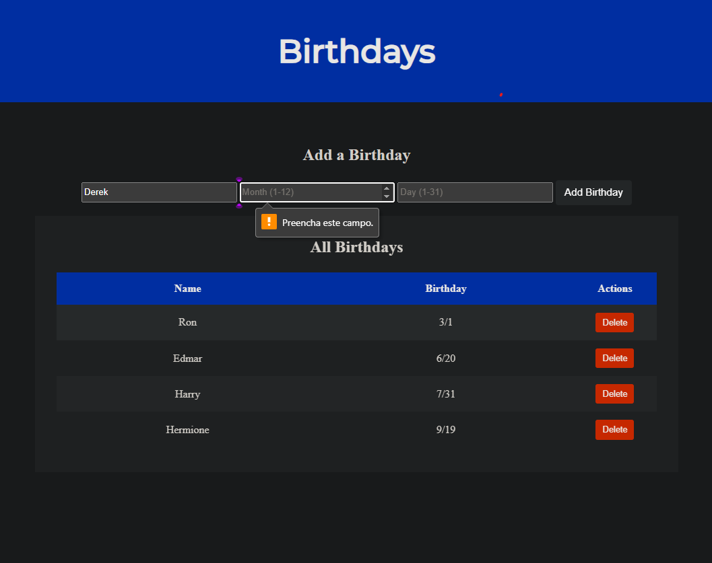
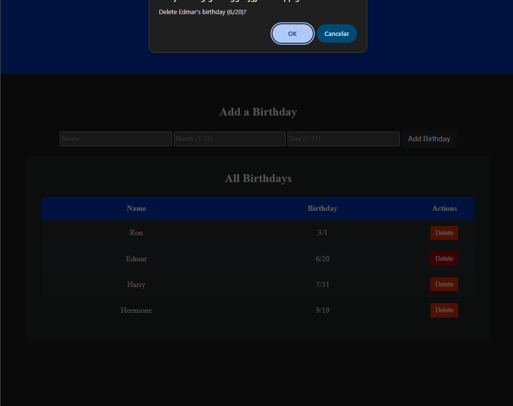
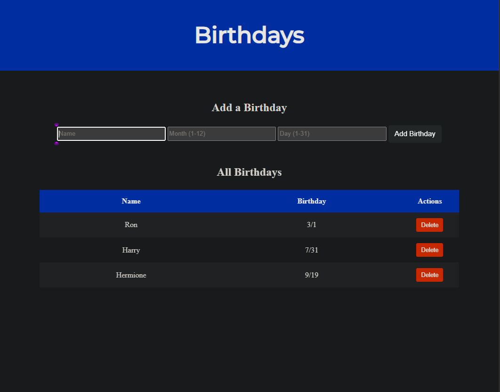
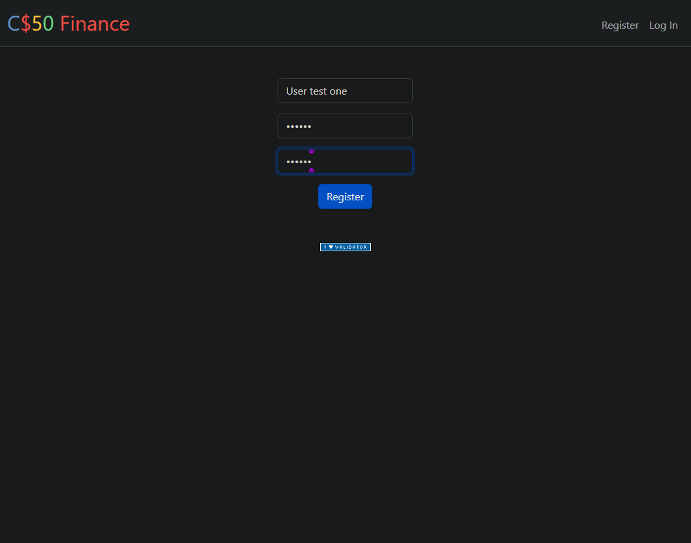
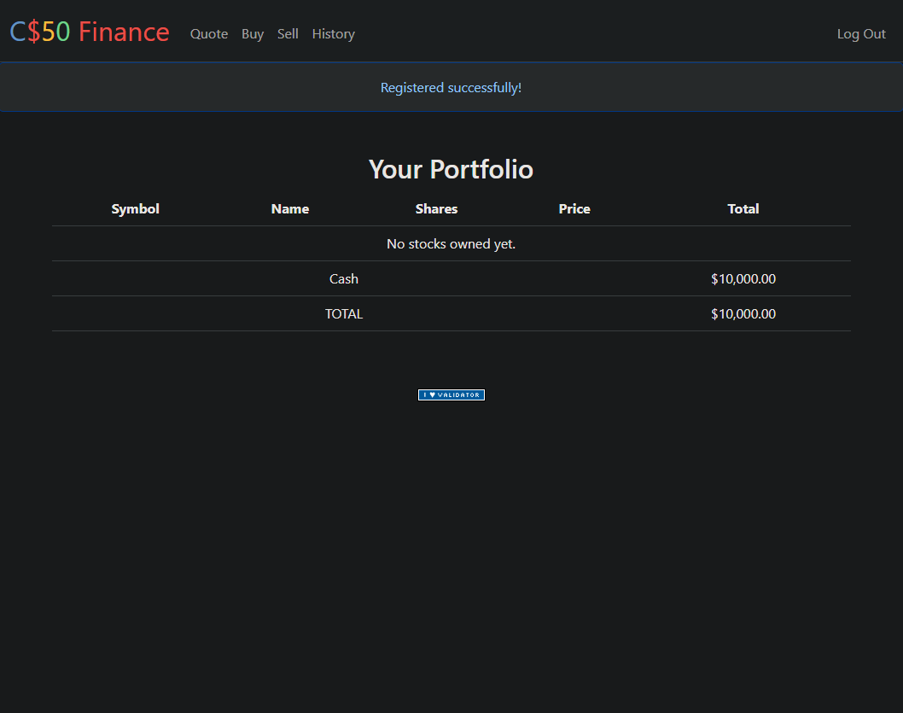
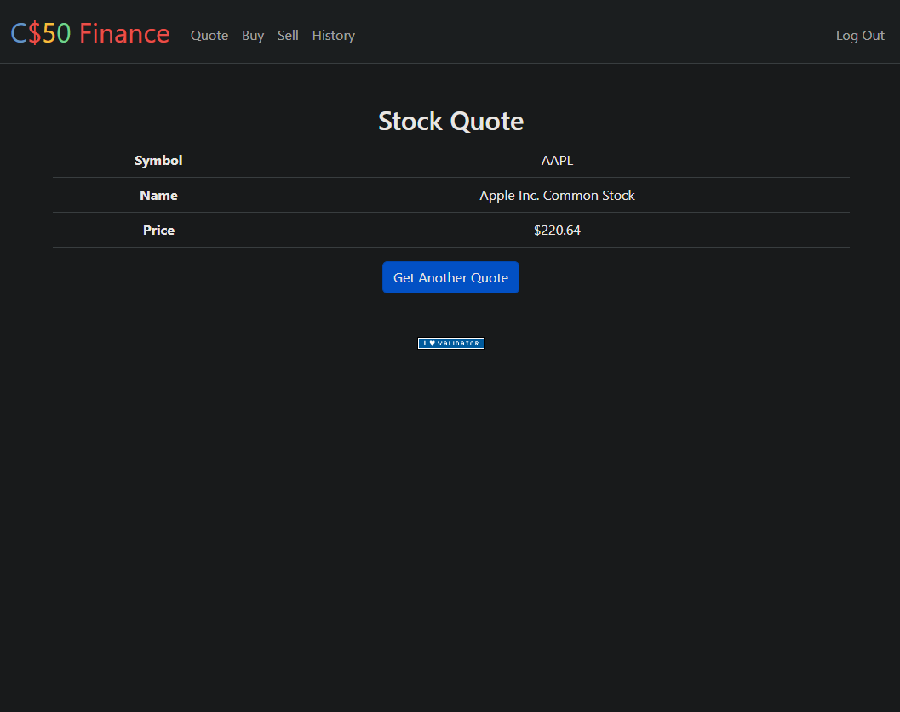
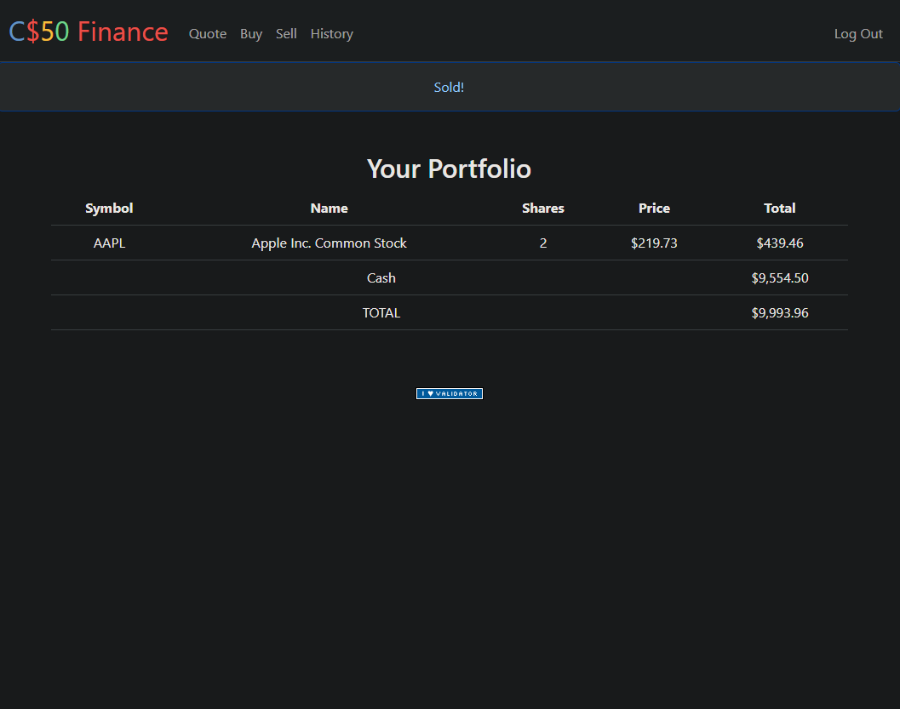
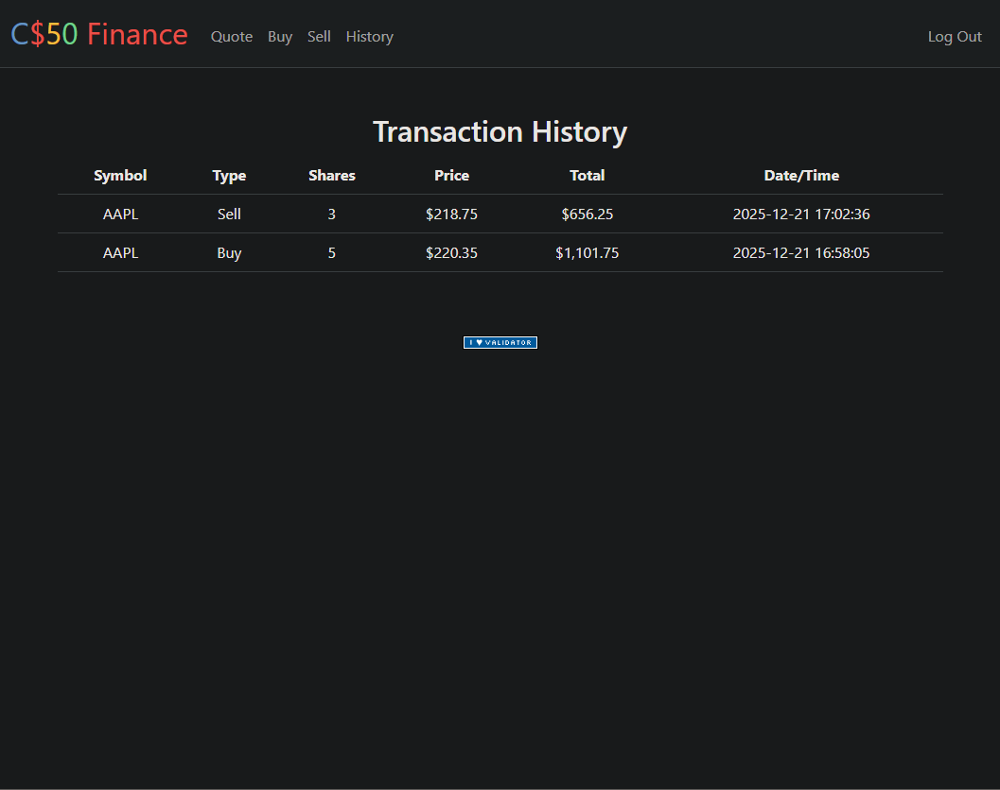

<DOCUMENT filename="README.md">

<p align="center">

  
  
</p>

<br>

# CS50 - Class 9: Flask e Web Applications

## Introduction to Computer Science

### Week 9 – Flask, SQL, Web Forms & Session Management

Taught by **Dr. David J. Malan, Ph.D.**

<br>

> 🎯 Learning Objectives :
>
> > - Understand **_[Flask](https://flask.palletsprojects.com/en/stable/)_** `microframework` and how it enables Python-based web development
> > - Build `dynamic` web applications with server-side rendering using `Jinja2` templates
> > - Integrate **_[SQL](https://www.w3schools.com/sql/)_** `databases` with web applications for persistent data storage
> > - Implement `user authentication` with session management and password hashing
> > - Create `RESTful APIs` and handle `JSON` responses
> > - Develop `full-stack web applications` combining **_[HTML](https://developer.mozilla.org/en-US/docs/Web/HTML)_** , **_[CSS](https://developer.mozilla.org/en-US/docs/Web/CSS)_** , **_[Python](https://www.python.org/)_** and **_[SQL](https://www.w3schools.com/sql/)_**.

<br>

### 📋 Activities Overview

|   Activity    | Description                                                | Key Concepts                                                  | Status |
| :-----------: | ---------------------------------------------------------- | ------------------------------------------------------------- | :----: |
| **Birthdays** | Web application to store and manage birthday records       | Flask Basics, SQL Integration, Form Handling, CRUD Operations |   ✔    |
|  **Finance**  | Stock trading simulation platform with user authentication | Session Management, APIs, Database Design, Security           |   ✔    |

---

<p align="center">
  
</p>
<table align="center">
  <tr>
    <td align="center">
      <a href="../materials/images/result_activity_birthdays_0.png">
        
      </a>
      <br>
      <sub><b>Birthdays Interface - Main View</b></sub>
    </td>
    <td align="center">
      <a href="../materials/images/result_activity_birthdays_1.png">
        
      </a>
      <br>
      <sub><b>Birthdays Interface - Adding New Entry</b></sub>
    </td>
    <td align="center">
      <a href="../materials/images/result_activity_birthdays_2.png">
        
      </a>
      <br>
      <sub><b>Birthdays Interface - Delete Confirmation</b></sub>
    </td>
  </tr>  
</table>

<br>
<br>

<p align="center">
  
</p>
<table align="center">
  <tr>
    <td align="center">
      <a href="../materials/images/result_activity_finance_0.png">
        
      </a>
      <br>
      <sub><b>Finance Interface ➡ Register</b></sub>
      <br>
      <br>
      <a href="../materials/images/result_activity_finance_1.png">
        
      </a>
      <br>
      <sub><b>Finance Interface ➡ Log In</b></sub>
    </td>
    <td align="center">
      <a href="../materials/images/result_activity_finance_2.png">
        
      </a>
      <br>
      <sub><b>Finance Interface ➡ Quote</b></sub>
      <br>
      <br>
      <a href="../materials/images/result_activity_finance_3.png">
        
      </a>
      <br>
      <sub><b>Finance Interface ➡ Buy </b></sub>
    </td>
    <td align="center">
      <a href="../materials/images/result_activity_finance_4.png">
        
      </a>
      <br>
      <sub><b>Finance Interface ➡ Sell </b></sub>
      <br>
      <br>
      <a href="../materials/images/result_activity_finance_5.png">
        
      </a>
      <br>
      <sub><b>Finance Interface ➡ History </b></sub>
    </td>
  </tr>  
</table>

---

### 📚 Prerequisites

- [ ] Before starting these activities, you should have basic knowledge in:

- **Python Programming:** Variables, functions, loops, and conditionals from Week 6
- **SQL Database:** Basic SQL queries (SELECT, INSERT, UPDATE, DELETE) from Week 7
- **HTML/CSS/JavaScript:** Web fundamentals from Week 8
- **Command Line:** Navigating directories and running Python scripts
- **Git Basics:** Version control fundamentals

---

### 🛠️ Technologies Used

All activities were developed using:

[](https://www.python.org/)&nbsp;&nbsp;&nbsp;&nbsp;&nbsp;&nbsp;[](https://flask.palletsprojects.com/)&nbsp;&nbsp;&nbsp;&nbsp;&nbsp;&nbsp;[](https://www.sqlite.org/)&nbsp;&nbsp;&nbsp;&nbsp;&nbsp;&nbsp;[](https://jinja.palletsprojects.com/)&nbsp;&nbsp;&nbsp;&nbsp;&nbsp;&nbsp;[](https://getbootstrap.com/)&nbsp;&nbsp;&nbsp;&nbsp;&nbsp;&nbsp;[](https://developer.mozilla.org/en-US/docs/Web/HTML)&nbsp;&nbsp;&nbsp;&nbsp;&nbsp;&nbsp;[](https://developer.mozilla.org/en-US/docs/Web/CSS)&nbsp;&nbsp;&nbsp;&nbsp;&nbsp;&nbsp;[](https://developer.mozilla.org/en-US/docs/Web/JavaScript)&nbsp;&nbsp;&nbsp;&nbsp;&nbsp;&nbsp;[](https://cs50.dev/)&nbsp;&nbsp;&nbsp;&nbsp;&nbsp;&nbsp;[](https://code.visualstudio.com/)

---

### 📂 Activity Structure

```bash
week_9_flask/
├── exercises/
│   ├── scripts_and_corrections/

│   ├── src/
│   │   ├── birthdays/                       # Activity 0: Birthday Tracker
│   │   │   ├── static/
│   │   │   │   └── styles.css
│   │   │   ├── templates/
│   │   │   │   └── index.html
│   │   │   ├── app.py
│   │   │   └── birthdays.db
│   │   └── finance/                         # Activity 1: Stock Trading Platform
│   │       ├── flask_session/
│   │       ├── static/
│   │       │   └── styles.css
│   │       ├── templates/
│   │       │   ├── apology.html
│   │       │   ├── buy.html
│   │       │   ├── history.html
│   │       │   ├── index.html
│   │       │   ├── layout.html
│   │       │   ├── login.html
│   │       │   ├── quote.html
│   │       │   ├── quoted.html
│   │       │   ├── register.html
│   │       │   └── sell.html
│   │       ├── app.py
│   │       ├── finance.db
│   │       ├── helpers.py
│   │       └── requirements.txt
│   └── README.md                            # This file
└── materials/
    ├── images/
    ├── src/
    └── CS50_class_9_flask.pdf
```

---

### 🔍 Activities Details

<br>

📍 &nbsp;**0. Birthdays - Birthday Tracker Web Application**

- Objective: Create a Flask web application to store, display, and manage birthday records with full CRUD operations.

  - Key Features Implemented:

    - Display all birthdays in a responsive HTML table.

    - Add new birthdays via form with validation (1-12 months, 1-31 days).

    - Extra Feature: Delete functionality with confirmation dialog.

    - Form validation on both client and server side.

    - Persistent SQLite database storage.

    - Clean, user-friendly interface with Bootstrap styling.

```python
# Key implementation - app.py with full CRUD operations
from flask import Flask, redirect, render_template, request
from cs50 import SQL

app = Flask(__name__)
db = SQL("sqlite:///birthdays.db")

@app.route("/", methods=["GET", "POST"])
def index():
    """Handle GET (display) and POST (add) requests"""

    if request.method == "POST":
        # Get form data
        name = request.form.get("name")
        month = request.form.get("month")
        day = request.form.get("day")

        # Server-side validation
        if not name or not month or not day:
            return redirect("/")

        try:
            month = int(month)
            day = int(day)

            # Validate ranges
            if month < 1 or month > 12 or day < 1 or day > 31:
                return redirect("/")

            # Insert into database
            db.execute(
                "INSERT INTO birthdays (name, month, day) VALUES (?, ?, ?)",
                name, month, day
            )

        except ValueError:
            return redirect("/")

        return redirect("/")

    else:
        # GET request - display all birthdays
        birthdays = db.execute("SELECT * FROM birthdays ORDER BY month, day")
        return render_template("index.html", birthdays=birthdays)

@app.route("/delete", methods=["POST"])
def delete():
    """Extra Feature: Delete a birthday from the database"""
    id = request.form.get("id")
    if id:
        db.execute("DELETE FROM birthdays WHERE id = ?", id)
    return redirect("/")
```

<br>

```html
<!-- Key implementation - index.html with delete functionality -->
 
<h1 class="text-center mb-4">Birthday Tracker</h1>

<!-- Add Birthday Form -->
<div class="card mb-4">
  <div class="card-body">
    <h2 class="h4 mb-3">Add New Birthday</h2>
    <form action="/" method="post">
      <div class="row g-3">
        <div class="col-md-4">
          <input
            type="text"
            class="form-control"
            name="name"
            placeholder="Name"
            required
          />
        </div>
        <div class="col-md-3">
          <input
            type="number"
            class="form-control"
            name="month"
            placeholder="Month (1-12)"
            min="1"
            max="12"
            required
          />
        </div>
        <div class="col-md-3">
          <input
            type="number"
            class="form-control"
            name="day"
            placeholder="Day (1-31)"
            min="1"
            max="31"
            required
          />
        </div>
        <div class="col-md-2">
          <button type="submit" class="btn btn-primary w-100">
            Add Birthday
          </button>
        </div>
      </div>
    </form>
  </div>
</div>

<!-- Birthdays Table -->
<div class="card">
  <div class="card-body">
    <h2 class="h4 mb-3">All Birthdays</h2>
    
    <div class="table-responsive">
      <table class="table table-striped table-hover">
        <thead>
          <tr>
            <th>Name</th>
            <th>Birthday</th>
            <th>Actions</th>
          </tr>
        </thead>
        <tbody>
          
          <tr>
            <td>{{ birthday.name }}</td>
            <td>{{ birthday.month }}/{{ birthday.day }}</td>
            <td>
              <!-- Extra Feature: Delete Button with Confirmation -->
              <form action="/delete" method="post" style="display: inline;">
                <input type="hidden" name="id" value="{{ birthday.id }}" />
                <button
                  type="submit"
                  class="btn btn-danger btn-sm delete-btn"
                  onclick="return confirm('Delete {{ birthday.name }}\\'s birthday ({{ birthday.month }}/{{ birthday.day }})?')"
                >
                  Delete
                </button>
              </form>
            </td>
          </tr>
          
        </tbody>
      </table>
    </div>
    
    <p class="text-muted text-center">No birthdays recorded yet.</p>
    
  </div>
</div>

```

<br>

📍 &nbsp;**1. Finance - Stock Trading Simulation Platform**

- Objective: Implement a full-featured web application where users can register, login, buy/sell stocks, check real-time quotes, and view transaction history.

  - Key Requirements Met:

    - User registration with password hashing and validation.

    - Login/logout functionality with session management.

    - Real-time stock quotes via IEX API integration.

    - Buy/sell stocks with validation (sufficient funds, valid shares).

    - Portfolio display with current valuations.

    - Complete transaction history.

    - SQL database with proper schema design.

    - Security measures (SQL injection prevention, password hashing).

```python
# Key implementation - Finance app.py (simplified structure)
import os
from cs50 import SQL
from flask import Flask, flash, redirect, render_template, request, session
from flask_session import Session
from werkzeug.security import check_password_hash, generate_password_hash
from helpers import apology, login_required, lookup, usd

app = Flask(__name__)
app.jinja_env.filters["usd"] = usd

# Configure session
app.config["SESSION_PERMANENT"] = False
app.config["SESSION_TYPE"] = "filesystem"
Session(app)

# Database connection
db = SQL("sqlite:///finance.db")

@app.route("/")
@login_required
def index():
    """Show portfolio of stocks"""
    user_id = session["user_id"]

    # Get user's cash balance
    user = db.execute("SELECT cash FROM users WHERE id = ?", user_id)
    cash = user[0]["cash"]

    # Get user's stocks
    stocks = db.execute("""
        SELECT symbol, SUM(shares) as total_shares
        FROM transactions
        WHERE user_id = ?
        GROUP BY symbol
        HAVING total_shares > 0
    """, user_id)

    # Calculate portfolio value
    portfolio = []
    total_value = cash

    for stock in stocks:
        quote = lookup(stock["symbol"])
        if quote:
            stock_value = quote["price"] * stock["total_shares"]
            portfolio.append({
                "symbol": stock["symbol"],
                "name": quote["name"],
                "total_shares": stock["total_shares"],
                "price": quote["price"],
                "total_value": stock_value
            })
            total_value += stock_value

    return render_template("index.html", stocks=portfolio, cash=cash, total=total_value)

@app.route("/register", methods=["GET", "POST"])
def register():
    """Register user with validation"""
    if request.method == "POST":
        username = request.form.get("username")
        password = request.form.get("password")
        confirmation = request.form.get("confirmation")

        # Validation
        if not username or not password or not confirmation:
            return apology("must fill all fields", 400)
        if password != confirmation:
            return apology("passwords do not match", 400)

        # Check for existing username
        existing = db.execute("SELECT id FROM users WHERE username = ?", username)
        if existing:
            return apology("username already exists", 400)

        # Hash password and insert user
        hash_pw = generate_password_hash(password)
        try:
            new_user_id = db.execute(
                "INSERT INTO users (username, hash) VALUES (?, ?)",
                username, hash_pw
            )
        except ValueError:
            return apology("username already exists", 400)

        # Log user in
        session["user_id"] = new_user_id
        flash("Registered successfully!")
        return redirect("/")

    return render_template("register.html")

@app.route("/buy", methods=["GET", "POST"])
@login_required
def buy():
    """Buy shares of stock"""
    if request.method == "POST":
        symbol = request.form.get("symbol")
        shares = request.form.get("shares")

        # Validation
        if not symbol:
            return apology("must provide symbol", 400)
        if not shares or not shares.isdigit() or int(shares) <= 0:
            return apology("must provide positive integer number of shares", 400)

        shares = int(shares)
        stock = lookup(symbol)

        if not stock:
            return apology("invalid symbol", 400)

        user_id = session["user_id"]
        user = db.execute("SELECT cash FROM users WHERE id = ?", user_id)
        cash = user[0]["cash"]
        total_cost = stock["price"] * shares

        if cash < total_cost:
            return apology("can't afford", 400)

        # Update user's cash
        db.execute("UPDATE users SET cash = cash - ? WHERE id = ?", total_cost, user_id)

        # Record transaction
        db.execute("""
            INSERT INTO transactions (user_id, symbol, shares, price, type)
            VALUES (?, ?, ?, ?, 'buy')
        """, user_id, symbol.upper(), shares, stock["price"])

        flash("Bought!")
        return redirect("/")

    return render_template("buy.html")

# Additional routes: /sell, /quote, /history, /login, /logout
```

<br>

```sql
-- Key implementation - Database schema for Finance
-- users table
CREATE TABLE users (
    id INTEGER PRIMARY KEY AUTOINCREMENT,
    username TEXT NOT NULL UNIQUE,
    hash TEXT NOT NULL,
    cash NUMERIC NOT NULL DEFAULT 10000.00
);

-- transactions table
CREATE TABLE transactions (
    id INTEGER PRIMARY KEY AUTOINCREMENT,
    user_id INTEGER NOT NULL,
    symbol TEXT NOT NULL,
    shares INTEGER NOT NULL,
    price REAL NOT NULL,
    type TEXT NOT NULL,  -- 'buy' or 'sell'
    transacted TIMESTAMP DEFAULT CURRENT_TIMESTAMP,
    FOREIGN KEY(user_id) REFERENCES users(id)
);

-- Indexes for performance
CREATE INDEX idx_transactions_user_id ON transactions(user_id);
CREATE INDEX idx_transactions_symbol ON transactions(symbol);
```

<br>

```html
<!-- Key implementation - Finance portfolio display (index.html) -->
  Portfolio  
<h2 class="mb-4">Your Portfolio</h2>

<!-- Portfolio Table -->
<div class="table-responsive mb-4">
  <table class="table table-striped table-hover">
    <thead>
      <tr>
        <th>Symbol</th>
        <th>Name</th>
        <th>Shares</th>
        <th>Price</th>
        <th>Total</th>
      </tr>
    </thead>
    <tbody>
       
      <tr>
        <td>{{ stock.symbol }}</td>
        <td>{{ stock.name }}</td>
        <td>{{ stock.total_shares }}</td>
        <td>{{ stock.price | usd }}</td>
        <td>{{ stock.total_value | usd }}</td>
      </tr>
       
      <tr>
        <td colspan="5" class="text-center text-muted">
          No stocks owned yet. <a href="/buy">Buy your first stock!</a>
        </td>
      </tr>
      
    </tbody>
    <tfoot>
      <tr>
        <td colspan="4" class="text-end"><strong>Cash</strong></td>
        <td><strong>{{ cash | usd }}</strong></td>
      </tr>
      <tr class="table-primary">
        <td colspan="4" class="text-end"><strong>TOTAL</strong></td>
        <td><strong>{{ total | usd }}</strong></td>
      </tr>
    </tfoot>
  </table>
</div>

<!-- Quick Actions -->
<div class="d-grid gap-2 d-md-flex justify-content-md-center">
  <a href="/buy" class="btn btn-primary me-md-2">Buy Stocks</a>
  <a href="/sell" class="btn btn-secondary me-md-2">Sell Stocks</a>
  <a href="/quote" class="btn btn-info">Get Quote</a>
</div>

```

---

### ⚙️ Setup and Execution

- [ ] &nbsp;&nbsp;&nbsp;Prerequisites :

✔️ - Python 3.8+ installed

✔️ - Flask and required dependencies

✔️ - Modern web browser

✔️ - CS50 Dev environment or local Python setup

<br>

- [x] &nbsp;&nbsp;&nbsp;Workflow for each activity :

```bash
# 1. Birthdays Activity
$ cd birthdays/
$ ls
app.py  birthdays.db  requirements.txt  static/  templates/

# Install dependencies
$ pip install -r requirements.txt

# Run the Flask application
$ flask run

# Open browser to: http://localhost:5000
# Test all features:
# 1. View existing birthdays in table
# 2. Add new birthday with valid/invalid data
# 3. Test delete functionality with confirmation
# 4. Verify database persistence

# 2. Finance Activity
$ cd ../finance/
$ ls
app.py  finance.db  helpers.py  requirements.txt  static/  templates/

# Install dependencies
$ pip install -r requirements.txt

# Initialize database (if needed)
$ sqlite3 finance.db
sqlite> .schema
sqlite> .quit

# Run the Flask application
$ flask run

# Open browser to: http://localhost:5000
# Complete test sequence:
# 1. Register new user
# 2. Login with credentials
# 3. Check portfolio (should show $10,000 cash)
# 4. Get quote for AAPL, GOOGL, etc.
# 5. Buy 5 shares of AAPL
# 6. Check portfolio (cash reduced, AAPL added)
# 7. Sell 2 shares of AAPL
# 8. Check portfolio (cash increased, shares reduced)
# 9. View transaction history
# 10. Logout and login again to verify persistence
```

---

### 🔬 Validation Tests

✔️ **Birthdays** :

- [x] &nbsp;&nbsp;&nbsp;**Database Operations**:

  - SQLite database with proper schema
  - CRUD operations fully functional
  - Data persistence across server restarts
  - Proper foreign key relationships

- [x] &nbsp;&nbsp;&nbsp;**Web Interface**:

  - Responsive table displaying all birthdays
  - Form with validation (month 1-12, day 1-31)
  - Bootstrap-styled interface
  - Confirmation dialog for delete operations
  - Clear user feedback

- [x] &nbsp;&nbsp;&nbsp;**Flask Implementation**:

  - Proper route handling (GET/POST)
  - Server-side validation
  - Template rendering with Jinja2
  - Session management (if implemented)
  - Error handling

- [x] &nbsp;&nbsp;&nbsp;**Extra Features**:
  - Delete functionality with confirmation
  - Enhanced validation
  - Improved UI/UX

<br>

✔️ **Finance** :

- [x] &nbsp;&nbsp;&nbsp;**User Authentication**:

  - Registration with password hashing
  - Login/logout functionality
  - Session management
  - Password confirmation
  - Duplicate username prevention

- [x] &nbsp;&nbsp;&nbsp;**Stock Operations**:

  - Real-time stock quotes via API
  - Buy stocks with validation (funds, valid symbol)
  - Sell stocks with validation (sufficient shares)
  - Portfolio valuation
  - Transaction history

- [x] &nbsp;&nbsp;&nbsp;**Database Design**:

  - Proper schema with users and transactions tables
  - Foreign key constraints
  - Indexes for performance
  - Appropriate data types

- [x] &nbsp;&nbsp;&nbsp;**Security**:

  - Password hashing with werkzeug
  - SQL injection prevention (parameterized queries)
  - Session-based authentication
  - Input validation on server side

- [x] &nbsp;&nbsp;&nbsp;**User Interface**:

  - Bootstrap-based responsive design
  - Currency formatting with custom filter
  - Clear navigation
  - Informative error messages
  - Portfolio summary with totals

- [x] &nbsp;&nbsp;&nbsp;**API Integration**:
  - IEX API integration via lookup() helper
  - Error handling for API failures
  - JSON parsing and data extraction
  - Fallback mechanisms

---

### 🧠 Skills Developed

> By completing these activities, you will have acquired the following skills and sub-skills:

<br>

🧩 **Flask Web Framework** :

- Setting up Flask applications with proper configuration
- Creating routes and handling HTTP methods (GET/POST)
- Using decorators for route protection (@login_required)
- Template rendering with Jinja2
- Static file serving and organization

<br>

🧩 **Database Integration** :

- Connecting Flask applications to SQL databases
- Executing parameterized SQL queries
- Designing database schemas for web applications
- Implementing CRUD operations
- Using transactions for data integrity

<br>

🧩 **User Authentication & Security** :

- Implementing registration and login systems
- Password hashing and verification
- Session management with Flask-Session
- Protecting routes with authentication middleware
- Preventing common web vulnerabilities

<br>

🧩 **Web Form Handling** :

- Creating HTML forms with validation
- Processing form data in Flask
- Client-side and server-side validation
- File upload handling (if applicable)
- Form security best practices

<br>

🧩 **API Integration** :

- Making HTTP requests to external APIs
- Parsing JSON responses
- Handling API errors and timeouts
- Caching API responses
- Designing internal APIs

<br>

🧩 **Full-Stack Application Design** :

- Architecting complete web applications
- Separating concerns (models, views, controllers)
- Implementing business logic
- Error handling and user feedback
- Application state management

<br>

🧩 **Deployment & Production Considerations** :

- Configuring applications for production
- Environment variable management
- Database migration strategies
- Performance optimization
- Security hardening

---

### 📜 Academic Context

These activities are part of Harvard University's CS50: Introduction to Computer Science course. They represent the transition from front-end to full-stack web development, focusing on:

1. **Server-Side Programming**: Moving beyond static HTML to dynamic, Python-driven web applications.
2. **Database-Driven Applications**: Creating applications that store and retrieve data persistently.
3. **User Authentication**: Implementing secure login systems with session management.
4. **API Consumption**: Integrating external data sources into web applications.
5. **Full-Stack Development**: Combining all layers (front-end, back-end, database) into cohesive applications.

The Birthdays activity demonstrates fundamental Flask concepts with database integration, while the Finance project showcases a complete, production-like application with user authentication, financial transactions, and external API integration.

Both exercises emphasize the importance of:

- **Security**: Protecting user data, preventing SQL injection, and hashing passwords.
- **Validation**: Ensuring data integrity through client and server-side validation.
- **User Experience**: Creating intuitive interfaces with clear feedback.
- **Code Organization**: Separating concerns into models, views, and controllers.
- **Testing**: Validating all functionality works as expected.

The Finance project in particular serves as a capstone exercise that demonstrates proficiency in full-stack web development—combining database design, server-side logic, user interface, and external API integration into a single, functional application.

> [!IMPORTANT]
> These implementations follow CS50's academic integrity policies and are intended for educational purposes. Each exercise applies Flask and web development concepts to practical problems, creating a comprehensive learning experience from simple CRUD applications to complex financial platforms.

---

<h4 align="center">
  👤 Developed by 
<h4/>
<br>

<table align="center">
  <tr>
    <td align="center">
      <a href="https://www.linkedin.com/in/edmar-radanovis/">
        <br>
        <sub><b>Edmar Radanovis</b></sub><br>
        <sub>Full Stack Developer &nbsp;&</sub><br>
        <sub>Bachelor's degree candidate in</sub><br>
        <sub>Software Engineering</sub>
      </a>
    </td>
    <td align="center">
      <a href="https://edwebdev.vercel.app/">
        <br>
        <sub><b>Ed Web Dev</b></sub><br>
      </a>
    </td>
  </tr>
</table>

<br>
<br>

[⬆ Back to top](#cs50---class-9-flask-e-web-applications)

</DOCUMENT>
